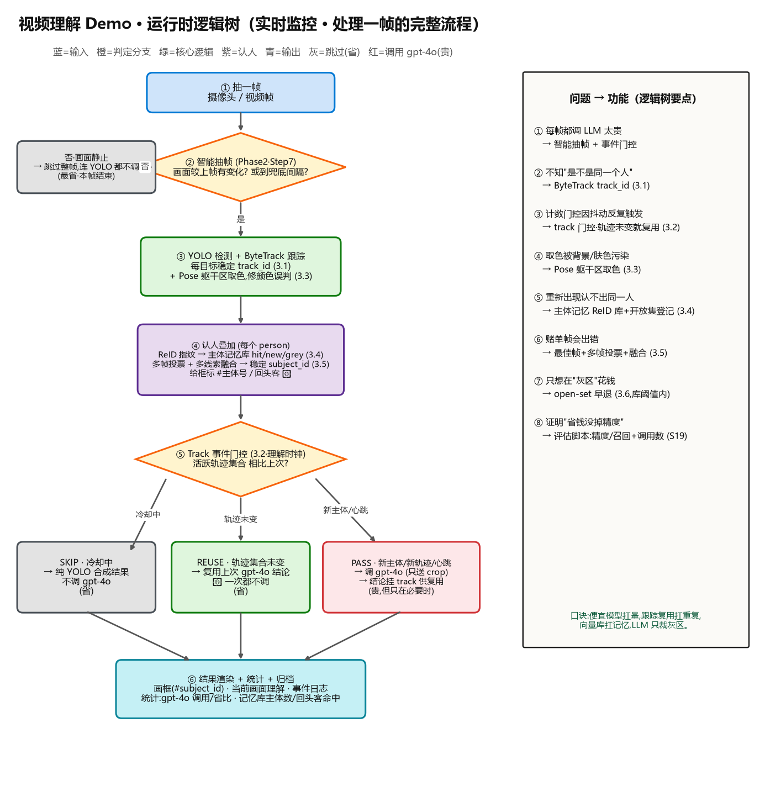
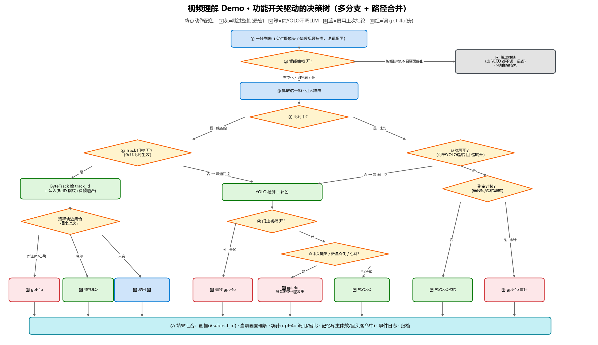

# 📌 检查点：Phase 1–3 已落地基线（baseline-phase1-3）

> 本分支是一个**冻结的还原点**：记录"修改 task 之前"的状态。
> 后续的新方向（客户对齐 · 事件理解重构）会在**另外的分支**上进行，与本快照分开。
> 📅 节点时间：2026-06-23 ｜ 🔗 仓库：https://github.com/Zhijing-W/video-ai-poc

---

## 一、这个节点做了什么（一句话）

把"视频理解 Demo"从 **LLM-first MVP** 一路做到 **逐轨迹认人 + 主体记忆 + 多帧融合**，
核心成果：**用便宜的 CV 扛量、跟踪复用扛重复、向量库扛记忆、LLM 只在必要时调** —— 既识得准、又花得省。
Phase 4/5 已写好设计文档（客户对齐的事件理解 / Azure 上云），尚未编码。

## 二、运行时逻辑流（当前已实现）

**功能开关驱动的决策树（多分支 + 路径合并）：**

## 三、各 Phase 完成情况

| Phase | 内容 | 状态 |
|---|---|---|
| **Phase 1** | LLM-first MVP：视频 → ffmpeg 抽帧 → gpt-4o → 结构化 JSON | ✅ 已落地 |
| **Phase 2** | 成本可控混合：YOLO 检测 + 事件门控 + 智能抽帧，LLM 只在"每事件"调 | ✅ 已落地 |
| **Phase 3** | 逐轨迹识别 + 主体记忆：ByteTrack 跟踪、ReID FAISS 向量库、多帧融合、实时认人集成、评估脚本 | ✅ 已落地 |
| **Phase 4** | 客户对齐 · 身份感知多帧事件理解（人脸+人形+步态 → 身份 → 多帧事件理解） | 📝 设计文档 |
| **Phase 5** | 基于 Azure 的全链路上云（推流 → AML 推理 → 拉流） | 📝 设计文档 |

## 四、Phase 3 已落地的关键能力（本节点的主要增量）

| 能力 | 模块 |
|---|---|
| 多目标跟踪（ByteTrack，稳定 track_id，按 session 隔离） | `app/tracker.py`、`/track` |
| 三时钟解耦 / track 门控（轨迹未变就复用结论，新主体才调 LLM） | `app/services/track_gate.py` |
| 细粒度感知 v1（YOLO-Pose 躯干区取色，修颜色误判） | `app/pose.py` |
| 主体记忆 ReID 向量库（FAISS 余弦 + 开放集登记 + 质量门控 + 负缓存） | `app/gallery.py`、`app/reid.py`、`/identify` |
| 多线索融合 + 最佳帧投票（时序/ReID/颜色/位置，人脸留槽） | `app/track_fusion.py`、`/fusion` |
| 实时认人集成（认出回头客、跨 track 复用，前端展示） | `app/services/identity_integration.py` |
| 评估体系（识别准召 + 单位视频 LLM 调用数，证明省钱没掉精度） | `scripts/eval_phase3.py` |

## 五、Phase 4/5 设计要点（下一步在新分支上做）

- **Phase 4（客户对齐）**：传统 CV（人脸+人形 ReID+步态）出身份 → 结构化身份 + 连续多帧图 一起喂多模态大模型 → 跨帧**事件理解**；事件提供器做成可插拔（人物只是其一，预留宠物/车辆/包裹/OCR/异常）；两段选帧（定时 4fps + 内容感知关键帧降图数）。详见 `docs/phase/Phase4-客户对齐-身份感知多帧事件理解.md`。
- **Phase 5（上云）**：推流 → AML 在线端点实时推理 → 拉流分发 / 闭环训练。详见 `docs/phase/Phase5-Azure全链路上云.md`。

---

> 🧭 **口诀**：便宜模型扛量，跟踪复用扛重复，向量库扛记忆，LLM 只裁灰区。
