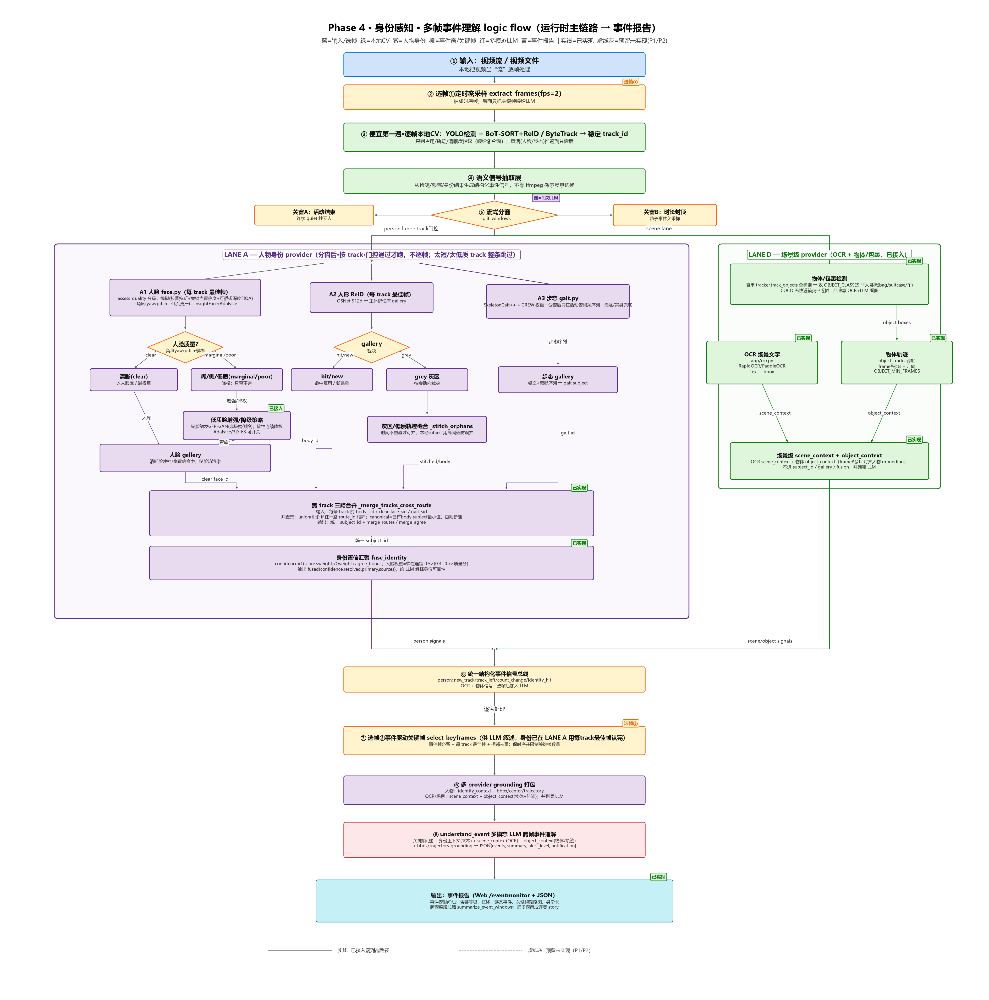

# Event Monitor

Turns surveillance videos into event timelines, alerts, and structured reports that explain who appeared, what happened, and when.

[English](#english) | [中文](#中文)



---

## English

### Overview

Event Monitor turns a video into an identity-aware event timeline instead of analyzing isolated frames.

```text
Video or future camera stream
  -> frame sampling
  -> object detection and multi-object tracking
  -> body ReID, face recognition, and gait recognition
  -> semantic event windows and keyframe selection
  -> identity, spatial, OCR, and object grounding
  -> multimodal LLM event reports
  -> cross-window overall summary
```

The traditional computer-vision pipeline determines **who is present and where**. The multimodal LLM focuses on **what happened**, using externally supplied identity and spatial context rather than re-identifying people itself.

### Key capabilities

- YOLO detection with ByteTrack or BoT-SORT tracking.
- Body ReID with an open-set, multi-shot subject gallery.
- Optional InsightFace/AdaFace face recognition and face-quality gating.
- Optional SkeletonGait++ gait recognition for distant or back-facing people.
- Quality-aware face/body/gait confidence aggregation.
- Cross-track identity merging and local trajectory stitching.
- Event-driven windowing and keyframe selection.
- Spatial grounding with bounding boxes, centers, and trajectories.
- Scene-level OCR and object/package context.
- Multimodal event reports and a text-only overall video summary.
- Web timeline with keyframes, identity cards, alerts, and per-run settings.
- Dry-run mode for validating the CV pipeline without calling the LLM.

### Requirements

- Windows or Linux.
- Python 3.11 or 3.12.
- `ffmpeg` available on `PATH`.
- An Azure OpenAI or Foundry vision-capable deployment for LLM event reports.
- GPU is optional. CPU execution is supported but face, gait, and super-resolution are slower.

### Quick start

```powershell
git clone --branch feature/event-understanding --single-branch https://github.com/Zhijing-W/video-ai-poc.git
cd video-ai-poc

python -m venv .venv
.\.venv\Scripts\python.exe -m pip install -r requirements.txt

copy .env.example .env
# Edit .env and provide your Azure OpenAI endpoint, API key, and deployment.

.\.venv\Scripts\python.exe scripts\download_models.py --include-optional-yolo
.\.venv\Scripts\python.exe -m uvicorn app.main:app --port 8000
```

Open:

- Event Monitor: <http://127.0.0.1:8000/event-monitor>
- API documentation: <http://127.0.0.1:8000/docs>
- Health check: <http://127.0.0.1:8000/health>

Linux/macOS users can replace `.\.venv\Scripts\python.exe` with `.venv/bin/python`.

### Main API

| Endpoint | Purpose |
|---|---|
| `GET /api/event-monitor/samples` | List locally available sample videos |
| `POST /api/event-monitor/understand` | Run the complete video-to-event pipeline |
| `POST /api/event-monitor/complete` | Continue a dry run with the LLM without rerunning CV |
| `GET /health` | Service health |

The legacy page path `/eventmonitor` redirects to `/event-monitor`.

### Models

Git stores only model manifests and instructions, never model binaries.

```text
models/
├── README.md
├── manifest.json
├── yolov8m.pt                 # local, ignored
├── yolov8n-pose.pt            # local, ignored
├── yolov8m-seg.pt             # local, ignored
├── AdaFace/                   # optional, ignored
├── OpenGait/                  # optional, ignored
└── gfpgan/                    # optional, ignored
```

Prepare the Ultralytics models with:

```powershell
python scripts\download_models.py --include-optional-yolo
```

See [`models/README.md`](models/README.md) for InsightFace, AdaFace, OpenGait, and GFPGAN setup.

### Data

Large datasets, customer videos, generated outputs, and licensed papers are not committed.

```text
data/
├── samples/       # small, license-compatible local demo videos
├── external/      # manually downloaded datasets and local references
└── generated/     # optional preprocessing cache
```

The UI also accepts uploaded videos, so bundled sample data is not required. See [`data/README.md`](data/README.md).

### Configuration

Copy `.env.example` to `.env`. Important settings include:

| Setting | Meaning |
|---|---|
| `AZURE_OPENAI_ENDPOINT` | Azure OpenAI or Foundry endpoint |
| `AZURE_OPENAI_API_KEY` | API credential; never commit it |
| `AZURE_OPENAI_DEPLOYMENT` | Vision-capable model deployment |
| `DATA_DIR`, `OUTPUT_DIR`, `GALLERY_DIR` | Runtime storage locations |
| `TRACK_BACKEND` | `bytetrack`, `botsort`, or `botsort_reid` |
| `REID_BACKEND` | `auto`, `osnet`, `resnet50`, or `coarse` |
| `FACE_REC_BACKEND` | `arcface` or `adaface` |
| `FACE_SUPERRES` | `off`, `gfpgan`, or another supported backend |
| `GAIT_ENABLED` | Enable the optional gait provider |
| `OCR_ENABLED` | Enable scene-level OCR |
| `OBJECT_DETECT` | Enable object/package context |

The web settings panel can override selected options for one run without permanently modifying `.env`.

### Project structure

```text
app/
├── main.py
├── event_analysis_pipeline.py       # compatibility facade
├── pipeline/                        # session, windowing, spatial/object context
├── identity/                        # gallery, resolution, confidence, face quality
├── detector.py
├── tracker.py
├── body_reid.py
├── body_gallery.py                  # compatibility import
├── face.py
├── gait.py
├── ocr.py
├── keyframe.py
├── routers/
└── services/

static/            # modular Event Monitor frontend
templates/         # HTML entry
tests/             # behavior and API contract tests
scripts/           # demos, model setup, evaluation, and diagram generation
experiment/        # experiment code, manifests, reports, and figures
docs/              # architecture, deployment, and design documentation
infra/             # Bicep and deployment scripts
charts/            # Helm chart
models/            # manifests plus local ignored weights
data/              # documentation plus local ignored data
```

See [`CODE_MAP.md`](CODE_MAP.md) for feature-to-file ownership.

Install `requirements-dev.txt` when running the behavior-protection tests.

### Docker and Azure deployment

- `Dockerfile.cpu`: CPU deployment.
- `Dockerfile.gpu`: CUDA/GPU deployment.
- `charts/video-poc/`: Helm deployment.
- `infra/`: Azure provisioning and deployment scripts.
- [`docs/AZURE_DEPLOY.md`](docs/AZURE_DEPLOY.md): deployment guide.
- [`docs/cloud-deploy/`](docs/cloud-deploy/): cloud architecture documentation.

Models and runtime data should be mounted into containers instead of baked into images.
Runnable code under `experiment/` is included in CPU/GPU images; experiment datasets, outputs, and local papers remain excluded.

### Experiments and documentation

- [`docs/phase4-logic-flow.svg`](docs/phase4-logic-flow.svg): runtime logic flow.
- [`docs/人脸质量与身份融合逻辑.md`](docs/人脸质量与身份融合逻辑.md): face quality and identity aggregation.
- [`experiment/糊脸消融实验/`](experiment/糊脸消融实验/): face-quality and multimodal identity experiments.
- Local-only papers and licensed datasets belong under `data/external/`.

### Reproducibility notes

- The core detection/tracking pipeline can run without optional face, gait, OCR, or super-resolution providers.
- LLM event generation requires valid Azure OpenAI/Foundry credentials.
- Optional third-party models must follow their own licenses.
- Event processing is serialized in the current PoC to prevent per-request model settings and identity state from interfering with each other.
- The repository does not include customer data, large public datasets, model binaries, secrets, or generated output.

The previous frame-by-frame monitor is preserved on the [`feature/monitor-v1`](https://github.com/Zhijing-W/video-ai-poc/tree/feature/monitor-v1) branch.

---

## 中文

### 项目简介

Event Monitor 不再孤立地逐帧分析，而是把视频转换为带人物身份的事件时间线。

```text
视频或后续摄像头流
  -> 抽帧
  -> 目标检测与多目标跟踪
  -> 人形 ReID、人脸识别、步态识别
  -> 语义事件分窗与关键帧选择
  -> 身份、空间、OCR 和物体信息打包
  -> 多模态 LLM 事件报告
  -> 跨事件窗整段总结
```

传统视觉模块负责确定**谁在画面中、位于哪里**；多模态 LLM 主要理解**发生了什么**，不重新做人脸或人物身份识别。

### 主要能力

- YOLO 检测以及 ByteTrack/BoT-SORT 跟踪。
- 人形 ReID、开放集登记和多样本主体库。
- 可选 InsightFace/AdaFace 人脸识别及人脸质量门控。
- 可选 SkeletonGait++ 步态识别，为远距离、背身和无脸场景兜底。
- 人脸、人形和步态的质量自适应置信度聚合。
- 跨轨迹身份合并和视频内轨迹缝合。
- 事件驱动的分窗与关键帧选择。
- 包含人物框、中心点和运动轨迹的空间定位信息。
- 场景级 OCR 和物品/包裹上下文。
- 逐事件窗报告及整段视频总结。
- 带关键帧、身份卡、告警和设置面板的 Web 时间线。
- 不调用 LLM 的 dry-run 链路检查。

### 环境要求

- Windows 或 Linux。
- Python 3.11 或 3.12。
- 系统 `PATH` 中可以调用 `ffmpeg`。
- 生成事件报告需要 Azure OpenAI 或 Foundry 的视觉模型部署。
- GPU 不是必需；CPU 可以运行，但人脸、步态和超分会更慢。

### 快速启动

```powershell
git clone --branch feature/event-understanding --single-branch https://github.com/Zhijing-W/video-ai-poc.git
cd video-ai-poc

python -m venv .venv
.\.venv\Scripts\python.exe -m pip install -r requirements.txt

copy .env.example .env
# 编辑 .env，填写 Azure OpenAI endpoint、API key 和 deployment。

.\.venv\Scripts\python.exe scripts\download_models.py --include-optional-yolo
.\.venv\Scripts\python.exe -m uvicorn app.main:app --port 8000
```

访问：

- Event Monitor：<http://127.0.0.1:8000/event-monitor>
- API 文档：<http://127.0.0.1:8000/docs>
- 健康检查：<http://127.0.0.1:8000/health>

Linux/macOS 将 `.\.venv\Scripts\python.exe` 替换为 `.venv/bin/python`。

### 主要接口

| 接口 | 作用 |
|---|---|
| `GET /api/event-monitor/samples` | 列出本地样片 |
| `POST /api/event-monitor/understand` | 运行完整的视频事件理解流程 |
| `POST /api/event-monitor/complete` | 在不重跑视觉链路的情况下继续完成 dry-run |
| `GET /health` | 服务健康检查 |

旧页面地址 `/eventmonitor` 会自动跳转到 `/event-monitor`。

### 模型与数据管理

Git 只保存模型清单和下载说明，不保存模型二进制。

```powershell
python scripts\download_models.py --include-optional-yolo
```

人脸、AdaFace、OpenGait 和 GFPGAN 的配置见 [`models/README.md`](models/README.md)。

大型数据集、客户视频、运行输出和论文 PDF 不进入 Git。本地数据统一放在 `data/`，具体规范见 [`data/README.md`](data/README.md)。

### 配置

复制 `.env.example` 为 `.env`。主要配置包括：

- Azure OpenAI/Foundry endpoint、API key 和 deployment。
- `DATA_DIR`、`OUTPUT_DIR`、`GALLERY_DIR`。
- 跟踪和 ReID backend。
- 人脸、超分、步态、OCR 和物体检测开关。
- 事件窗长度、关键帧数量以及身份融合阈值。

设置页面可以只覆盖本次运行参数，不会永久修改 `.env`。

### 代码结构

- `app/event_analysis_pipeline.py`：兼容入口；内部编排已拆到 `app/pipeline/`。
- `app/detector.py`、`app/tracker.py`：检测与跟踪。
- `app/body_reid.py`、`app/identity/embedding_gallery.py`：人形特征和通用向量库。
- `app/identity/resolution.py`：轨迹缝合、跨路线合并和时间冲突拆分。
- `app/face.py`、`app/identity/face/`、`app/gait.py`：人脸质量/识别和步态。
- `app/ocr.py`：场景级文字。
- `app/identity/identity_context.py`：身份信息打包。
- `app/services/event_reporter.py`：逐窗事件报告和整段总结。
- `static/js/event-monitor/`、`static/css/event-monitor/`：模块化 Event Monitor 前端。
- `tests/`：分窗、身份、人脸质量、API 和输出契约测试。
- `experiment/`：实验代码、清单、结果和图表。
- `docs/`：架构、设计与部署文档。
- `infra/`、`charts/`：Azure 和 Kubernetes 部署。

功能与文件的完整映射见 [`CODE_MAP.md`](CODE_MAP.md)。

需要运行行为保护测试时安装 `requirements-dev.txt`。

### 部署

- `Dockerfile.cpu`：CPU 镜像。
- `Dockerfile.gpu`：CUDA/GPU 镜像。
- `charts/video-poc/`：Helm Chart。
- `infra/`：Azure 基础设施和部署脚本。
- [`docs/AZURE_DEPLOY.md`](docs/AZURE_DEPLOY.md)：部署说明。

模型和运行数据应通过云存储或 PVC 挂载，不应直接打进镜像。
`experiment/` 下的可运行实验代码会进入 CPU/GPU 镜像；实验数据、输出和本地论文资料仍会排除。

### 实验与复现说明

- Phase 4 主流程图：[`docs/phase4-logic-flow.svg`](docs/phase4-logic-flow.svg)。
- 人脸质量与身份逻辑：[`docs/人脸质量与身份融合逻辑.md`](docs/人脸质量与身份融合逻辑.md)。
- 糊脸和多模态身份实验：[`experiment/糊脸消融实验/`](experiment/糊脸消融实验/)。
- 论文和受许可约束的数据仅保存在本地 `data/external/`。
- LLM 报告必须配置有效的 Azure OpenAI/Foundry 凭据。
- 当前 PoC 将事件分析请求串行执行，避免请求级模型设置与身份状态互相影响。

旧版逐帧监控保存在 [`feature/monitor-v1`](https://github.com/Zhijing-W/video-ai-poc/tree/feature/monitor-v1) 分支。
