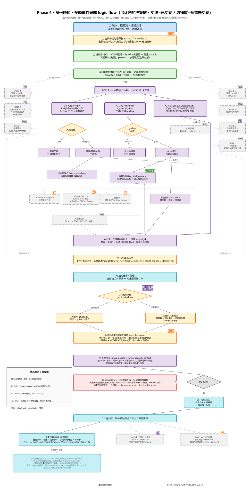

# Video AI PoC — Identity-Aware Multi-Frame Event Understanding

**English** ｜ [中文](README.zh-CN.md)

A video-understanding proof of concept that turns a surveillance stream into an **identity-aware event timeline**.
Traditional CV (face + body ReID + gait) decides **who** is in frame; a multimodal LLM then looks at the
frames and decides **what happened** — producing a per-event narrative (who, when, did what, is it abnormal),
not just a frame-by-frame caption.

Design principle: **cheap CV runs on every frame; the expensive LLM only sees a few selected keyframes per event.**

> 🔗 Repo: https://github.com/Zhijing-W/video-ai-poc

---

## What it does (current main line: Phase 4)

```
video stream
  → ① timed dense sampling (every frame runs local CV — cheap)
  → YOLO detection + ByteTrack tracking (stable track_id)
  → identity providers (pluggable): face + body ReID + gait → WHO
       · face   — InsightFace ArcFace (strongest when the face is clear)
       · body   — OSNet-AIN ReID + subject-memory gallery (returning-subject recall)
       · gait   — SkeletonGait++ (OpenGait, GREW weights) — fallback when no face / back-facing
       · grey-zone track stitching — re-merge ByteTrack fragments of the same person
  → semantic event annotation (new_track / track_left / count_change / identity_hit)
  → streaming windowing (one event window = one LLM call; long events split by duration cap)
  → ② event-driven keyframe selection (cut hundreds of frames down to a few)
  → identity packaging (group by subject) → grounding text for the LLM
  → ③ multimodal gpt-4o cross-frame event understanding (WHO is given, WHAT must be seen in the images)
  → event-window timeline + optional cross-window overall summary
```

The **WHO is given, don't re-identify; WHAT must be read from the images** split is the core idea:
identity comes from traditional CV, and the LLM is told not to re-guess identities but to visually
analyse what each person is actually doing across frames.

## Logic flow

The full **as-planned decision tree** (solid = implemented, dashed-gray = reserved with P1/P2 badges):



> Earlier Phase 1–3 runtime tree: [`docs/phase3-logic-flow.png`](video-understanding-poc/docs/phase3-logic-flow.png).

## Try it

```powershell
cd video-understanding-poc

# 1) Create a virtual env and install deps
python -m venv .venv
.\.venv\Scripts\Activate.ps1
pip install -r requirements.txt

# 2) Configure Azure OpenAI
copy .env.example .env
#   Edit .env: AZURE_OPENAI_ENDPOINT / API_KEY / DEPLOYMENT (a vision model)

# 3a) Event understanding — CLI (end-to-end on one clip)
.\.venv\Scripts\python.exe scripts\event_understand_demo.py --dry-run        # no LLM, verify the pipeline
.\.venv\Scripts\python.exe scripts\event_understand_demo.py                  # real gpt-4o event narrative

# 3b) Or run the web app
.\.venv\Scripts\python.exe -m uvicorn app.main:app --port 8000
```

- **Event monitor** (Phase 4): `http://127.0.0.1:8000/eventmonitor` — pick a sample clip → event-window timeline
- **Live monitor** (Phase 1–3): `http://127.0.0.1:8000/monitor` — per-frame analysis + subject recognition
- Swagger at `/docs`, health at `/health`.

> Gait (SkeletonGait++) needs the OpenGait repo + the GREW checkpoint (~726 MB), both kept outside the git
> repo; paths are configured via `GAIT_*` in `app/core/config.py`. It runs on CPU (slow but same accuracy as
> GPU; switch to `GAIT_DEVICE=cuda` in the cloud).

## Phase status

| Phase | Scope | Status |
|---|---|---|
| **Phase 1** | LLM-first MVP: video → ffmpeg frames → gpt-4o → structured JSON | ✅ Done |
| **Phase 2** | Cost-controlled hybrid: YOLO detection + event gating + smart frame sampling; LLM per-event only | ✅ Done |
| **Phase 3** | Track-and-identify + subject memory: ByteTrack, ReID FAISS gallery, multi-frame fusion, eval | ✅ Done |
| **Phase 4** | **Identity-aware multi-frame event understanding — current main line** | 🚧 In progress (core done) |
| **Phase 5** | End-to-end on Azure (ingest → GPU inference → playback) | 📝 Design |

## Phase 4 — what's built

| Capability | Module | Status |
|---|---|---|
| Two-stage frame selection (① timed dense sampling → ② event-driven keyframes) | `app/video_processor.py` (`fps=`), `app/keyframe.py` | ✅ |
| Face identity (InsightFace ArcFace 512-d, quality gating, multi-frame fusion) | `app/face.py` | ✅ |
| Body ReID upgraded to OSNet-AIN (domain-generalizable, via boxmot) | `app/reid.py` | ✅ |
| Gait identity — **SkeletonGait++** (OpenGait, GREW weights), CPU loader + 4096-d embedding | `app/gait.py` | ✅ core |
| In-video grey-zone track stitching (re-merge fragments of the same person) | `app/event_pipeline.py` (`_stitch_orphans`) | ✅ |
| Structured identity packaging (group by subject → LLM grounding) | `app/services/identity_context.py` | ✅ |
| Identity-aware cross-frame event understanding (WHO given / WHAT from images; 429 backoff) | `app/services/event_understanding.py` | ✅ |
| Streaming event windowing + duration cap; end-to-end orchestration | `app/event_pipeline.py`, `scripts/event_understand_demo.py` | ✅ |
| Cross-window overall event summary | `app/services/event_understanding.py` (`summarize_event_windows`) | ✅ |
| Event-monitor web page (event-window timeline + JSON export) | `app/routers/eventmonitor.py`, `/eventmonitor` | ✅ |
| Gait fusion into identity · bad-case eval · pet/vehicle/package/OCR providers | — | 📝 reserved (P1/P2) |

## Phase 1–3 foundation (reused by Phase 4)

| Capability | Module |
|---|---|
| Multi-object tracking (ByteTrack, stable track_id, per-session isolation) | `app/tracker.py`, `/track` |
| Track gating / three-clock decoupling (reuse when tracks unchanged; LLM only for new subjects) | `app/services/track_gate.py` |
| Subject-memory ReID vector store (FAISS cosine + open-set enrollment + quality gate + negative cache) | `app/gallery.py`, `app/reid.py`, `/identify` |
| Multi-cue fusion + best-frame voting | `app/track_fusion.py`, `/fusion` |
| Evaluation harness (precision/recall + LLM calls per video) | `scripts/eval_phase3.py` |

## Branches

| Branch | Purpose |
|---|---|
| `feature/event-understanding` | 🚩 **Main line** — identity-aware event understanding (active development) |
| `snapshot/baseline-phase1-3` | 🧊 Frozen snapshot — Phase 1–3 restore point (kept as backup) |
| `main` | Integration trunk |

## Docs

- `video-understanding-poc/CODE_MAP.md` — code map (feature → file index)
- `docs/phase/` — Phase 1–5 design documents
- `video-understanding-poc/docs/phase4-logic-flow.svg` — Phase 4 decision tree

---

> 🧭 Phase 4 motto: **identity is given by traditional CV; the LLM looks at the frames and tells the story.**
> 🧭 Cost motto: cheap models carry the volume, tracking + memory handle repetition, the LLM only sees a few keyframes per event.
