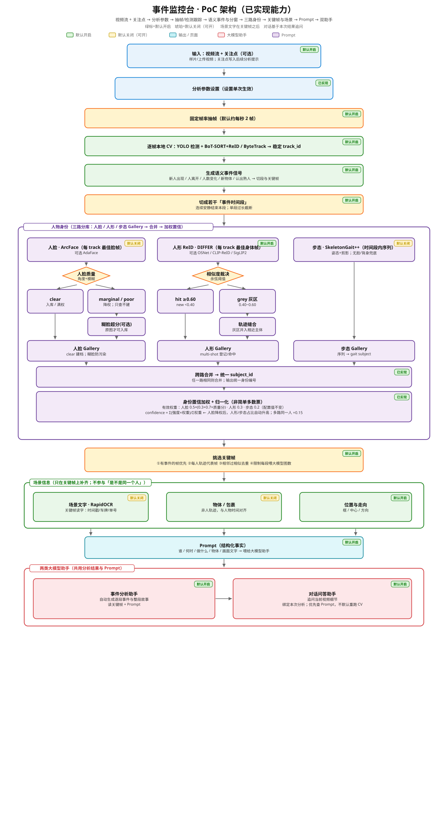

# Event Monitor

Turns surveillance videos into event timelines, alerts, and structured reports that explain who appeared, what happened, and when.

[English](#english) | [中文](#中文)

[](docs/poc-architecture.svg)

---

## English

### Overview

Event Monitor turns a video into an identity-aware event timeline instead of analyzing isolated frames.

```text
Video or future camera stream
  -> frame sampling
  -> object detection and multi-object tracking
  -> body ReID, face recognition, and gait recognition
  -> semantic event windows and keyframe selection
  -> identity, spatial, OCR, and object grounding
  -> multimodal LLM event reports
  -> cross-window overall summary
```

The traditional computer-vision pipeline determines **who is present and where**. The multimodal LLM focuses on **what happened**, using externally supplied identity and spatial context rather than re-identifying people itself.

### Key capabilities

- YOLO detection with ByteTrack or BoT-SORT tracking.
- Body ReID with an open-set, multi-shot subject gallery.
- Optional InsightFace/AdaFace face recognition and face-quality gating.
- Optional SkeletonGait++ gait recognition for distant or back-facing people.
- Quality-aware face/body/gait confidence aggregation.
- Cross-track identity merging and local trajectory stitching.
- Event-driven windowing and keyframe selection.
- Spatial grounding with bounding boxes, centers, and trajectories.
- Scene-level OCR and object/package context.
- Multimodal event reports and a text-only overall video summary.
- Web timeline with keyframes, identity cards, alerts, and per-run settings.
- Dry-run mode for validating the CV pipeline without calling the LLM.
- Compact normalized evidence tables for LLM calls and run follow-up chat.

### Compact LLM evidence protocol

`result.json` remains the canonical JSON artifact. Immediately before a per-window
report, dry-run completion, overall summary, or follow-up chat call, the service
projects that JSON into deterministic `EM-EVIDENCE-TSV/1` tables. Each table has one
header and uses subject IDs and window IDs as references, avoiding repeated JSON
field names while preserving window/time, subjects, actions, spatial evidence, OCR,
and object citations. Tabs, newlines, and Unicode are JSON-escaped inside cells.
OCR and all other supplied evidence are explicitly untrusted, so embedded prompt
injection text is never treated as an instruction. Image data URIs remain multimodal
image inputs and are never copied into text prompts.

After a run, **Download prompt** and **View prompt** offer two server-generated
formats for that run only: **Canonical JSON** is the persisted source result, and
**Compact table (TSV/CSV-style)** is the exact evidence-only TSV serializer used for
LLM context. Trusted task instructions remain server-owned because they vary by LLM
operation; they are not exported. The endpoint validates the run ID and format,
reads only that run's `result.json`, and omits inline image data and secret-like
fields. TSV downloads use the `.tsv` extension.

`EVENT_EVIDENCE_MAX_CHARS` caps the complete projection; the
`EVENT_EVIDENCE_TABLE_MAX_ROWS` and `EVENT_EVIDENCE_TABLE_MAX_CHARS` limits bound
each nonessential table. When a long recording is trimmed, the `TRUNCATION` table
reports the limits and omitted rows. Every window retains a time-range and summary
citation before deterministic priority evidence (events, subjects, objects, OCR,
and spatial data) is added. At the configured lower bound, this invariant uses the
ultra-compact `WINDOW_MIN_UNTRUSTED` table; an impossibly small direct caller budget
is rejected rather than claiming that dropped citations were preserved.

### Requirements

- Windows or Linux.
- Python 3.11 or 3.12.
- `ffmpeg` available on `PATH`.
- An Azure OpenAI or Foundry vision-capable deployment for LLM event reports.
- GPU is optional. CPU execution is supported but face, gait, and super-resolution are slower.

### Quick start

```powershell
git clone --branch feature/event-understanding --single-branch https://github.com/Zhijing-W/video-ai-poc.git
cd video-ai-poc

python -m venv .venv
.\.venv\Scripts\python.exe -m pip install -r requirements.txt

copy .env.example .env
# Edit .env and provide your Azure OpenAI endpoint, API key, and deployment.

.\.venv\Scripts\python.exe scripts\download_models.py --all
.\.venv\Scripts\python.exe -m uvicorn app.main:app --port 8000
```

Open:

- Event Monitor: <http://127.0.0.1:8000/event-monitor>
- API documentation: <http://127.0.0.1:8000/docs>
- Health check: <http://127.0.0.1:8000/health>

Linux/macOS users can replace `.\.venv\Scripts\python.exe` with `.venv/bin/python`.

### Main API

| Endpoint | Purpose |
|---|---|
| `GET /api/event-monitor/samples` | List locally available sample videos |
| `POST /api/event-monitor/understand` | Run the complete video-to-event pipeline |
| `POST /api/event-monitor/complete` | Continue a dry run with the LLM without rerunning CV |
| `GET /api/event-monitor/runs/{run_id}/prompt?format=json\|tsv` | Download/view a run-scoped canonical JSON or compact evidence artifact |
| `GET /api/event-monitor/llm-models` | List active vision-capable Azure OpenAI deployments available to the UI |
| `GET /api/event-monitor/reid-backends` | List registered body ReID backends |
| `GET /api/event-monitor/superres-backends` | List registered face super-resolution backends |
| `GET /health` | Service health |

The legacy page path `/eventmonitor` redirects to `/event-monitor`.

### Models

Git stores only model manifests and instructions, never model binaries. Models are
shared outside the checkout through `MODEL_ROOT`, which defaults to
`~/.cache/event-monitor/models`.

```text
~/.cache/event-monitor/models/
├── detection/yolo/
├── face/
├── superres/
├── reid/
└── gait/
```

Prepare all standard product models with:

```powershell
python scripts\download_models.py --all
```

See [`models/README.md`](models/README.md) for InsightFace, AdaFace, OpenGait, and GFPGAN setup.

Product runtimes never download weights implicitly. They load a selected backend
lazily from `MODEL_ROOT` and return an explicit error when its local assets are
missing. Only ReID `auto` may fall back (`OSNet -> ResNet50 -> coarse`).

### Data

Large datasets, customer videos, generated outputs, and licensed papers are not committed.

```text
data/
├── samples/       # small, license-compatible local demo videos
├── external/      # manually downloaded datasets and local references
└── generated/     # optional preprocessing cache
```

The UI also accepts uploaded videos, so bundled sample data is not required. See [`data/README.md`](data/README.md).
If `data/samples/` contains a local demo clip, it will show up in `/api/event-monitor/samples`.
An optional `<video-stem>.gallery.json` sidecar can explicitly pre-seed named body
and face references before video frames are processed. Asset paths are relative to
the sidecar and must remain inside `data/samples/`; gallery images never enter
tracking, event counts, or the timeline. Use references from the same licensed
dataset and a different camera than the continuous analysis clip.

### Configuration

Copy `.env.example` to `.env`. Important settings include:

| Setting | Meaning |
|---|---|
| `AZURE_OPENAI_ENDPOINT` | Azure OpenAI or Foundry endpoint |
| `AZURE_OPENAI_API_KEY` | API credential; never commit it |
| `AZURE_OPENAI_DEPLOYMENT` | Vision-capable model deployment |
| `DATA_DIR`, `OUTPUT_DIR`, `GALLERY_DIR` | Runtime storage locations |
| `TRACK_BACKEND` | `botsort` (default), `bytetrack`, or the more expensive `botsort_reid` |
| `TRACK_REID_BACKEND` | Lightweight tracker-only appearance encoder (`osnet`) |
| `EVENT_TRACKING_FPS` | High-rate CV/MOT cadence, independent from semantic/LLM sampling |
| `TRACK_BUFFER_SECONDS` | Time-based lost-track retention, converted to tracker frames at runtime |
| `TRACK_ENROLL_MIN_SECONDS` | Minimum duration for auto-enrolling a new identity; known-gallery matching remains immediate |
| `IDENTITY_AUTO_ENROLL_UNKNOWN` | Keep `false` so only pre-registered named identities persist; enabling it also restores unnamed reuse |
| `IDENTITY_MERGE_UNNAMED_TRACKS` | Keep `false` to prefer fragmentation over false merges for unnamed people |
| `GAIT_SAMPLE_FPS` | Temporal sampling rate for gait inside active event windows |
| `MODEL_ROOT` | Shared model directory outside the Git checkout |
| `REID_BACKEND` | Default `differ` (accuracy-first); may be `auto`, `osnet`, `resnet50`, `coarse`, `clipreid`, or `siglip2` |
| `FACE_REC_BACKEND` | `arcface` or `adaface` |
| `FACE_SUPERRES` | `off`, `gfpgan`, `codeformer`, or `realesrgan_x2plus` |
| `FACE_CODEFORMER_FIDELITY` | CodeFormer identity fidelity in `[0,1]`; default `1.0` is identity-first |
| `FACE_CODEFORMER_WEIGHTS` | Optional local path or URL for CodeFormer weights |
| `FACE_REALESRGAN_X2PLUS_WEIGHTS` | Optional local path or URL for Real-ESRGAN x2plus weights |
| `GAIT_ENABLED` | Enable the optional gait provider |
| `OCR_ENABLED` | Enable scene-level OCR |
| `OBJECT_DETECT` | Enable object/package context |

The web settings panel can override selected options for one run without permanently modifying `.env`.

Super-resolution dispatch lives in
`app/identity/face/super_resolution.py`; it owns only the light registry and
dispatch. GFP-GAN, CodeFormer, and Real-ESRGAN adapters live under
`app/identity/face/superres_backends/` and lazily import model libraries only
when selected. To add another algorithm, create an adapter module exposing
`register(register_backend, settings)`, register a lazy loader/enhancer pair,
and import/call that module with the other built-ins. The API and UI discover
registered names through `/api/event-monitor/superres-backends`.
CodeFormer is integrated for research/non-commercial evaluation under S-Lab
License 1.0; commercial deployment requires separate permission. The complete
notice is in `licenses/CodeFormer-S-Lab-License-1.0.txt`.

Body ReID dispatch lives in `app/body_reid.py`. Each model-specific adapter lives
under `app/identity/body_reid_backends/` and is registered with a lazy loader and
embedder. CLIP-ReID, SigLIP2, and DIFFER are selectable through the same API/UI
catalog; none of their official source trees or checkpoints is imported at process
startup.
Under the current frozen evaluation protocol, the product default is accuracy-first
DIFFER for the GPU POC. CLIP-ReID remains the latency-sensitive option. Explicit API/UI,
CLI-process environment, and `.env` selections continue to override the default;
`auto` retains its OSNet-to-ResNet50-to-coarse fallback order.
Each analysis result includes `body_reid_timing`: the effective backend/device,
per-crop call count, cumulative/mean latency, and deterministic nearest-rank P95.
The timer covers crop preprocessing through model forward, host result transfer,
validation, and L2 normalization; it excludes model loading and gallery lookup.
Tracking, final identity/gallery, and face-consistency call sites are attributed
separately. These overlapping per-call totals are diagnostic and must not be added
to the mutually exclusive `stage_timings`. DIFFER CPU and high-concurrency
performance are not validated; operators should measure the target demo video on
the target hardware (including the intended T4) before making a latency claim.
The Event Monitor presents post-run `stage_timings` in a collapsed-by-default
details panel. Its bars are relative to the longest measured stage (with a distinct
marker for sub-1% nonzero stages), and are not live progress indicators.

### Project structure

```text
app/
├── main.py
├── event_analysis_pipeline.py       # compatibility facade
├── pipeline/                        # session, windowing, spatial/object context
├── identity/                        # gallery, resolution, confidence, face quality
├── detector.py
├── tracker.py
├── body_reid.py
├── body_gallery.py                  # compatibility import
├── face.py
├── gait.py
├── ocr.py
├── keyframe.py
├── routers/
└── services/

static/            # modular Event Monitor frontend
templates/         # HTML entry
tests/             # behavior and API contract tests
scripts/           # demos, model setup, evaluation, and diagram generation
experiment/        # experiment code, manifests, reports, and figures
docs/              # architecture, deployment, and design documentation
infra/             # Bicep and deployment scripts
charts/            # Helm chart
models/            # manifests plus local ignored weights
data/              # documentation plus local ignored data
```

See [`CODE_MAP.md`](CODE_MAP.md) for feature-to-file ownership.

Install `requirements-dev.txt` when running the behavior-protection tests.

### Docker and Azure deployment

- `Dockerfile.cpu`: CPU deployment.
- `Dockerfile.gpu.base`: stable CUDA/Python dependency image.
- `Dockerfile.gpu`: lightweight GPU application image built from the dependency image.
- `charts/video-poc/`: Helm deployment.
- `infra/`: Azure provisioning and deployment scripts.
- [`docs/AZURE_DEPLOY.md`](docs/AZURE_DEPLOY.md): deployment guide.
- [`docs/cloud-deploy/`](docs/cloud-deploy/): cloud architecture documentation.

Models and runtime data should be mounted into containers instead of baked into images.
Runnable code under `experiment/` is included in CPU/GPU images; experiment datasets, outputs, and local papers remain excluded.

### Experiments and documentation

- [`docs/poc-architecture.svg`](docs/poc-architecture.svg): code-evidence PoC architecture (`phase4-logic-flow.*` kept as alias).
- [`docs/face-quality-and-identity-fusion.md`](docs/face-quality-and-identity-fusion.md): face quality and identity aggregation.
- [`experiment/face_blur_ablation/`](experiment/face_blur_ablation/): face-quality and multimodal identity experiments.
- Local-only papers and licensed datasets belong under `data/external/`.

### Reproducibility notes

- The core detection/tracking pipeline can run without optional face, gait, OCR, or super-resolution providers.
- LLM event generation requires valid Azure OpenAI/Foundry credentials.
- Optional third-party models must follow their own licenses.
- Event processing is serialized in the current PoC to prevent per-request model settings and identity state from interfering with each other.
- The repository does not include customer data, large public datasets, model binaries, secrets, or generated output.

The previous frame-by-frame monitor is preserved on the [`feature/monitor-v1`](https://github.com/Zhijing-W/video-ai-poc/tree/feature/monitor-v1) branch.

---

## 中文

### 项目简介

Event Monitor 不再孤立地逐帧分析，而是把视频转换为带人物身份的事件时间线。

```text
视频或后续摄像头流
  -> 抽帧
  -> 目标检测与多目标跟踪
  -> 人形 ReID、人脸识别、步态识别
  -> 语义事件分窗与关键帧选择
  -> 身份、空间、OCR 和物体信息打包
  -> 多模态 LLM 事件报告
  -> 跨事件窗整段总结
```

传统视觉模块负责确定**谁在画面中、位于哪里**；多模态 LLM 主要理解**发生了什么**，不重新做人脸或人物身份识别。

### 主要能力

- YOLO 检测以及 ByteTrack/BoT-SORT 跟踪。
- 人形 ReID、开放集登记和多样本主体库。
- 可选 InsightFace/AdaFace 人脸识别及人脸质量门控。
- 可选 SkeletonGait++ 步态识别，为远距离、背身和无脸场景兜底。
- 人脸、人形和步态的质量自适应置信度聚合。
- 跨轨迹身份合并和视频内轨迹缝合。
- 事件驱动的分窗与关键帧选择。
- 包含人物框、中心点和运动轨迹的空间定位信息。
- 场景级 OCR 和物品/包裹上下文。
- 逐事件窗报告及整段视频总结。
- 带关键帧、身份卡、告警和设置面板的 Web 时间线。
- 不调用 LLM 的 dry-run 链路检查。

运行结束后的“下载 prompt”和“查看 prompt”均由服务端按 run 生成：**规范 JSON**
是持久化的源结果，**紧凑表格（TSV/CSV 风格）**是送入 LLM 上下文时使用的精确、
仅证据 TSV 序列化。可信任务指令会随具体 LLM 操作变化，故仍由服务端持有，不会导出。
接口只读取已验证 run 的 `result.json`，并省略内联图片数据和疑似密钥字段；表格下载使用
`.tsv` 扩展名。

### 环境要求

- Windows 或 Linux。
- Python 3.11 或 3.12。
- 系统 `PATH` 中可以调用 `ffmpeg`。
- 生成事件报告需要 Azure OpenAI 或 Foundry 的视觉模型部署。
- GPU 不是必需；CPU 可以运行，但人脸、步态和超分会更慢。

### 快速启动

```powershell
git clone --branch feature/event-understanding --single-branch https://github.com/Zhijing-W/video-ai-poc.git
cd video-ai-poc

python -m venv .venv
.\.venv\Scripts\python.exe -m pip install -r requirements.txt

copy .env.example .env
# 编辑 .env，填写 Azure OpenAI endpoint、API key 和 deployment。

.\.venv\Scripts\python.exe scripts\download_models.py --include-optional-yolo
.\.venv\Scripts\python.exe -m uvicorn app.main:app --port 8000
```

访问：

- Event Monitor：<http://127.0.0.1:8000/event-monitor>
- API 文档：<http://127.0.0.1:8000/docs>
- 健康检查：<http://127.0.0.1:8000/health>

Linux/macOS 将 `.\.venv\Scripts\python.exe` 替换为 `.venv/bin/python`。

### 主要接口

| 接口 | 作用 |
|---|---|
| `GET /api/event-monitor/samples` | 列出本地样片 |
| `POST /api/event-monitor/understand` | 运行完整的视频事件理解流程 |
| `POST /api/event-monitor/complete` | 在不重跑视觉链路的情况下继续完成 dry-run |
| `GET /api/event-monitor/runs/{run_id}/prompt?format=json\|tsv` | 查看/下载指定 run 的规范 JSON 或紧凑证据表格 |
| `GET /api/event-monitor/llm-models` | 列出 UI 可选择的、已启用且支持视觉输入的 Azure OpenAI deployment |
| `GET /health` | 服务健康检查 |

旧页面地址 `/eventmonitor` 会自动跳转到 `/event-monitor`。

### 模型与数据管理

Git 只保存模型清单和下载说明，不保存模型二进制。

```powershell
python scripts\download_models.py --include-optional-yolo
```

人脸、AdaFace、OpenGait 和 GFPGAN 的配置见 [`models/README.md`](models/README.md)。

大型数据集、客户视频、运行输出和论文 PDF 不进入 Git。本地数据统一放在 `data/`，具体规范见 [`data/README.md`](data/README.md)。

### 配置

复制 `.env.example` 为 `.env`。主要配置包括：

- Azure OpenAI/Foundry endpoint、API key 和 deployment。
- `DATA_DIR`、`OUTPUT_DIR`、`GALLERY_DIR`。
- 跟踪和 ReID backend。
- 人脸、超分、步态、OCR 和物体检测开关。
- 事件窗长度、关键帧数量以及身份融合阈值。

设置页面可以只覆盖本次运行参数，不会永久修改 `.env`。

### 代码结构

- `app/event_analysis_pipeline.py`：兼容入口；内部编排已拆到 `app/pipeline/`。
- `app/detector.py`、`app/tracker.py`：检测与跟踪。
- `app/body_reid.py`、`app/identity/embedding_gallery.py`：人形特征和通用向量库。
- `app/identity/resolution.py`：轨迹缝合、跨路线合并和时间冲突拆分。
- `app/face.py`、`app/identity/face/`、`app/gait.py`：人脸质量/识别和步态。
- `app/ocr.py`：场景级文字。
- `app/identity/identity_context.py`：身份信息打包。
- `app/services/event_reporter.py`：逐窗事件报告和整段总结。
- `static/js/event-monitor/`、`static/css/event-monitor/`：模块化 Event Monitor 前端。
- `tests/`：分窗、身份、人脸质量、API 和输出契约测试。
- `experiment/`：实验代码、清单、结果和图表。
- `docs/`：架构、设计与部署文档。
- `infra/`、`charts/`：Azure 和 Kubernetes 部署。

功能与文件的完整映射见 [`CODE_MAP.md`](CODE_MAP.md)。

需要运行行为保护测试时安装 `requirements-dev.txt`。

### 部署

- `Dockerfile.cpu`：CPU 镜像。
- `Dockerfile.gpu.base`：稳定的 CUDA/Python 依赖镜像。
- `Dockerfile.gpu`：基于依赖镜像构建的轻量 GPU 应用镜像。
- `charts/video-poc/`：Helm Chart。
- `infra/`：Azure 基础设施和部署脚本。
- [`docs/AZURE_DEPLOY.md`](docs/AZURE_DEPLOY.md)：部署说明。

模型和运行数据应通过云存储或 PVC 挂载，不应直接打进镜像。
`experiment/` 下的可运行实验代码会进入 CPU/GPU 镜像；实验数据、输出和本地论文资料仍会排除。

### 实验与复现说明

- PoC 架构图（代码证据对齐）：[`docs/poc-architecture.svg`](docs/poc-architecture.svg)（`phase4-logic-flow.*` 为兼容别名）。
- 人脸质量与身份逻辑：[`docs/face-quality-and-identity-fusion.md`](docs/face-quality-and-identity-fusion.md)。
- 糊脸和多模态身份实验：[`experiment/face_blur_ablation/`](experiment/face_blur_ablation/)。
- 论文和受许可约束的数据仅保存在本地 `data/external/`。
- LLM 报告必须配置有效的 Azure OpenAI/Foundry 凭据。
- 当前 PoC 将事件分析请求串行执行，避免请求级模型设置与身份状态互相影响。

旧版逐帧监控保存在 [`feature/monitor-v1`](https://github.com/Zhijing-W/video-ai-poc/tree/feature/monitor-v1) 分支。
