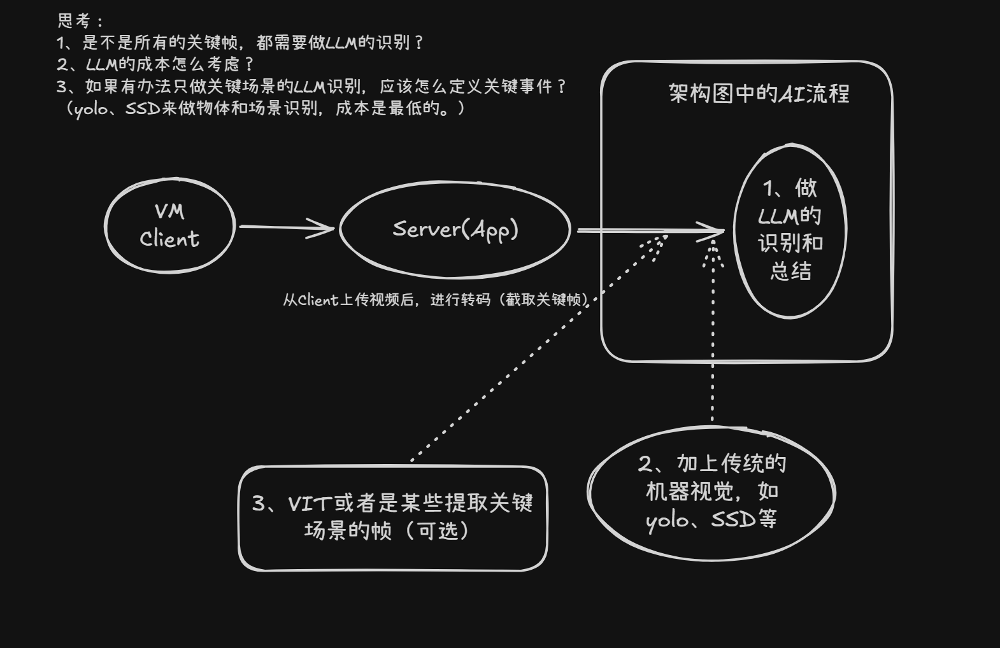
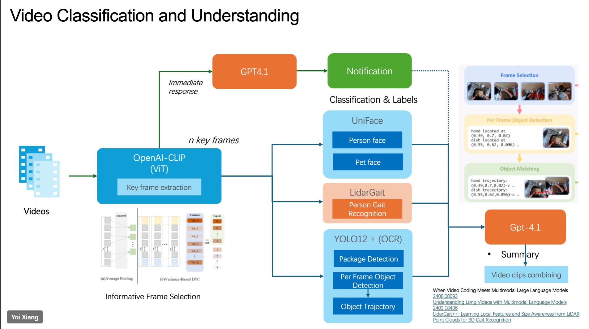

# Demo 推进计划

> 创建：2026-06-11（周四） ｜ 角色：CSA 入职培训 ｜ 目标：完成 mentor 要求的"产品基础操作 + 原理理解 + 整合 Demo 开发"

---

## 一、时间轴总览

| 日期 | 星期 | 主线 | 关键事项 |
|---|---|---|---|
| **6/11** | 四（今天） | Azure 学习 | 完成**网络 Demo 动手实验**（Load Balancer Lab01） |
| **6/12** | 五 | Azure 学习 | 上午整理 + 学习 **Compute** 文档；下午 **CSU 技术分享会** |
| **6/15** | 一 | Azure 学习 | 争取**完成 Compute 学习** |
| **6/16** | 二 | Azure 学习 + 重要会议 | 跑完 **Compute Demo 动手实验**；下午 **侯总 Round Table** |
| **6/17** | 三（截止线） | Azure 学习 + Demo | 写完 **Azure 学习总结文档**；Demo 前置模块技术方案写完 + 环境搭好；与 **jiawei 老师**对业务需求 |

> ⏰ **硬截止**：Compute 学习最迟 **6/17（周三）** 完成。

---

## 二、主线一：Azure 文档学习（Compute）

**目标**：本周（最迟下周三 6/17）完成对 **Compute（计算）** 的学习，闭环成笔记 + 实验 + 总结。

- [ ] **6/11 周四**：完成网络 Demo 动手实验（Load Balancer Lab01）
- [ ] **6/12 周五上午**：整理 + 学习 Compute 文档（按 `azure-learn` skill：截图分级 → 爬官方文档 → 拆板块笔记）
- [ ] **6/15 周一**：完成 Compute 学习（笔记成型）
- [ ] **6/16 周二**：跑完 Compute Demo 动手实验（走 `azure-lab` skill：先读 `00-实验环境配置清单.md`，做完回填）
- [ ] **6/17 周三前**：产出《Azure 学习总结文档》（VNet / App Gateway / Load Balancer / Compute 串成体系）

---

## 三、主线二：视频理解 Demo 架构搭建

**本周目标**：完成架构**前段链路**——视频输入 → 转码（截取关键帧）→ 上传 Blob；并在 **6/17 周三前**把每个模块"具体要用到的技术"都写清楚，前段实际 VM 与环境搭好。

### 3.1 架构思路（草图）

**这张图说什么**：一条端到端的视频理解链路——
- **VM Client → Server(App)**：客户端把视频上传到服务端 App。
- **转码 / 关键帧提取**：原文"从 Client 上传视频后，进行转码（截取关键帧）"——把视频拆成若干帧，避免对整段视频逐帧硬算。
- **AI 流程（右侧大框）三层**：
  1. **LLM 识别与总结**：对关键帧/场景做语义理解和总结（最贵的一层）。
  2. **传统机器视觉兜底**：YOLO、SSD 做物体/场景识别，**成本最低**，承担大部分粗筛。
  3. **ViT / 关键场景帧提取（可选）**：进一步只挑"信息量大"的帧喂给上层。

**图里留的三个思考题（正是 Demo 的成本/架构权衡点，值得和老师聊）**：
1. 是不是**所有关键帧都要走 LLM**？（不一定，贵）
2. **LLM 成本**怎么控？
3. 如果只对"关键场景"做 LLM，**关键事件怎么定义**？（用 YOLO/SSD 先做廉价识别筛选）

> 💡 个人理解：这本质是**"廉价模型粗筛 → 昂贵模型精算"的分层架构**，CSA 视角的核心卖点就是"在保证效果的前提下压成本"。

### 3.2 完整目标架构（参考）

**这张图说什么**（Video Classification and Understanding 完整版）：
- **Videos → OpenAI-CLIP (ViT) 关键帧提取**：底部 *Informative Frame Selection*（Average Pooling / Variance-Based）负责"挑出有信息量的 n 帧"，对应 3.1 里的第 3 层。
- **n key frames 分流到多个识别模块**：
  - **即时响应**：关键帧直接给 **GPT4.1 → Notification**（分类与标签，做实时告警）。
  - **UniFace**：人脸 / 宠物脸识别。
  - **LidarGait**：步态识别（Person Gait Recognition）。
  - **YOLO12 + OCR**：包裹检测、逐帧物体检测、物体轨迹（Object Trajectory）。
- **汇总**：各模块结果 → **GPT-4.1 做 Summary → Video clips combining**（把片段拼成有意义的结果）。
- **右侧示例**：Frame Selection → Per Frame Object Detection（标坐标）→ Object Matching（连成轨迹），是 YOLO 那条链的可视化。

> 💡 个人理解：图 1 是"我要先搭的最小链路 + 成本思考"，图 2 是"最终形态的全貌"。**本周只啃图 1 左半段**（输入→转码→Blob），右侧 AI 模块后续再接。

### 3.3 本周任务（6/17 周三前）

- [ ] **前段链路搭建**：视频输入 → 转码（截取关键帧）→ 上传 Blob
  - [ ] VM Client / Server(App) 实际开起来（复用 `zhijing-lab` 环境，先读配置清单）
  - [ ] 转码 + 关键帧提取跑通（工具选型先记下来）
  - [ ] 关键帧/视频上传到 **Blob Storage**
- [ ] **技术清单**：把架构图里**每个模块**计划用到的技术写清楚（转码、CLIP/ViT、YOLO/SSD、LLM、Blob 等各自的选型与作用）
- [ ] **6/17 周三**：和 **jiawei 老师**聊实际业务需求 + 技术指导，校准方向

---

## 四、关键日程（别错过）

- [ ] **6/12 周五 14:00–15:00**：**CSU 技术分享会**（线下）
  - 地点：**Conf Room SHENZHEN-COMTECH / 3035 (12) Lotus**
- [ ] **6/16 周二**：**侯总 Round Table**（peter 老师组织）
  - 地点：**3032** ｜ 🌟 珍贵学习机会，提前想好想听/想问的点

---

## 五、本周成功标准（自检）

- [ ] Compute 学习闭环：笔记 + 动手实验 + 学习总结文档
- [ ] Demo 前段链路（输入→转码→Blob）实际跑通
- [ ] 每个模块技术选型有书面清单
- [ ] 和 jiawei 老师对齐了业务需求
- [ ] 参加了 CSU 分享会 与 侯总 Round Table
