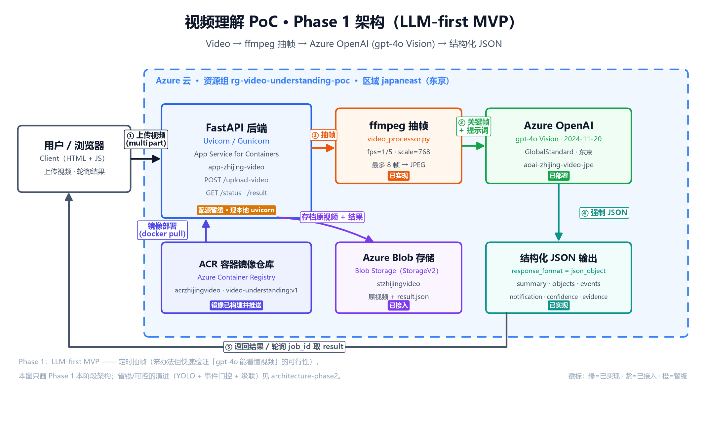

# 视频理解 Demo · Phase 1 — LLM-first MVP（部署进度记录）

> 🔖 **用途**：记录这个视频理解 PoC **Phase 1（LLM-first MVP）** 的搭建进度。**每次开工前先读这份**，就知道上次做到哪、下一步干什么。
> 🛠️ **维护约定**：每完成一步，回来勾选 + 填实际值（资源名/endpoint/部署名等）；改架构就重跑 `video-understanding-poc/scripts/make_arch_diagram.py` 并同步本文。
> ⏱️ **最后更新**：2026-06-16（Step 4 镜像已构建；部署被订阅配额卡住，暂缓本地演示）
> 🔙 **上一阶段**：无（本项目起点）
> 🚀 **下一阶段**：Phase 2（成本可控混合架构）见 [`Phase2-成本可控混合架构.md`](Phase2-成本可控混合架构.md)

---

## 架构总览（Phase 1）



> 图说：用户上传视频 → FastAPI（App Service）异步入队 → ffmpeg 定时抽帧 → gpt-4o（东京）视觉理解 → 强制结构化 JSON → 返回用户；原视频/结果可选存 Blob。
> 矢量图 `../../assets/architecture-phase1.svg`，由 `video-understanding-poc/scripts/make_arch_diagram.py` 生成，改了再跑一次即可更新。

---

## 一、这个 Demo 是什么（一句话）

视频 → ffmpeg 抽几帧关键画面 → Azure OpenAI vision 模型理解 → 返回结构化 JSON（summary / 物体 / 事件 / 通知 / 置信度）。
**Phase 1 = LLM-first MVP**，先本地跑通代码逻辑，再上 Azure 部署。不做 YOLO/CLIP/Tracking（那是 Phase 2+）。

详细架构：`../Azure_Video_Understanding_POC_Phase1_Architecture.md`
代码工程：`video-understanding-poc/`

---

## 二、推进路线（4 步）

```
Step 0  拆雷：Azure OpenAI 部署一个 vision 模型(gpt-4o)        ✅ 已完成（东京 GlobalStandard）
Step 1  本地装 Python + 项目骨架                                 ✅ 已完成
Step 2  本地竖切脚本：视频→抽帧→调OpenAI→输出JSON               ✅ 已跑通（首条 JSON 8.3s）
Step 3  包成 FastAPI（/upload-video）+ Blob 上传                ✅ 本地跑通（异步任务+轮询）
Step 4  容器化 + 部署 Azure App Service                          🟡 镜像已构建，部署被订阅配额卡住（暂缓）
```

---

## 三、进度清单（开工前核对）

### Step 1 · 本地代码骨架 ✅ 已完成（2026-06-15）
- [x] 装 Python 3.12.10 + venv + 依赖（fastapi/openai/azure-storage-blob/imageio-ffmpeg 等）
- [x] 项目骨架 `video-understanding-poc/`：config / utils / video_processor / llm_client
- [x] 竖切脚本 `scripts/vertical_slice.py`
- [x] **抽帧链路已实测通过**（用 `ffmpeg-learning/output/short_video.mp4` 抽出 3 帧）
- [x] 本地 ffmpeg 可用（8.1.1）

### Step 0 · Azure OpenAI 资源（云上，Cloud Shell az 操作）✅ 已完成（2026-06-15）
- [x] 新建资源组 `rg-video-understanding-poc`（订阅 Workshop，区域 East Asia）
- [x] **踩坑**：Southeast Asia 不支持 gpt-4o 的按量付费 SKU（只有 Provisioned 预留型）→ 弃用
- [x] 新建 **Azure OpenAI 资源** `aoai-zhijing-video-jpe`（**东京 japaneast**，经典版，S0）
- [x] 部署 **gpt-4o**（版本 `2024-11-20`，**GlobalStandard** 按量付费，容量 10）
- [x] 3 个值已填进 `video-understanding-poc/.env`：
  - `AZURE_OPENAI_ENDPOINT` = `https://aoai-zhijing-video-jpe.openai.azure.com/`
  - `AZURE_OPENAI_API_KEY` = （Cloud Shell `keys list` 取的 key1，⚠️ 已泄露需轮换，见注意事项）
  - `AZURE_OPENAI_DEPLOYMENT` = `gpt-4o`

### Step 2 · 本地竖切验证 ✅ 已完成（2026-06-15）
- [x] `.env` 已填东京资源凭据
- [x] `.\.venv\Scripts\python.exe scripts\vertical_slice.py` 跑通（3 帧，**8.3s**）
- [x] 得到 `out/result.json`，含 summary/detected_objects/possible_events/notification/confidence/evidence/limitations
- [x] 验收：summary 能描述视频内容，evidence 带时间戳，limitations 诚实标注不确定性 → **质量够用**

### Step 3 · FastAPI + Blob ✅ 本地跑通（2026-06-15）
- [x] `app/pipeline.py`：抽帧→理解→JSON 核心逻辑抽出，API 与竖切脚本共用
- [x] `app/main.py`：`POST /upload-video`（异步入队，返回 job_id）、`GET /status/{id}`、`GET /result/{id}`、`GET /health`、`GET /`（上传网页）
- [x] `app/storage.py`：Blob 上传封装，**未配置 Storage 时自动降级纯本地**（连接字符串或账户名+RBAC 两种启用方式）
- [x] `templates/index.html`：演示用上传页（选文件→轮询→展示 JSON）
- [x] 本地 `uvicorn app.main:app` 实测：上传 short_video.mp4 → 8.87s → 返回结构化 JSON ✅
- [ ] （可选）建 Storage Account + 容器 `video-understanding-poc`，填 `.env` 后自动开启 Blob 落盘
- [x] **已建 Storage `stzhijingvideo`（japaneast）**，`.env` 填连接字符串后 Blob 自动开启；实测上传后容器内有 `原视频 + result.json` ✅
- 运行命令：`.\.venv\Scripts\python.exe -m uvicorn app.main:app --port 8000`，浏览器开 `http://127.0.0.1:8000/`（Swagger 在 `/docs`）

### Step 4 · 部署 App Service 🟡 镜像已构建，部署被配额卡住（暂缓，本地演示为主）
- [x] `Dockerfile`（python:3.12-slim + 系统级 ffmpeg）+ `.dockerignore`
- [x] 部署包 `Demo推进/vu-deploy.zip`（仅镜像所需文件，无密钥/venv）
- [x] **ACR `acrzhijingvideo` 已建**，`az acr build` 云端构建成功，镜像 `video-understanding:v1` 已推送
- [ ] **被卡**：`az appservice plan create` 报 `Total VMs quota = 0`（Workshop 订阅计算配额为 0）→ 需申请配额或换订阅
- [ ] 待配额到位后：建 Plan + Web App + 绑镜像 + 配 App Settings + 重启（命令见第六节运行手册）
- [ ] 公网 endpoint `/` 与 `/docs` 演示
- **决定**：MVP 功能已在本地验证，先用本地 `uvicorn` 给 mentor 演示；攒齐 Phase 2 功能后再回来完成上云。

---

## 四、已建 Azure 资源台账（建一个填一个）

| 资源 | 名称 | 区域 | 状态 | 备注 |
|---|---|---|---|---|
| 资源组 | `rg-video-understanding-poc` | East Asia | ✅ 已建 | PoC 专用，玩完整组删 |
| Azure OpenAI | `aoai-zhijing-video` | Southeast Asia | ⚠️ 待删 | 该区无按量付费 SKU，弃用，验证完删 |
| Azure OpenAI | `aoai-zhijing-video-jpe` | **japaneast 东京** | ✅ 在用 | 经典版 S0；endpoint 见 .env |
| gpt-4o 部署 | `gpt-4o` (2024-11-20) | — | ✅ 已部署 | GlobalStandard，= .env DEPLOYMENT |
| Storage Account | `stzhijingvideo` | japaneast | ✅ 已建 | Standard_LRS；容器 `video-understanding-poc`（代码自动建） |
| ACR 容器仓库 | `acrzhijingvideo` | japaneast | ✅ 已建 | 镜像 `video-understanding:v1` 已推；Basic≈¥35/月，长期不用可删 |
| App Service | `app-zhijing-video`(计划) | japaneast | 🟡 待建 | 被订阅 VM 配额=0 卡住，暂缓 |

---

## 五、注意事项 / 已知风险

1. **资源组区域无所谓**：East Asia 只是元数据；模型可用性由 **Azure OpenAI 资源区域**决定。
2. **公司租户 Azure OpenAI 可能需申请权限** —— 头号风险，建资源时留意是否被拦。
3. **gpt-4o 必须支持 vision（看图）**；部署时区域里没有就换 East US / Sweden Central。
4. **不需要任何 VM**：全程本地电脑 + PaaS 服务；架构里的 "VM Client" 指浏览器/本机。
5. **API key 只进 `.env`（已 gitignore）**，别提交仓库；后续迁 Managed Identity。
6. **清理省钱**：玩完 `az group delete -n rg-video-understanding-poc --yes`，不连累 `zhijing-lab`。

---

## 六、下一步该做什么（给未来的自己）

> **现状（2026-06-15）**：Step 0/1/2/3 全部完成；Step 4 镜像已构建推上 ACR，但 `az appservice plan create`
> 被 **Workshop 订阅 VM 配额=0** 卡住。**决定先停在本地**：MVP 已验证，给 mentor 用本地服务演示即可，
> 攒齐 Phase 2 功能 + 解决配额后再回来一键上云。

### 本地演示（给 mentor 看，效果同云端）
```powershell
cd video-understanding-poc
.\.venv\Scripts\python.exe -m uvicorn app.main:app --port 8000
# 浏览器开 http://127.0.0.1:8000/ （上传页）或 /docs （Swagger）
```

### Step 4 续传运行手册（配额到位后照抄）
前置：`vu-deploy.zip` 上传 Cloud Shell 解压；ACR `acrzhijingvideo` 与镜像 `video-understanding:v1` 已就绪。
```bash
# 0) 申请/确认配额后再继续；建 Plan（Linux B1）
az appservice plan create -n plan-vu -g rg-video-understanding-poc --is-linux --sku B1 -l japaneast
# 1) ACR 凭据
ACR_USER=$(az acr credential show -n acrzhijingvideo --query username -o tsv)
ACR_PASS=$(az acr credential show -n acrzhijingvideo --query 'passwords[0].value' -o tsv)
# 2) 建 Web App + 绑镜像
az webapp create -g rg-video-understanding-poc -p plan-vu -n app-zhijing-video \
  --deployment-container-image-name acrzhijingvideo.azurecr.io/video-understanding:v1
az webapp config container set -g rg-video-understanding-poc -n app-zhijing-video \
  --docker-custom-image-name acrzhijingvideo.azurecr.io/video-understanding:v1 \
  --docker-registry-server-url https://acrzhijingvideo.azurecr.io \
  --docker-registry-server-user "$ACR_USER" --docker-registry-server-password "$ACR_PASS"
# 3) App Settings（密钥从 .env 取，勿明文长留）
az webapp config appsettings set -g rg-video-understanding-poc -n app-zhijing-video --settings \
  WEBSITES_PORT=8000 \
  AZURE_OPENAI_ENDPOINT="https://aoai-zhijing-video-jpe.openai.azure.com/" \
  AZURE_OPENAI_API_KEY="<key>" AZURE_OPENAI_DEPLOYMENT="gpt-4o" AZURE_OPENAI_API_VERSION="2024-10-21" \
  AZURE_STORAGE_CONNECTION_STRING="<conn>" AZURE_STORAGE_CONTAINER_NAME="video-understanding-poc" \
  FRAME_INTERVAL_SECONDS=5 MAX_FRAMES=8 FRAME_WIDTH=768
# 4) 重启 + 取地址
az webapp restart -g rg-video-understanding-poc -n app-zhijing-video
echo "https://app-zhijing-video.azurewebsites.net"
```

### 收尾待办
① 删旧资源 `aoai-zhijing-video`（Southeast Asia）；② Portal 轮换东京 OpenAI 资源 key1（聊天里泄露过）；
③ 轮换 Storage `stzhijingvideo` 访问密钥（连接字符串泄露过）；④ 长期不上云可删 ACR `acrzhijingvideo` 省钱（镜像随时可重建）。

```bash
# 删旧的 Southeast Asia 资源（验证已通过，可删）
az cognitiveservices account delete -n aoai-zhijing-video -g rg-video-understanding-poc
# Azure OpenAI 删除后有软删除保留，彻底清掉再跑：
az cognitiveservices account purge -n aoai-zhijing-video -g rg-video-understanding-poc -l southeastasia
# （可选）长期不上云，删 ACR 省钱（以后 az acr build 90 秒重建）
az acr delete -n acrzhijingvideo -g rg-video-understanding-poc --yes
```
