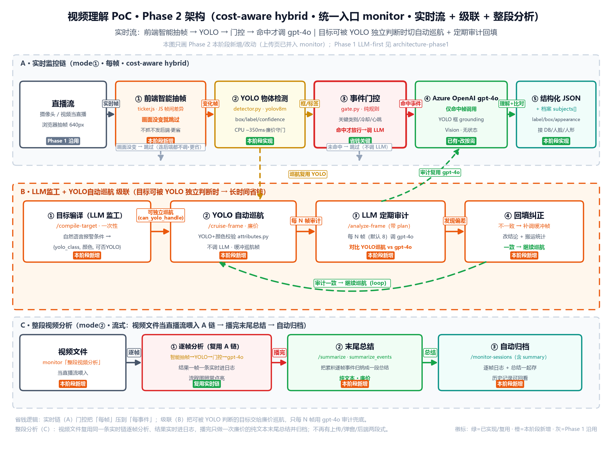

# 视频理解 Demo · Phase 2 — 成本可控混合架构（架构演进设计）

> 🔖 **用途**：Phase 1（LLM-first MVP）已验证"gpt-4o 能看懂视频"。Phase 2 要把它从"能跑"升级成
> **"省钱、可控、可扩展"的工程方案** —— 这正是 mentor 架构图里点的方向，也是对标客户现有架构的演进。
> 🛠️ **维护约定**：改架构就重跑 `video-understanding-poc/scripts/make_arch_diagram_phase2.py` 并同步本文。
> ⏱️ **最后更新**：2026-06-22
> 🔙 **上一阶段**：Phase 1（LLM-first MVP）见 [`Phase1-LLM-first-MVP.md`](Phase1-LLM-first-MVP.md)
> 🚀 **下一阶段**：Phase 3（逐轨迹识别与主体记忆）见 [`Phase3-逐轨迹识别与主体记忆.md`](Phase3-逐轨迹识别与主体记忆.md)

---

## 架构总览（Phase 2）



> 图说（**本图只画 Phase 2 本阶段实际新增/改动**，Phase 1 原始上传管线见 `architecture-phase1`）：
> **统一入口**：原独立上传页已并入 `monitor`，**一个页面两种模式**（实时流 / 整段视频分析）。
> **A · 实时监控链（mode① · 每帧）** — 直播流 → **① 前端智能抽帧**（JS 帧间差异，画面没变就跳过、连后端都不调）→ **② YOLO 物体检测**（detector.py）→
> **③ 事件门控**（gate.py，命中关键事件才放行）→ **④ gpt-4o**（仅命中帧调用 + YOLO 框 grounding）→ **⑤ 结构化 JSON + 目标档案 subjects[]**。
> **B · LLM监工 + YOLO自动巡航 级联** — **① 目标编译**（/compile-target）→ **② YOLO 自动巡航**（/cruise-frame，不调 LLM）→
> **③ LLM 定期审计**（/analyze-frame 带 plan，每 N 帧）→ **④ 不一致则回填重判**；一致则继续巡航。
> **C · 整段视频分析（mode② · 流式）** — 视频文件**当直播流喂入 A 链**逐帧分析（结果实时进日志）→ 播完 → **① 末尾总结**（/summarize 把累积事件归纳成一段总结）→ **② 自动归档**（/monitor-sessions，含总结）。
> 矢量图 `../../assets/architecture-phase2.svg`，由 `video-understanding-poc/scripts/make_arch_diagram_phase2.py` 生成。

---

## 一、为什么要做 Phase 2（一句话）

Phase 1 是**无脑全帧丢给 LLM**：定时抽帧 → 每帧都喂 gpt-4o。能验证可行性，但**最费 token、不可控**。

Phase 2 的核心思想 = **cost-aware hybrid（成本可控的混合架构）**：

> **先用便宜的传统视觉（YOLO/SSD）过一遍，只在"关键事件"发生时才调用贵的 LLM。**

这同时回答了 mentor 在架构图上点的三个"思考问题"（见第五节）。

---

## 二、对标分析：我们补什么、客户改什么

### vs Mentor 目标（黑色架构图）—— 补齐 3 块

| Gap | Phase 1 现状 | Phase 2 补齐 |
|---|---|---|
| **智能选帧** | `fps=1/5` 定时抽帧（笨办法） | ffmpeg 场景切换检测 + CLIP/ViT 信息量选帧 |
| **传统 CV 层** | 无 | YOLO/SSD 物体&场景识别（成本最低，先过一遍） |
| **关键事件门控** | 全帧无脑调 LLM | Event Gate：命中关键物体/场景切换才触发 LLM |

### vs 客户现有架构（Video Classification and Understanding）—— 借鉴 + 改进

**借鉴（客户做得好的）**：
- CLIP/ViT 做 `Informative Frame Selection`（variance-based DTC + Top-K）→ 我们引入
- 两段式 GPT：`Immediate response`（实时通知）+ 最终 `Summary` → 我们引入

**改进（客户偏重的地方，CSA 增值点）**：
- 客户自托管 UniFace / LidarGait / YOLO12 等**一堆专用模型**，运维与 GPU 成本高、LidarGait 还要 LiDAR 点云、场景窄
  → **能用 Azure 托管服务（AI Vision / Video Indexer / Content Understanding）替代的就别自建**。
- 客户 GPT-4.1 调两次但**没看到成本门控** → 我们用 **Event Gate 显式控制 LLM 调用频率**。
- 客户选帧只用 variance（纯画面变化）可能漏掉"画面没大变但语义重要"的帧
  → 我们补 **场景切换检测（scene detection）+ 事件驱动**双触发。

---

## 三、组件与技术栈（逐个讲透）

| # | 组件 | 技术 / 服务 | 作用 | 状态 |
|---|---|---|---|---|
| ① | **智能抽帧（双实现）** | 实时流：前端 JS 帧间差异跳帧；CLI 竖切：ffmpeg scene + 定时兜底 | 画面没变就跳过/只抽信息量帧，替代纯定时 | ✅ 已实现（Step 7 + 实时流前端版） |
| ② | **传统 CV 廉价初筛** | YOLO / SSD（+ OCR 可选） | 便宜地识别物体&场景，给门控提供判断依据 | ✅ 已实现 |
| ③ | **事件门控 Event Gate** | 规则 / 事件驱动逻辑 | 命中关键物体或场景切换才放行 → 控制 LLM 调用 | ✅ 已实现（**省钱关键**） |
| ④ | **LLM 理解** | Azure OpenAI gpt-4o Vision | 仅对关键场景做理解（配合门控按需调用） | ✅ 已有，改为按需 |
| ⑤ | **结构化 JSON** | `response_format=json_object` | 扩展字段：summary/objects/events/subjects[] | ✅ 已实现 |
| ⑥ | **末尾总结** | 纯文本廉价调用（/summarize） | 整段视频分析跑完后，把累积的逐帧事件归纳成一段总结并归档 | ✅ 已实现 |
| — | **Blob 存储** | Azure Blob（StorageV2） | 存原视频 + 关键帧 + result.json | ✅ 已接入 |

### 3.1 智能抽帧（Smart Frame Selection）

**Hybrid 策略：scene detection + 定时兜底**（Step 7，✅ 已实现 · `video_processor.extract_frames_smart`）

解决两个问题：
- ❌ **纯定时抽帧**：冗余多（静止画面也抽）
- ❌ **纯 scene detection**：会漏检（长时间静止但重要的画面一帧不抽）

**方案**：两个触发条件 **OR** 逻辑（实际实现用 `prev_selected_t` 做"距上次选帧"的时间兜底，比帧号 `mod(n,N)` 更稳，不依赖固定 fps）：

```bash
# 实际实现（scene > 阈值 OR 距上次选帧 >= N 秒 OR 首帧），showinfo 给精确时间戳
ffmpeg -i input.mp4 \
  -vf "select='gt(scene,0.4)+isnan(prev_selected_t)+gte(t-prev_selected_t,30)',showinfo,scale=W:-2" \
  -fps_mode vfr out_%03d.jpg
#       画面突变 > 0.4        OR 首帧            OR 距上次选帧 >= 30 秒
```

**参数可配置**（`.env` / `config.py`）：
- `SCENE_THRESHOLD`（默认 0.4）：越高越严，只取剧烈变化
- `FALLBACK_INTERVAL_SECONDS`（默认 30）：最长多久必须抽一帧，防止静止画面漏检
- `SMART_FRAMES`（默认 true）：关掉则回退 Phase 1 的纯定时抽帧
- 选出的帧若超过 `MAX_FRAMES`，在时间轴上**均匀降采样**（不只截开头，避免偏置）

**价值**：
- ✅ **高效**：画面突变（镜头切换/人物进出）立刻抓
- ✅ **保险**：静止画面最多 N 秒也会抽一帧（不漏检）
- ✅ **配合门控**：抽出来的帧再过门控，进一步筛 LLM 调用

**应用场景**：两种模式都已接入 —— **整段报告（mode②）** 走后端 `extract_frames_smart`（`pipeline.analyze_video` 按 `SMART_FRAMES` 选择）；**实时流（mode①）** 走前端 JS 帧间差异跳帧（`ticker.js` + `utils.js` 的 `frameSignature`/`signatureDiff`，画面没变就不抓不发）。

### 3.2 事件门控（Event Gate）—— Phase 2 的灵魂

这是把"贵"控制住的关键。**判定逻辑**（可配置规则）：

```
对每个候选关键帧：
  YOLO/SSD 检测物体 + 场景  →
  IF 命中关键物体（如 人/包裹/车/跌倒姿态…）
     OR 发生场景切换（scene > 阈值）
     OR 与上次理解的画面差异够大：
        → 触发 gpt-4o 理解（贵但准）
  ELSE:
        → 跳过，不调 LLM（直接复用上次结论 / 只记录 CV 标签）
```

> **效果**：一段 10 分钟监控视频，可能只有几个"关键事件"需要 LLM，其余几百帧用 YOLO 标签就够 →
> **LLM 调用量从"每帧"降到"每事件"，token 成本数量级下降**。

### 3.3 整段视频分析 + 末尾总结（mode② · ✅ 已实现 · 流式）

**设计**：视频文件**不走单独的后端批处理**，而是和摄像头一样**当直播流喂进实时链（A）**逐帧分析——结果实时进事件日志、流程图照常点亮。播放结束后再做一次廉价的"末尾总结"，并自动归档。

- **流式即时反馈**：每帧走 智能抽帧→YOLO→门控→（命中才）gpt-4o，结果一帧一条进日志（即"即时通知"由实时管线天然产生）。
- **末尾总结**：视频 `ended` → 前端把本次累积的逐帧事件 POST `/summarize`（`llm_client.summarize_events`，**纯文本廉价调用**）→ 得到 `summary / detected_objects / overall_alert_level / confidence`，显示在日志与结果区。
- **自动归档**：连同总结写入监控会话（`/monitor-sessions`，meta 增加 `summary` 字段），可在「历史记录」回看。
- **相关文件**：`static/js/monitoring/ticker.js`（`startFullVideoRun`/`finishFullVideoRun`）、`static/js/monitoring/batch-report.js`（`fetchSummary`/`showSummary`）、`app/routers/session.py`（`/summarize`）。

> 注：原"上传整段 → 后端 ffmpeg 抽帧 → 两段式批处理 → 弹窗报告"那套已**删除**（`/upload-video`、`two_stage_report` 不再保留）；ffmpeg 智能抽帧仅保留给 Phase 1 竖切 CLI（`pipeline.analyze_video`）。

---

## 四、成本怎么算（给 mentor 讲的账）

| 维度 | Phase 1（全帧） | Phase 2（门控） |
|---|---|---|
| LLM 调用次数 | ≈ 抽帧数（每帧都调） | ≈ 关键事件数（远小于帧数） |
| 主要成本 | gpt-4o vision token（线性涨） | YOLO 自托管算力（便宜）+ 少量 LLM |
| 可控性 | 差（视频越长越贵） | 好（门控阈值直接调成本/精度平衡） |

> 一句话：**用便宜模型扛"量"，用贵模型扛"质"，门控决定两者的分工。**

---

## 五、回答 Mentor 的三个思考题

1. **是不是所有关键帧都要做 LLM 识别？**
   → 不是。先 YOLO/SSD 廉价识别，**只有命中关键事件的帧**才交给 LLM。

2. **LLM 的成本怎么考虑？**
   → 通过**事件门控**把调用次数从"每帧"压到"每事件"；阈值可调，直接权衡成本与精度。

3. **如何只做关键场景的 LLM 识别？怎么定义"关键事件"？**
   → 用三类信号定义关键事件：**① 场景切换**（ffmpeg scene > 阈值）、**② 命中关键物体**（YOLO 检出业务关心的类别）、**③ 画面与上次理解差异够大**。任一命中即触发 LLM。

---

## 六、演进路线（Phase 2 实施步骤）

> 沿用 Phase 1 的"本地先跑通，再上云"节奏。每步本地验证后再集成。

```
Step 5  集成 YOLO 物体检测层（ultralytics YOLO）                       ✅ 已做（detector.py + /detect，实测 medium ~350ms）
Step 6  实现事件门控逻辑（规则可配置：关键类别 + 场景阈值）             ✅ 已做（gate.py + /analyze-frame 重写 + 前端开关/省钱统计）
Step 6.5 LLM监工 + YOLO自动巡航 三段式级联                             ✅ 已做（见下「八、级联」）
Step 7  智能抽帧（scene detection + 定时兜底，兜底间隔可配置）         ✅ 已做（实时流前端 JS 帧间差异跳帧；CLI 竖切用 ffmpeg 版 extract_frames_smart）
        - 前端版：相邻帧 32×32 灰度指纹差异；画面没变就跳过（连后端都不调），兜底间隔可配
        - ffmpeg 版：scene>阈值 OR prev_selected_t 时间兜底；均匀降采样（仅 Phase 1 竖切 CLI 用）
Step 8  整段视频分析 + 末尾总结（mode② · 流式）                        ✅ 已做（视频当流跑实时链逐帧分析 → 播完 /summarize 末尾总结 → 自动归档）
        - 不再有"上传整段 + 后端两段式 + 弹窗"；/upload-video 与 two_stage_report 已删除
        - ticker.js startFullVideoRun/finishFullVideoRun；session.py /summarize；归档 meta 加 summary
Step 8.5 统一入口（上传页并入 monitor，一页两模式）                   ✅ 已做（/ 302→/monitor；删 index.html；静态资源 no-cache）
```

**Phase 2 完成标准**：Step 5/6/6.5 已实现 → **核心算法架构（cost-aware hybrid）已完成**。
**优化项**：Step 7（智能抽帧·双实现）、Step 8（整段视频分析 + 末尾总结）、Step 8.5（统一入口）✅ 已补齐。

---

## 七、风险 / 待办

1. **YOLO 自托管需算力**：本地 CPU 能跑小模型（yolov8n）做 PoC；上云要考虑 GPU 或换 Azure AI Vision 托管检测。
2. **"关键物体/事件"定义依赖业务场景**：需要和具体用例（安防/零售/巡检…）对齐才能定类别清单。
3. **门控阈值需调参**：太严会漏事件，太松省不了钱；建议加一组评估视频量化召回/成本。
4. **缺评估体系**：Phase 2 应引入准确率/召回的量化指标（对标客户论文方法），否则无法证明"省了钱还没掉精度"。
5. **延续 Phase 1 风险**：订阅 VM 配额=0（上云受阻）、泄露的 OpenAI key/Storage 密钥需轮换。

---

> 维护：改架构图就重跑 `video-understanding-poc/scripts/make_arch_diagram_phase2.py`（输出 SVG+PNG）。

---

## 八、级联：LLM监工 + YOLO自动巡航（成本可控的"长时间省钱"模式）

事件门控（Step 6）解决"哪些帧值得看"，但命中关键类别的帧仍会**每帧调 gpt-4o**。当报警条件其实
能被 YOLO 独立判断时（如"出现红色汽车"=YOLO `car` + 颜色判断），完全没必要每帧都花 LLM 的钱。
级联用"**LLM 当监工、YOLO 当巡逻兵**"把成本进一步压低：

### 三段式

1. **① 目标编译（LLM 监工·一次性）** — `POST /compile-target`
   把自然语言报警条件编译成 YOLO 可执行规则 `plan`：
   `{ yolo_class（必须是 COCO 80 类之一，否则 null）, attribute{type:color,value,region}, can_yolo_handle, summary }`。
   关键诚实点：**YOLO 只认物体类别、不懂颜色**，所以"红色汽车"= `car` 框 + 廉价 CV 颜色判断（`attributes.py`，裁框算 HSV 主色）。
   姿态/动作/持物/身份等语义 YOLO 给不了 → `can_yolo_handle=false`，回落每帧 gpt-4o。

2. **② YOLO 自动巡航（廉价·每帧）** — `POST /cruise-frame`
   只跑 YOLO + 颜色校验出 `cruise` 裁决（`is_match/reason/matched_boxes`），**不调 gpt-4o**。前端缓冲这些帧。

3. **③ LLM 定期审计 + 回填（权威·每 N 帧）** — `POST /analyze-frame`（带 `plan`）
   每 `auditEvery`（默认 8，可调）帧调一次 gpt-4o 拿权威裁决，同帧附带 `cruise_match`（YOLO 巡航裁决）做对比：
   - **一致** → YOLO 巡航可信，清空缓冲，继续巡航（省钱继续）。
   - **不一致** → YOLO 跑偏了：把缓冲的巡航帧逐个补调 gpt-4o **回填纠正**结论 + 统计搬运（"省下的帧"→"已调用"）。

### 设计决策

- **编排在前端**，后端只提供**无状态原语**（`/compile-target`、`/cruise-frame`、`/analyze-frame` 加可选 `plan` 算 `cruise_match`）。
- 颜色用 **HSV 启发式**（`app/attributes.py`），CPU 毫秒级、无训练；只对"主色明显"够用。
- 审计 cadence 默认 8 帧、前端可调；回填靠前端已缓冲的帧。
- `can_yolo_handle=false` 时整条级联回落到 Step 6 的"每帧门控→条件 LLM"行为，无缝兼容。

### 相关文件

- `app/attributes.py`：`dominant_color()/color_matches()/_classify_rgb()` 廉价颜色判断。
- `app/detector.py`：`class_names()` 返回 COCO 80 类（供编译时让 LLM 从合法类别选）。
- `app/llm_client.py`：`compile_target()` 把自然语言编译成 plan（内嵌类别清单、兜底校验非法类别）。
- `app/main.py`：`/compile-target`、`/cruise-frame`、`_apply_plan()`（YOLO+颜色巡航裁决）、`/analyze-frame` 加 `plan`→`cruise_match`。
- `templates/monitor.html`：开始比对先编译显示巡航计划（✅可独立巡航 / ⚠需每帧LLM）；巡航帧走 `/cruise-frame`、每 N 帧审计、不一致回填。
