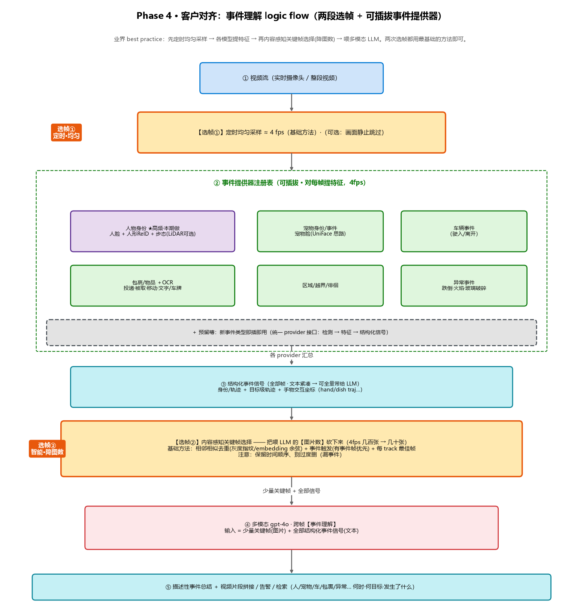

# 视频理解 Demo · Phase 4 — 客户对齐：身份感知的多帧事件理解（最小可运行版）

> 🔖 **用途**：和 jiawei 老师确认了 **TP-Link 客户的真实架构**后，发现我们 Phase 1~3 的"算法/认人"底座基本对齐，但 **LLM 这一段没对齐**。Phase 4 回答——
> **"怎么先搭一个最简单、能跑起来、又和客户模型对得齐的架构？"** —— 即把我们的 LLM 段从"逐帧视觉理解"升级成客户那套 **"传统 CV(人脸+人形 ReID/库比对)出身份 → 结构化身份+连续多帧图 一起喂多模态大模型 → 跨帧事件理解 → 描述性总结"**，并落一个最小可运行 PoC。
> ⚠️ **状态**：**设计草案 + 实施蓝图（规划中）**。底座（检测/跟踪/ReID/融合/评估）已在 Phase 3 落地，本阶段聚焦"**对齐 LLM 段 + 补人脸分支 + 在 bad case 上证明增量价值**"。
> 🎯 **业务前提**：① 我们**拿不到客户数据** → 只能**并行做 demo、自己找数据**，目标是"**证明加某个 feature/模型确实能救回一部分 bad case**"，从而说服客户来试；② 客户痛点主要是**人脸模糊**，先做 **人脸 + 人形 + 步态**（有清晰脸时把人脸做好就能大幅提准，没脸/糊脸时人形/步态兜底）。
> 🛠️ **维护约定**：改架构就重跑 `video-understanding-poc/scripts/make_arch_diagram_phase4.py`（输出 `assets/architecture-phase4.png`）并同步本文；每落地一个 Step 回来勾选 + 填实际文件。
> ⏱️ **最后更新**：2026-06-23
> 🔙 **上一阶段**：Phase 3（逐轨迹识别与主体记忆）见 [`Phase3-逐轨迹识别与主体记忆.md`](Phase3-逐轨迹识别与主体记忆.md)
> 🚀 **下一阶段**：Phase 5（基于 Azure 的全链路上云）见 [`Phase5-Azure全链路上云.md`](Phase5-Azure全链路上云.md)

---

## 架构总览（Phase 4）



> 图说（**本图只画 Phase 4 新增**，检测/跟踪/ReID/融合沿用 Phase 3）：**两段选帧**（①定时均匀 ≈4fps → ②内容感知关键帧选择降图数）+ **可插拔事件提供器**（本期先做人物：人脸+人形 ReID+步态；其余事件预留槽）+ **身份感知多帧事件理解 LLM 段**。由 `video-understanding-poc/scripts/make_arch_diagram_phase4.py` 生成。

文字版数据流（**新增部分加粗**；其余沿用 Phase 1~3）：

```
连续视频 → 抽多帧（最佳帧优先）
   │
   ├─ 传统 CV 身份层（Phase 3 已有 + 本阶段补人脸/步态）
   │     YOLO 检测 + ByteTrack 跟踪 → 每目标 track_id
   │     ├─ 人形 ReID 指纹（app/reid.py，主力）────────┐
   │     ├─【新】人脸分支：检测/对齐/embedding ───────┤→ 与【库】比对 → 身份
   │     │     【新】人脸质量处理：最佳脸/多帧脸融合/超分/质量加权（攻"人脸模糊"）
   │     ├─【新·P1】步态分支：YOLO-Pose 骨架序列 → OpenGait ┘（无脸/背身兜底）
   │     └─ 多帧融合：最佳帧+多帧投票+多线索（app/track_fusion.py，face_cue/gait_cue 槽）
   │
   ├─【新】结构化信号打包（人物只是其一；其余事件见 §3.7 借鉴客户）
   │     person → { 库内身份/subject_id, 轨迹, 人脸/ReID/步态命中+置信度, 属性 }
   │     ＋【P2 借鉴客户】目标级轨迹 + 手物交互坐标、OCR 文字/车牌、宠物身份
   │
   └─【新】身份感知的多帧事件理解（LLM 段 · 本阶段灵魂）
         连续多帧图 + 上面的结构化信号  ──一起注入 prompt──▶  gpt-4o(多模态)
         约定：身份由外部给定、模型不重新认人；基于身份+画面做【跨帧事件理解】
         → 输出描述性总结 ＋【P2 借鉴客户】按事件拼接 highlight 视频片段
   ▲
   └─【新】bad-case 评估闭环：自找模糊人脸数据，对比 加 feature 前/后 的准确率提升
```

---

## 一、为什么要做 Phase 4（一句话）

我们和客户的差距**几乎全在 LLM 这一段**，底座是对齐的：

| 环节 | 客户（TP-Link）要的 | 我们现状 | 结论 |
|---|---|---|---|
| 检测+跟踪+ReID+多帧融合 | 传统模型+多特征 | YOLO+ByteTrack+ReID+融合（3.1/3.4/3.5） | ✅ 对齐 |
| 和**库**比对出身份 | 客户人员库 | 自建主体记忆库（接口可换库） | 🟡 接口对齐 |
| **人脸** | 多特征之一（且痛点是糊） | **只留了 face 槽，未实现** | 🔴 **要补** |
| **LLM 输入** | **连续多帧图 + 结构化身份 一起喂** | 单帧/crop、且**不带身份** | 🔴 **要补** |
| **LLM 任务** | 身份感知的**跨帧事件理解**→叙述 | 逐帧场景描述 + 末尾总结（不带身份） | 🔴 **本阶段灵魂** |

> **一句话**：底座（眼睛+记忆）我们有了，缺的是"**把多帧图 + 身份一起喂给大模型做事件级理解**"这一段，以及**人脸分支**。Phase 4 就补这两块，并先跑通最小版。

---

## 二、心智模型：认人 / 讲事件 —— 解耦再拼接

把整条链拆成两个职责分明、再拼接的角色：

| 角色 | 干什么 | 谁来做 | 关键认知 |
|---|---|---|---|
| **认人（身份层）** | 检测+人脸+人形+多帧 → 和库比对 → "这个框=张三" | 传统 CV / ReID / 人脸（Phase 3 + 本阶段补人脸） | 人脸模糊在**这层**解决，不是靠 LLM |
| **讲事件（理解层）** | 看连续多帧图 + 收到的身份，讲清"谁在何时做了什么" | 多模态大模型（gpt-4o） | 大模型**看图但不认人**；身份是外部喂的 |

> **核心**：大模型仍然看图（多帧），但**不负责识别身份**——身份由前面的人脸/人形比对提供、通过 prompt 注入。这正是客户的做法，也是我们要对齐的点。

---

## 三、核心机制（逐个讲透）

### 3.1 身份提供层 —— 先做"人脸 + 人形"，重点啃"人脸模糊"

监控场景"把人脸做好" **≠** 在清晰脸上换个更强模型，而是**让低质量人脸也能用 + 没脸时人形兜底**：

| 能力 | 作用 | 对应 bad case |
|---|---|---|
| 人脸检测 + 对齐 + embedding（ArcFace/InsightFace 类，预训练） | 提人脸指纹与库比对 | 有清晰脸 → 最强信号 |
| **最佳脸选择**（复用 3.5 最佳帧） | 一条轨迹里挑最清晰/最正的脸去识别 | 模糊但偶有清晰帧 |
| **多帧人脸特征融合** | 多帧脸 embedding 加权投票，压单帧模糊 | 持续偏糊 |
| **人脸增强/超分**（GFP-GAN / CodeFormer，识别前预处理） | 把糊脸拉清再识别 | 低分辨率/远景 |
| **质量加权匹配**（复用 gallery 质量门控） | 糊脸降权，不让它带偏 | 遮挡/运动模糊 |
| **人形 ReID 兜底**（app/reid.py 主力） | 没脸/背身 → 至少认出是同一人 | 侧背身/无脸 |

> 落地：**人脸 = Phase 3 预留 `face_cue` 槽的真正实现（即 Step 17）**；有脸高权重、糊脸降权、没脸退人形——全部喂进 `track_fusion` 的多线索融合打分。

### 3.2 结构化身份打包 —— 喂给 LLM 的"身份上下文"

把每个 person 整理成大模型能读的结构化条目（沿用 `analyze_single_frame` 已有的"检测 grounding 注入"思路，再加身份）：

```json
{ "subject_id": 3, "identity": "库#A123(置信 0.82)",
  "track": "10:02 进门 → 10:05 货架前",
  "face": {"matched": true, "quality": "blurry→enhanced", "score": 0.71},
  "reid": {"score": 0.86}, "attributes": ["male","backpack"] }
```

### 3.3 多帧窗口选择 —— 按"时间窗"而非逐帧

按事件/时间窗攒 **N 帧连续图**（最佳帧优先、去冗余），一次性喂给 LLM 做事件理解——不是逐帧调。这把"调用粒度"从 Phase 2 的"逐帧门控"转向"**每事件一次事件理解**"，与客户一致。

### 3.4 身份感知的多帧事件理解（LLM 段 · 本阶段灵魂）

把 **3.2 的身份上下文 + 3.3 的多帧图** 一起注入 prompt 喂 gpt-4o：

- **复用**：`llm_client.py::summarize_frames` **已支持把多帧（带时间戳）图一起喂 vision 模型**；`analyze_single_frame` 已会**把检测结果注入 prompt 做 grounding**——两者一拼就是雏形。
- **新增 prompt 约定**：明确告诉模型"**身份是外部给定的、你不要重新认人**；请基于这些身份 + 多帧画面，理解并整合成一段**跨帧事件叙述**（谁、何时、做了什么、是否异常）"。
- **输出**：描述性事件总结（而非逐帧"画面里有个人"）。

### 3.5 bad-case 评估闭环 —— 证明"加 feature 救回了多少"

拿不到客户数据 → 自找/自造**模糊人脸**数据，用评估脚本（复用并扩展 `scripts/eval_phase3.py`）跑：

- **baseline**：face-only（清晰脸模型，无质量处理、无人形兜底）
- **+ 我们的 feature**：人脸增强 / 多帧脸融合 / 质量加权 / 人形兜底，逐项叠加
- **指标**：在同一批 bad case 上的 识别准确率/召回提升、ID switch 下降
- **产出**：一张"**加哪个 feature → 救回多少 bad case**"的对比表 —— 这就是说服客户来试的弹药。

### 3.6 步态（gait）分支 + 多模态融合（可行性调研小结）

> 写代码前先调研过，结论：**可行**，但 gait 是三者里最重、最不稳的，定为 **P1**（face+body 先跑通）。

- **步态可行**：**OpenGait**（开源、成熟，预训练 CASIA-B / OU-MVLP / GREW）。**骨架版可直接复用 Phase 3.3 的 YOLO-Pose 关键点**——免分割、较轻；但步态唯一性弱于人脸、**跨视角仍是难点**，且需一条 track 累积**足够长的连续序列**（几十帧）才出 gait 向量 → **当一个补充 cue，不单独用**。
- **多模态融合（业界标准做法）**：**质量加权 score-level 融合 + 模态回退**——清晰正脸 → 人脸高权重；糊脸/无脸 → 降权、靠人形 ReID / 步态。非受控场景文献报告比单模态 **~10–20%** 提升（QANet 等质量感知融合）。**这正好落在我们 `track_fusion` 的多线索加权打分上**（已有 `face_cue` 槽，加 `gait_cue` 即可）。
- **结论**：face + body + gait 的多模态人物识别**可行**，且底座（ReID/融合/pose/库/评估）我们都已具备；增量主要是 `face.py` / `gait.py` + 融合权重 + 事件理解 LLM 段。

### 3.7 借鉴客户早期版的增量点（已并入本设计）

> 看了客户一版早期架构（CLIP 选帧 → UniFace[人脸+宠物脸] / LidarGait / YOLO12+OCR → GPT 总结+视频片段拼接）。**CLIP 信息量选帧、双链路本期不做**；其余值得借鉴的点已并入我们的事件提供器 / 结构化信号 / 输出：

| 借鉴点 | 怎么并入我们的架构 | 优先级 |
|---|---|---|
| **OCR**（车牌 / 包裹单 / 文字） | 包裹/物品 provider 内挂 OCR（PaddleOCR/EasyOCR），产出"文字/车牌"结构化字段 | P2 |
| **宠物身份**（UniFace 把人脸+宠物脸统一） | 宠物 provider 升级为"宠物身份/事件"：宠物脸识别 → 宠物档案（复用 gallery 形态） | P2 |
| **目标级轨迹 + 手物交互** | 结构化信号里除 person 身份/轨迹，补"目标级轨迹（hand/dish 坐标序列）+ 手物交互"，注入 LLM（grounding 更细） | P2 |
| **输出：视频片段拼接** | 事件理解输出层增加"按事件裁剪/拼接 highlight 片段"（复用 ffmpeg），交付不止文字 | P2 |
| **步态强选型：LidarGait++** | 若客户侧有 **LiDAR** → 用 LidarGait++（3D 点云步态，更稳）；纯相机则用 OpenGait 骨架版。我们 `gait.py` 留可插拔后端 | P1 备选 |

> 这些都挂在已有的"可插拔 provider 注册表 / 结构化信号 / 输出层"上，不改主骨架。

---

## 四、与现有代码的映射（基于 CODE_MAP）

**直接复用（已有）**：

| 能力 | 模块 |
|---|---|
| 检测 + 跟踪 track_id | `app/detector.py`、`app/tracker.py`、`/track` |
| 人形 ReID 指纹（可插拔） | `app/reid.py`（osnet/resnet50/coarse，**已留 face 槽**） |
| 主体记忆库（当"库"用） | `app/gallery.py`（FAISS + 质量门控 + 负缓存） |
| 多帧融合（最佳帧/投票/多线索，**face_cue 槽**） | `app/track_fusion.py` |
| 实时认人集成 | `app/services/identity_integration.py` |
| **多帧图喂 vision** | `app/llm_client.py::summarize_frames`（含时间戳） |
| **检测注入 prompt grounding** | `app/llm_client.py::analyze_single_frame::_format_detections` |
| 评估骨架 | `scripts/eval_phase3.py` |

**本阶段新增**：

| 新文件 | 作用 |
|---|---|
| `app/face.py` | 人脸检测/对齐/embedding（ArcFace）+ 质量评估 + 最佳脸/多帧脸融合 +（可选）超分增强 |
| `app/gait.py` | 步态：吃 track 的 YOLO-Pose 骨架序列 → OpenGait 骨架模型 → gait 向量（**P1**；客户有 LiDAR 时可换 LidarGait++ 后端） |
| `app/keyframe.py` | 选帧②：内容感知关键帧选择（相似去重 + 事件触发 + 最佳帧），降低喂 LLM 的图片数 |
| `app/ocr.py` | OCR：对包裹/车辆 crop 读文字/车牌（PaddleOCR/EasyOCR）→ 结构化文字字段（**P2 · 借鉴客户**） |
| `app/services/event_understanding.py` | 身份感知的多帧事件理解：组装"关键帧 + 身份/目标级轨迹+手物交互" → 喂 gpt-4o → 事件叙述 |
| `app/clip_export.py` | 输出层：按事件裁剪/拼接 highlight 视频片段（ffmpeg，**P2 · 借鉴客户"视频片段拼接"**） |
| `scripts/event_understand_demo.py` | 跑通最小版：视频 → 选帧/认人/融合 → 事件总结 |
| （扩展）`scripts/eval_phase3.py` | 加人脸/步态 + bad-case 模式，出"加 feature 前/后"对比表 |

---

## 五、MVP 实施手册：人脸 + 人形 + 步态（怎么做 / 怎么改 / 复用什么）

> 范围：**只做"人物" provider（人脸 + 人形 ReID + 步态）**，其余事件留预留槽；**本地离线在一段视频上跑通**（上云是 Phase 5）。原则：**能复用就不新写**——Phase 3 的检测/跟踪/ReID/融合/库/评估全部直接接上。

### 模块 0 · 两段选帧
| 做什么 | 复用 / 改动 |
|---|---|
| **选帧①** 定时均匀 ≈4fps | **改** `app/video_processor.py::extract_frames`：现为 `vf="fps=1/{interval},..."`（秒级），加一个 `fps: float\|None` 参数，传 4 时用 `vf="fps=4,..."`。其余不动（`Frame` 结构、ffmpeg 回退都沿用）。 |
| **选帧②** 内容感知关键帧（喂 LLM 前降图数） | **新增** `app/keyframe.py::select_keyframes(frames, embeds, events, max_n)`：基础三招——相邻相似去重（灰度指纹/embedding 余弦，和前端 `static/js/core/utils.js::frameSignature` 同款思路）+ 有事件帧优先 + 每 track 最佳帧（复用 `track_fusion` 最佳帧）；**保时序**。4fps 几百张 → 喂 LLM 的几十张。 |

### 模块 1 · 人物 provider（face + body + gait）
| 子能力 | 复用 / 新增 / 改动 |
|---|---|
| 人形 ReID | **复用** `app/reid.py`（osnet/resnet50，已可插拔，无需改）。 |
| 人脸 | **新增** `app/face.py`：`detect_align()`（InsightFace SCRFD+对齐 或 facenet MTCNN）→ `embed()`（ArcFace, InsightFace `buffalo_l`）→ `assess_quality()`（清晰度/正脸度/尺寸）→ `best_face()/fuse_faces()`（多帧脸质量加权融合）；可选 `enhance()`（GFP-GAN/CodeFormer 超分）。 |
| 步态 gait（**P1**） | **新增** `app/gait.py`：吃一条 track 的 **YOLO-Pose 骨架序列**（复用 Phase 3.3 `app/pose.py`）→ `embed(pose_seq)`（OpenGait 骨架模型，预训练）。骨架版免分割；需 track 累积足够帧才算。 |
| 多模态融合 | **改** `app/track_fusion.py`：已有多线索融合 + **`face_cue` 槽（权重 0）**；新增 `gait_cue`，按**质量加权**（清晰脸→face 高权；糊/无脸→降权，靠 body/gait）。**改** `app/core/config.py` 把 `FUSION_W_FACE` 开起来 + 加 `FUSION_W_GAIT`。 |
| 库比对 | **复用** `app/gallery.py`（FAISS）当"库"；MVP 本地，三模态可各建库或拼接向量。 |

### 模块 2 · 结构化身份打包
**改** `app/services/identity_integration.py::enrich_with_identity`：在现有 `subject_id` 基础上，给每个 person 补结构化字段 `{库内身份, face/body/gait 各自命中分+质量, 轨迹, 属性}`，产出供 LLM 注入的 identity context。

### 模块 3 · 身份感知多帧事件理解（LLM 段）
**新增** `app/services/event_understanding.py::understand_event(keyframes, identity_context)`：
- **复用** `app/llm_client.py::summarize_frames`（多帧带时间戳喂 vision）+ `analyze_single_frame::_format_detections`（注入 grounding）的写法；
- **新 prompt**："身份是外部给定的、不要重新认人；基于身份 + 这几张关键帧，输出跨帧**事件**叙述（谁/何时/做了什么/是否异常）"；
- 输入 = 模块 0 选帧②的**少量关键帧(图)** + 模块 2 的**结构化身份(文本，可全量)**。

### 模块 4 · 跑通（一个脚本串起来）
**新增** `scripts/event_understand_demo.py`：
`视频 → 选帧①4fps → 人物 provider(face/body/gait) → 库比对+融合 → 身份 → 选帧②关键帧 → event_understanding → 打印事件总结`。
```
python scripts/event_understand_demo.py --video data/sample.mp4 --fps 4 --llm-frames 16
```

### 模块 5 · 评估（说服客户的弹药）
**扩展** `scripts/eval_phase3.py`：加 `--face --gait` 与 bad-case(模糊脸) 模式，出 `baseline(face-only) vs +增强/+多帧脸/+人形/+gait` 的 识别准召 / ID switch 对比表。

### 落地顺序（P0 先跑通，P1 再加 gait + 关键帧降图 + 评估）
- **P0（先有可演示版本）**：模块 0① + 模块 1(face+body) + 模块 2 + 模块 3 + 模块 4 → "人脸+人形 → 身份 → 多帧事件理解" 端到端跑通。
- **P1（增强 + 证明价值）**：模块 0②（关键帧降图数）+ 模块 1 gait + 模块 5（bad-case 对比表）。

---

## 六、组件与技术栈（选型）

| 职责 | 技术 / 服务 | 状态 |
|---|---|---|
| 人脸检测+识别 | InsightFace(ArcFace) / facenet-pytorch（预训练，CPU 可跑） | 🔵 新建（Step 17） |
| 人脸增强/超分 | GFP-GAN / CodeFormer（识别前预处理） | 🔵 可选 |
| 人形 ReID | OSNet(torchreid) / ResNet50（已有可插拔） | ✅ 已有 |
| 步态 gait | OpenGait 骨架版（吃 YOLO-Pose 序列，预训练 CASIA-B/OU-MVLP/GREW）；有 LiDAR 时 LidarGait++ | 🔵 新建（P1） |
| OCR 文字/车牌 | PaddleOCR / EasyOCR（包裹单/车牌） | 🔵 新建（P2 · 借鉴客户） |
| 宠物身份 | 宠物脸识别（UniFace 思路，复用 gallery 形态建宠物档案） | 🔵 新建（P2 · 借鉴客户） |
| 视频片段拼接 | ffmpeg 按事件裁剪/拼接 highlight | 🔵 新建（P2 · 借鉴客户） |
| 主体记忆 / 库比对 | FAISS（本地）；上云换 Azure AI Search 向量 | ✅ 已有（本地） |
| 多帧融合 | 自研 `track_fusion`（最佳帧+投票+多线索） | ✅ 已有 |
| 多模态事件理解 | Azure OpenAI gpt-4o（多帧图 + 身份注入） | 🟡 改造现有调用 |
| 评估 | 自研 `eval_phase3`（精度/召回/ID switch） | 🟡 扩展加人脸 |

---

## 七、自己找数据（拿不到客户数据时的替代）

| 用途 | 公开数据集 | 说明 |
|---|---|---|
| **模糊/监控人脸**（对口痛点） | **QMUL-SurvFace、SCface、TinyFace** | 低分辨率/真实监控人脸，专门用于"糊脸识别" |
| 人形 ReID | Market-1501、MSMT17、DukeMTMC-reID | 行人重识别 |
| 步态 gait | CASIA-B、OU-MVLP、GREW | OpenGait 预训练数据集；GREW 偏真实"野外" |
| 人为造 bad case | 对清晰数据加模糊/降分辨率/遮挡 | 对比"加人脸增强/多帧融合前后"提升 |

---

## 八、演进路线（实施步骤）

> 沿用 Phase 3 的 Step 体系往后排（Phase 3 到 Step 19）。

```
Step 20  app/face.py 人脸分支（检测+对齐+ArcFace embedding+质量评估），接入 track_fusion face_cue   ⬜ P0
Step 21  app/video_processor.extract_frames 支持 fps 参数（选帧①定时 4fps）                        ⬜ P0
Step 22  结构化身份打包（identity_integration 补 face/body 命中分+质量+轨迹字段）                  ⬜ P0
Step 23  event_understanding：关键帧 + 身份上下文 → gpt-4o 跨帧事件理解（本阶段灵魂）               ⬜ P0
Step 24  event_understand_demo.py 跑通最小可运行版（人脸+人形 → 身份 → 事件总结）                  ⬜ P0
Step 25  app/keyframe.py 选帧②：内容感知关键帧选择（相似去重+事件触发+最佳帧，降喂 LLM 图数）       ⬜ P1
Step 26  人脸质量处理：最佳脸选择 + 多帧脸融合 +（可选）GFP-GAN/CodeFormer 超分                     ⬜ P1
Step 27  app/gait.py 步态分支（YOLO-Pose 骨架序列 → OpenGait）+ 融合加 gait_cue（质量加权回退）     ⬜ P1
Step 28  bad-case 评估扩展：模糊人脸数据上 baseline vs +增强/+多帧脸/+人形/+gait 对比表（弹药）      ⬜ P1
Step 29  【借鉴客户】OCR provider（app/ocr.py：包裹单/车牌文字 → 结构化字段）                       ⬜ P2
Step 30  【借鉴客户】宠物身份（宠物脸识别 → 宠物档案，复用 gallery）                               ⬜ P2
Step 31  【借鉴客户】结构化信号补「目标级轨迹 + 手物交互坐标」注入 LLM grounding                   ⬜ P2
Step 32  【借鉴客户】输出层 app/clip_export.py：按事件裁剪/拼接 highlight 视频片段                  ⬜ P2
Step 33  （可选）库比对接口对齐：gallery 指向"客户人员库"形态，便于后续替换                        ⬜ 可选
```

**建议优先级**：**P0** = Step 20→21→22→23→24（先把"人脸+人形 → 身份 → 多帧事件理解"端到端跑通）；**P1** = Step 25→26→27→28（关键帧降图数 + 人脸质量 + 步态 + bad-case 对比表）；**P2** = Step 29→32（借鉴客户：OCR / 宠物身份 / 目标级轨迹+手物交互 / 视频片段拼接）。

---

## 九、风险 / 限制 / 待办

1. **人脸模糊有物理极限**：太糊/无脸**谁也救不了** → 必须**人形 ReID 兜底**，别把宝全压人脸；demo 叙事要诚实（"有脸更准、没脸也能认人"）。
2. **自找数据 ≠ 客户真实分布**：公开数据集证明的是"方法有效"，不是"在客户现场一定有效"；话术上定位为"**先证明思路、再请客户用真实数据试**"。
3. **评估要诚实**：bad-case 对比要同一批样本、可复现；避免挑数据。
4. **隐私合规**：人脸是生物特征，demo 用授权/公开数据，留存与用途要说清。
5. **客户 LLM 是否硬性"只读结构化"**：经确认客户**也看多帧图**（只是不靠 LLM 认人），所以我们保留多模态、把身份注入 prompt，与客户一致；若后续要求"完全不看图"，再退化成纯文本整合即可（我们结构化数据已现成）。
6. **调用成本**：事件理解按"窗口"调用而非逐帧，比 Phase 2 更省；但单次喂多帧 token 更高，需在"帧数 vs 成本"上调参。

> 🧭 **结论**：**底座已就绪，Phase 4 只需补"人脸分支 + 身份感知多帧事件理解"两块**，即可对齐客户模型并跑通最小版；再用 bad-case 评估证明增量价值，形成"先证明、后说服客户试用"的闭环。
