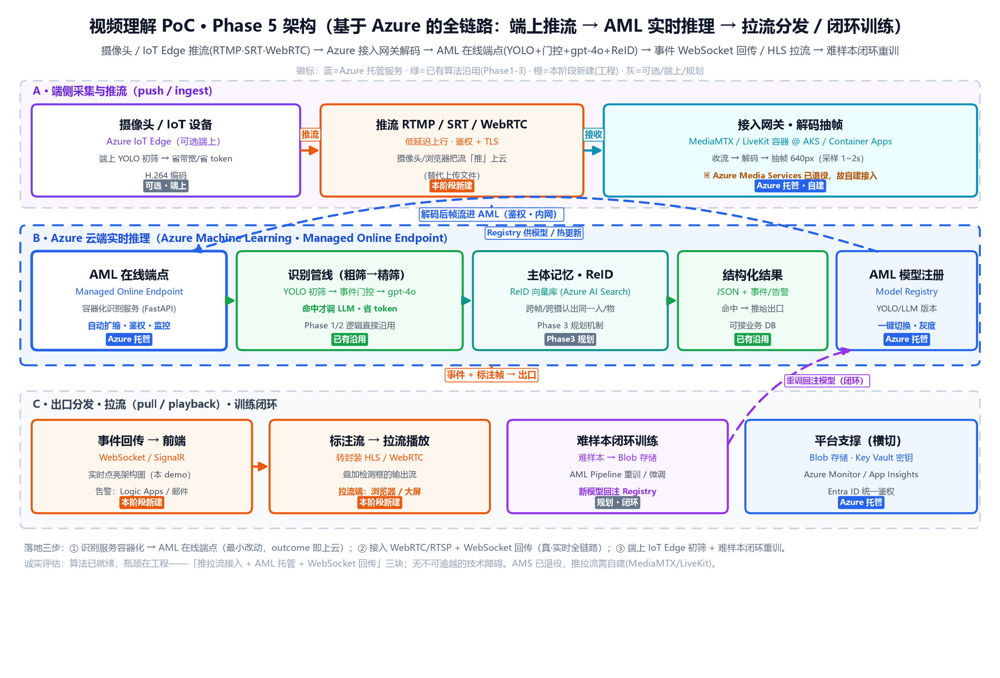

# 视频理解 Demo · Phase 5 — 基于 Azure 的全链路上云（端上推流 → AML 实时推理 → 拉流分发 / 闭环训练）

> 🔖 **用途**：Phase 1~4 把**算法**打磨好了（LLM-first → 成本可控混合 → 逐轨迹识别与主体记忆 → 客户对齐的身份感知事件理解），但都还跑在**本地 / demo**。Phase 5 回答 mentor 的下一问——
> **"这套 outcome 怎么真正落到 Azure 上、跑通端上推流 + AML 实时推理 + 拉流分发的全链路？"** —— 即从"本地能跑"升级成 **"上云可演示、可计费、可生产"**。
> ⚠️ **状态**：**本阶段为上云蓝图（规划中），尚未写部署代码**。算法已就绪，本文聚焦**工程化 / 云架构选型 / 落地路线**，供评审与排期。
> 🛠️ **维护约定**：改架构就重跑 `video-understanding-poc/scripts/make_arch_diagram_phase5.py` 并同步本文。
> ⏱️ **最后更新**：2026-06-17
> 🔙 **上一阶段**：Phase 4（客户对齐 · 身份感知多帧事件理解）见 [`Phase4-客户对齐-身份感知多帧事件理解.md`](Phase4-客户对齐-身份感知多帧事件理解.md)
> 🚀 **下一阶段**：Phase 6（规划中 · 多路并发 / 边缘集群 / MLOps 自动化）

---

## 架构总览（Phase 5）

> 图说（**本图画的是"全链路上云"蓝图**，算法细节见 Phase 1~3）：
> **A · 端侧采集与推流（push / ingest）** — 摄像头 / Azure IoT Edge（可选端上 YOLO 初筛省带宽）→ **推流 RTMP / SRT / WebRTC** → **云端接入网关**（MediaMTX / LiveKit 容器，解码抽帧；⚠ Azure Media Services 已退役，故自建）。
> **B · Azure 云端实时推理（AML Online Endpoint）** — **容器化识别服务**（FastAPI）= **YOLO 初筛 → 事件门控 → gpt-4o 精筛**（Phase 1/2 逻辑直接沿用）+ **ReID 主体记忆向量库**（Phase 3）→ 结构化结果；模型走 **AML Model Registry** 一键切换 / 灰度。
> **C · 出口分发 · 拉流 · 训练闭环** — 事件 **WebSocket / SignalR** 回传前端架构图（本 demo）/ 告警；标注流 **转封装 HLS / WebRTC** 供拉流播放；**难样本回流 → AML Pipeline 重训 → 回注 Registry** 形成闭环。横切支撑：Blob 存储 / Key Vault / Azure Monitor / Entra ID。
> 矢量图 `../../assets/architecture-phase5.svg`，由 `video-understanding-poc/scripts/make_arch_diagram_phase5.py` 生成。
> 徽标：**蓝**=Azure 托管服务 · **绿**=已有算法沿用(Phase1-3) · **橙**=本阶段新建(工程) · **灰**=可选/端上/规划。

---

## 一、为什么要做 Phase 5（一句话）

前三阶段交付的是**"一个会识别的程序"**，跑在你的笔记本上、靠本地 ffmpeg 抽帧、靠浏览器 canvas 喂帧。它**没法给客户用、没法计费、没法扩容**。

Phase 5 的核心 = **把 outcome 搬上 Azure，并补齐"真·实时"缺的那一截**：

> **让真实摄像头的视频流"推"进云，云端实时识别，结果与标注流再"拉"回大屏 —— 端到端跑在 Azure 托管服务上。**

一句话定位：**Phase 1~4 解决"识得准、花得省、对得齐"，Phase 5 解决"接得进、托得住、拉得出、能闭环"。**

---

## 二、心智模型：推流 → 云推理 → 拉流（全链路）

把整条链路想象成**寄快递 + 流水线 + 取快递**三段：

| 段 | 类比 | 技术词 | 我们现在有吗 |
|---|---|---|---|
| **推流 push / ingest** | 摄像头把视频**寄**到云 | RTMP / SRT / WebRTC 上行 | ❌ 现在是"上传文件"或"浏览器本地抽帧"，没有真推流 |
| **云端推理** | 云上**流水线**加工 | AML 在线端点跑 YOLO+门控+gpt-4o | ✅ 算法有了，缺"托管 + 服务端解码" |
| **拉流 pull / playback** | 观看端来**取**带框的结果流 | HLS / WebRTC 下行 + WebSocket 事件 | ❌ 现在只在本机浏览器画框，没有对外分发 |

**关键认知**：我们缺的**不是算法，是"接入推拉流 + 服务端解码 + 托管 + 回传分发"这几块工程**。没有不可逾越的技术障碍。

---

## 三、核心链路（逐个讲透）

### 3.1 端侧采集与推流（push / ingest）

- **采集**：真实摄像头 / 手机 / 浏览器 `getUserMedia`。生产场景下设备侧用 **Azure IoT Edge** 运行一个轻量容器。
- **可选端上初筛**：把 **YOLO 放到边缘盒子**先跑一遍，只把"有事件的帧/片段"推上云 —— 直接省上行带宽、省云端 token（呼应 Phase 2 的"省钱关键 = 门控前移"）。
- **推流协议**（三选一，按延迟/兼容权衡）：
  - **WebRTC**：亚秒级延迟，浏览器原生，最适合 demo（点开摄像头直接推）。
  - **SRT**：抗丢包、广域网稳，适合户外/弱网摄像头。
  - **RTMP**：生态最广、最成熟，但延迟略高（2~5s）。
- **安全**：上行加 **TLS + 鉴权 token**（接 Entra ID / 推流密钥）。

### 3.2 云端接入网关 + 服务端解码抽帧（⚠ 重点变化）

> 💡 **这一块是 Phase 5 相对现状最大的新增**，且和我们之前聊的 **ffmpeg** 直接相关。

- **现状盘点**：
  - **上传页（Phase 1）** 用 `app/video_processor.py::extract_frames()` 通过 `subprocess` 调 **ffmpeg 二进制**抽帧（命令 `fps=1/interval,scale=w:-2`）；找不到系统 ffmpeg 时回退到 `imageio-ffmpeg` 自带的静态二进制。
  - **实时监控（Phase 2）** **完全不用 ffmpeg**，抽帧是在**浏览器里把 `<video>` 画到 `<canvas>` 转 base64** 发后端的。
- **上云后的变化**：真·推流进来的是**编码视频流**，浏览器不再参与抽帧 → **必须在服务端解码**。这就要**重新引入 ffmpeg / GStreamer** 做收流 + 解码 + 抽帧 640px（采样 1~2s）。
- **网关选型**（⚠ **Azure Media Services 已于 2024-06 退役**，Live Video Analytics 也下线，**不能用**）：
  - **MediaMTX**（开源，RTSP/RTMP/SRT/WebRTC 全协议，最轻）
  - **LiveKit**（WebRTC 为主，自带 SFU，适合多路 + 浏览器）
  - 部署在 **AKS** 或 **Azure Container Apps** 上，容器化、可扩缩。

### 3.3 AML 在线端点（容器化识别服务）

- 把现有 **FastAPI 识别服务**（`app/`）打成容器，部署成 **Azure Machine Learning · Managed Online Endpoint**。
- 白送的能力：**自动扩缩容、蓝绿/灰度发布、鉴权、监控、日志**，省去自己搭 K8s 的运维。
- 端点对外暴露一个鉴权 HTTPS / WebSocket 接口，接入网关把解码后的帧推给它。

### 3.4 识别管线沿用 + 主体记忆（绿/灰）

- **管线零改算法**：`YOLO 初筛 → 事件门控 → gpt-4o 精筛`（Phase 1/2 逻辑直接搬，命中才调 LLM，省 token）。
- **ReID 主体记忆**：Phase 3 规划的向量库落到 **Azure AI Search**（向量检索）或 **Redis 向量**，做"跨帧 / 跨摄认出同一人/物"。

### 3.5 模型注册与热切换（AML Model Registry）

- YOLO 权重、LLM 版本、ReID 模型都登记到 **AML Model Registry**。
- 价值：**前端架构图上"切换模型"那个下拉**（YOLOv8m / 不同 LLM）后端就能真接上 —— 改注册表指向 + 灰度，不重启服务。

### 3.6 出口：事件回传 + 拉流分发

- **事件回传**：识别结果（结构化 JSON / 命中 / 告警）经 **WebSocket / Azure SignalR** 实时推回前端那张架构图（点亮当前步骤），并可接 **Logic Apps / 邮件 / Teams** 告警。
- **拉流播放**：把"叠加了检测框的输出帧"**转封装成 HLS / WebRTC** 流，供大屏 / 浏览器 / 监控墙**拉流**观看。

### 3.7 难样本闭环训练（规划 · 闭环）

- 识别**置信度灰区 / 人工纠错**的样本 → 存 **Blob 存储** → **AML Pipeline** 定期重训 / 微调 YOLO/ReID → 新模型**回注 Registry** → 灰度上线。
- 形成 **数据 → 模型 → 部署 → 再采数据** 的 MLOps 闭环（正好承接 Phase 3 的 ReID 向量库不断扩充）。

---

## 四、抽帧 / ffmpeg 在全链路里的位置（专题澄清）

| 路径 | 抽帧在哪做 | 用 ffmpeg 吗 |
|---|---|---|
| 上传页（Phase 1 批量） | 服务端 `extract_frames()` | ✅ subprocess 调 ffmpeg 二进制（`imageio-ffmpeg` 仅兜底定位二进制） |
| 实时监控（Phase 2） | **浏览器 canvas** | ❌ 不用 ffmpeg |
| **全链路上云（Phase 5）** | **服务端接入网关解码** | ✅ **重新引入 ffmpeg / GStreamer**（因为推流进来的是编码流，浏览器不再抽帧） |

> 📌 一句话：**ffmpeg 在全工程只用于"抽帧"这一件事**，且仅出现在 `extract_frames` 一个函数；Phase 5 把"抽帧"从浏览器搬回服务端，是 ffmpeg 重新登场的原因。

---

## 五、Azure 资源清单（服务选型）

| 链路职责 | Azure 服务 | 说明 / 备选 |
|---|---|---|
| 端上运行时 | **Azure IoT Edge** | 可选；端上跑轻量 YOLO 初筛 |
| 推流接入网关 | **MediaMTX / LiveKit @ AKS / Container Apps** | ⚠ 自建（AMS 已退役） |
| 模型托管 / 实时推理 | **Azure Machine Learning · Managed Online Endpoint** | 自动扩缩 + 灰度 + 监控 |
| 多模态理解 | **Azure OpenAI（gpt-4o）** | 沿用 Phase 1/2 |
| 主体记忆 / ReID 检索 | **Azure AI Search（向量）** / Redis 向量 | Phase 3 规划 |
| 模型版本管理 | **AML Model Registry** | 支撑前端"切换模型" |
| 事件实时回传 | **Azure SignalR / WebSocket** | 点亮前端架构图 + 告警 |
| 告警编排 | **Logic Apps / Event Grid** | 邮件 / Teams |
| 样本 / 模型存储 | **Azure Blob Storage** | 难样本 + 权重 |
| 密钥管理 | **Azure Key Vault** | API key / 推流密钥 |
| 监控可观测 | **Azure Monitor / Application Insights** | 延迟 / 成本 / 调用量 |
| 统一鉴权 | **Microsoft Entra ID** | 推流 + 端点 + 拉流 |

---

## 六、落地路线（三步走，风险递增）

> **算法不变，工作量全在工程化。** 建议小步快跑、每步可演示。

1. **第一步 · outcome 上云（最小改动，1~2 天）**
   把现有 FastAPI 识别服务**容器化 → 部署成 AML Online Endpoint**。前端架构图调用云端点而非本地。**立刻达成"基于 Azure 的 outcome"**。
2. **第二步 · 真·实时全链路（核心难点）**
   在 AKS/Container Apps 起 **WebRTC / RTSP 接入网关**，摄像头/浏览器**推流**进来，服务端 **ffmpeg 解码抽帧** → 喂 AML 端点 → 结果 **WebSocket** 推回前端 → 标注流 **HLS** 拉流播放。把"上传文件"升级成"实时流"。
3. **第三步 · 端上 + 闭环（增效）**
   YOLO/ReID 下沉 **IoT Edge** 端上初筛省带宽与 token；难样本回流 **AML Pipeline** 重训回注 Registry，形成 MLOps 闭环。

---

## 七、成本与风险（给老板的诚实话）

- **成本结构**：上云后大头是 **AML 端点常驻算力**（按实例小时计）+ **gpt-4o 调用**（已被门控压到"每事件"）+ **推拉流带宽**。端上初筛能进一步压云端调用。
- **延迟权衡**：WebRTC 亚秒级最适合 demo；RTMP 省事但 2~5s 延迟，演示"实时感"会打折。
- **关键风险**：
  - ⚠ **Azure Media Services 已退役** → 推拉流接入必须自建（MediaMTX/LiveKit），这是最大的"非算法工作量"。
  - **GPU 配额 / 区域可用性** → AML GPU 端点和 Azure OpenAI 都可能要提前申请配额（呼应实验环境里 East Asia 配额问题）。
  - **多路并发** → 单端点扛不住多摄像头时需扩缩 / 排队，留给 Phase 5。

---

## 八、风险 / 限制 / 待办

- [ ] `make_arch_diagram_phase5.py` 已生成架构图 ✅（本文已内嵌）。
- [ ] 识别服务容器化 Dockerfile 适配 AML（已有 `Dockerfile` 装了 ffmpeg，需补 AML scoring 入口）。
- [ ] 选定推流接入方案（WebRTC/LiveKit vs RTSP/MediaMTX）并起 PoC。
- [ ] 服务端解码抽帧模块（ffmpeg/GStreamer）替换浏览器 canvas 抽帧。
- [ ] 事件 WebSocket / SignalR 回传打通前端架构图。
- [ ] 标注流转封装 HLS/WebRTC 拉流验证。
- [ ] ReID 向量库选型（Azure AI Search vs Redis）—— 依赖 Phase 3 落地。
- [ ] 难样本闭环 AML Pipeline —— 长期项。
- [ ] GPU / Azure OpenAI 配额申请。

> 🧭 **结论**：**算法已就绪，Phase 5 是一条清晰、可分步、低不确定性的工程化路线。** 第一步（AML 在线端点）即可让"基于 Azure 的 outcome"成立，后续逐步补齐推拉流与闭环。
