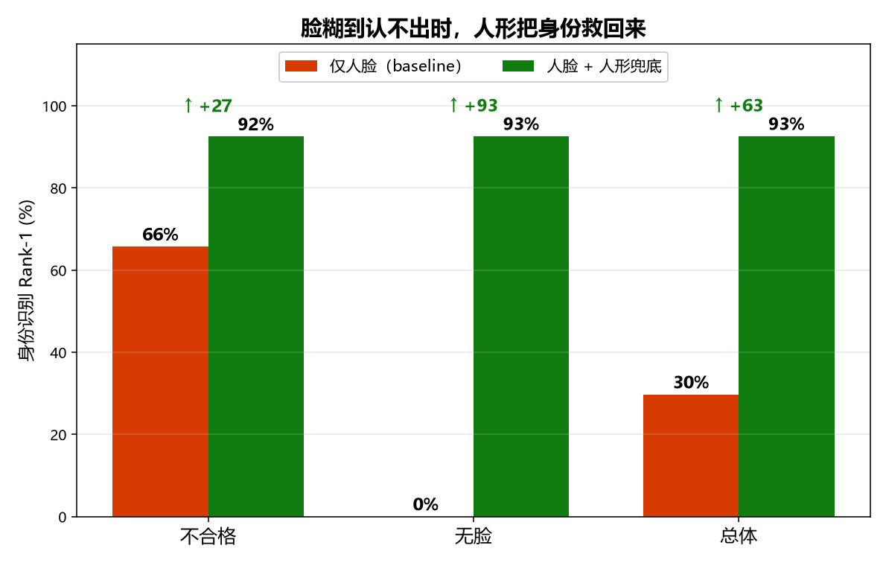
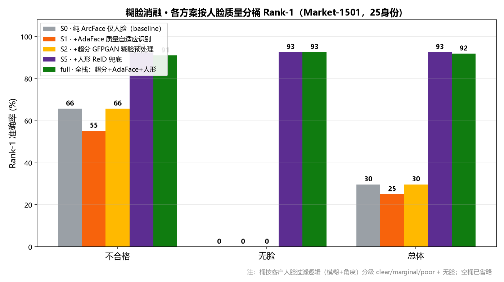
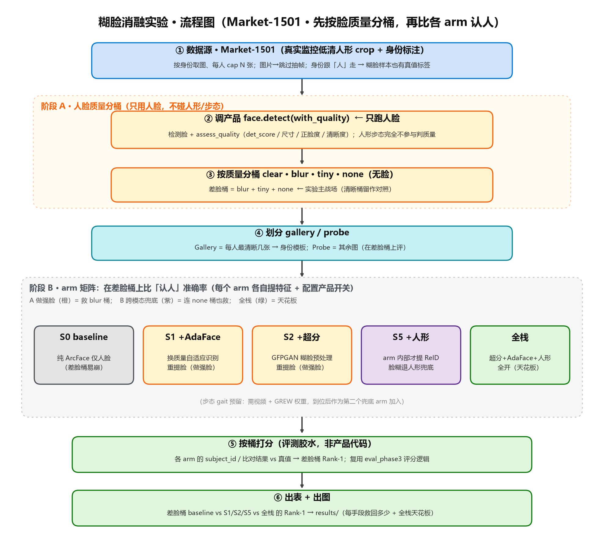

# Market-1501 / ChokePoint 糊脸实验（历史记录）

> 本文档为早期实验记录，正式论文结论请查看`../实习论文_MEVID多模态身份识别实验.md`。
> 本文中的结果文件现存放在`../../results/legacy_market/`，样例图片位于`../../dataset/`。

> 在真实监控低清行人图上，量化「**人脸糊到认不出时，加哪些手段能把『认人』救回多少**」。
> 核心卖点：**脸糊 → 退人形/步态兜底**。

---

## 1. 结论速览（第二版 · Market-1501，质量分级对齐客户人脸过滤 + 软性连续加权）

### 头条：脸糊到认不出时，人形把身份救回来


> **不合格脸 66→92、完全无脸 0→93、总体 30→93**（Rank-1，25 身份 / 148 probe）。
> 脸彻底没用（none 桶）时仍能认对 92.6% —— **「脸糊靠人形兜底」成立**。

### 完整消融：5 个方案 × 人脸质量桶


| arm | poor(不合格) | none(无脸) | overall | 说明 |
|---|---|---|---|---|
| **S0** baseline | 65.7 | **0.0** | 29.7 | 纯 ArcFace 仅人脸 |
| S1 +AdaFace | 55.2 | 0.0 | 25.0 | 换质量自适应识别 |
| S2 +超分 | 65.7 | 0.0 | 29.7 | GFPGAN 糊脸预处理（本次真启用） |
| **S5** +人形 | **92.5** | **92.6** | **92.6** | ReID 跨模态兜底 |
| full 全栈 | 91.0 | 92.6 | 91.9 | 超分+AdaFace+人形 |

> 质量桶按**客户人脸过滤逻辑（模糊+角度）**分级 clear/marginal/poor + 无脸；本数据集全部落 poor/none（`poor=67, none=81, clear/marginal=0`）。

**如实解读（读数注意，别直接外发）：**
1. **超分 S2 = S0（无变化）**：本次超分已真正启用（GFPGAN 加载成功），但 Market 的脸是十几像素极小脸，按拉普拉斯**不够"糊"** → 超分门控基本不触发。超分价值要靠**中距真糊脸**数据（SCFace）才测得出。
2. **AdaFace S1 反降（66→55）**：AdaFace 为"低清但完整"的脸设计，对 Market 这种极小侧脸不擅长，不如原始 ArcFace。数据集特性所致。
3. **full 的 poor 略降（92.5→91.0）**：full 人脸走 AdaFace（此数据集更差），软加权 floor=0.3 让"更差的人脸"仍保底参与，轻微拖累 → 脸本身没用时，**S5（纯人形兜底）在此数据集最优**。
4. Market 同一人常同机位/同衣服 → 人形 92% 含一定"靠衣着蒙对"水分，真实跨天换装会更低。

**下一步（提升可信度）：**
- 用 **ChokePoint** 补 **clear 桶对照**（清晰正脸 C1 + 斜视 C2/C3）→ 两数据集互补：Market 给"无脸兜底"、ChokePoint 给"清晰对照"。
- 让超分/AdaFace 体现价值需要 **blur 桶**（中距糊脸）数据 → 候选 SCFace / 真实监控片。

> 本次分桶图集存档：`../../dataset/market1501_25subj_newlogic/`（参考图75张及按质量分类的测试图）。

---

## 1.5 汇报用图（顺序 + 一句话讲解）

| 顺序 | 图 | 一句话讲解 |
|---|---|---|
| 1 | `../../results/legacy_market/fig_headline.png` | 脸糊/无脸时，人形把识别从30%拉到93% |
| 2 | `../../results/legacy_market/实验流程.png` | 两阶段：只用脸分桶，再比较不同认人方案 |
| 3 | `../../results/legacy_market/fig_ablation.png` | AdaFace、超分和人形的早期消融结果 |

### 方法流程图



---

## 2. 方法（见 `../../results/legacy_market/实验流程.svg`）

两阶段，重活全部 **call 产品代码**（人脸过滤逻辑详见 `docs/人脸质量与身份融合逻辑.md`）：
- **阶段 A · 质量分桶（只用人脸）**：`app.face.detect(with_quality)` 检测脸 + `assess_quality`（**对齐客户人脸过滤：主看模糊+角度**）→ 分桶 `clear / marginal / poor` + 无脸 `none`。人形步态**不参与判质量**。
- **阶段 B · arm 矩阵（认人对比）**：在差脸桶上比各 arm 的闭集 Rank-1。各 arm 只切产品开关：
  - 人脸识别后端 `FACE_REC_BACKEND`（arcface / adaface）
  - 超分 `enhance_blurry`（GFPGAN，**门控=糊才超分**）
  - 人形 `app.reid.embed`（仅 S5 / full 内部才提）
- **融合**：人脸权重用**软性连续加权** `w=0.5×(0.3+0.7×质量分)`，与产品 `identity_fusion` 一致（中等/微糊脸不再被一刀切压死）。

**纪律**：gallery（每人最清晰几张）与 probe（其余图）**图像互斥**，无数据泄漏；模型预训练冻结，不做训练。打分（Rank-1）是评测胶水，产品里没有。

---

## 3. 文件

```
糊脸消融实验/
  run_eval.py        # 评测主脚本（Market loader + arm 矩阵，薄薄 call 产品代码）
  dump_bins.py       # 把 probe 图按质量桶落盘到 dataset/<运行名>/（人眼查看糊脸样本）
  gen_flow.py        # 生成实验流程图
  gen_report_figs.py # 从结果 JSON 生成汇报用图（秒出，无需重跑）
  对比实验.md         # 总体对比实验指导手册（两条轴：精度 / 部署）
  README.md          # 本文件
  results/
    实验流程.svg/.png            # 方法流程图
    fig_headline.svg/.png        # 汇报图1：S0 vs S5 头条
    fig_ablation.svg/.png        # 汇报图3：5 方案完整消融
    face_blur_eval_results.json  # 本次结果数据
    face_blur_ablation.svg       # 脚本自动出的原始图（汇报用上面两张）
    run.log / dump.log           # 运行日志
  dataset/
    <运行名>/                    # 每次跑独立命名子文件夹（不覆盖），如 market1501_25subj_newlogic
      gallery/  probe_by_bin/{clear,marginal,poor,none}/  manifest.csv
```
> 数据本体（Market-1501 等）在 `data/external/`，git 仓库外，多实验共用。

---

## 4. 复现

```powershell
# 数据集（git 仓库外）：data/external/Market-1501-v15.09.15
# 来源：HF 镜像 huggingface.co/datasets/e8035669/reid-datasets

# 从仓库根运行（注意中文路径用相对路径）
.\.venv\Scripts\python.exe -u .\experiment\糊脸消融实验\scripts\run_eval.py `
    --data .\data\external\Market-1501-v15.09.15 `
    --arms S0,S1,S2,S5,full --max-subjects 25 --gallery-per-subject 3 --probe-per-subject 8

# 只验证「人形兜底」趋势（快 ~2.5x）：--arms S0,S5
# 实时看进度：另开窗口 Get-Content results\run.log -Wait -Tail 30
```

**耗时**：纯 CPU 上每图最多 4 次人脸 + 1 次人形，~0.2 张/s；25 身份约 **18 分钟**。
加速：少跑 arm、`FACE_DET_SIZE=320`、特征缓存；最终上 GPU 可数十倍加速。

---

## 5. 数据集说明

| 数据集 | 角色 | 脸质量 | 获取 |
|---|---|---|---|
| **Market-1501** | 本版主力（无脸兜底） | 极糊 / 无脸为主 | HF 镜像直下，146MB |
| **ChokePoint** | 待补：清晰对照 | 清晰正脸 + 斜视 | Zenodo record 815657（已下 P1E_S1） |
| SCFace / 真实片 | 待补：中距 blur 桶 | 中距糊脸 | 申请 / 自录 |

> 数据本体均在 `data/external/`（git 仓库外，多实验共用）。
