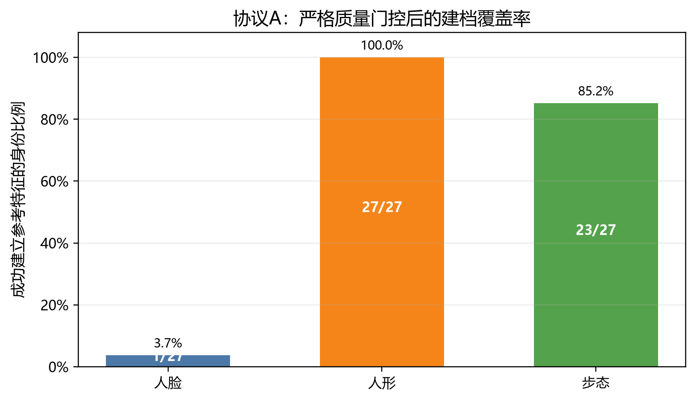
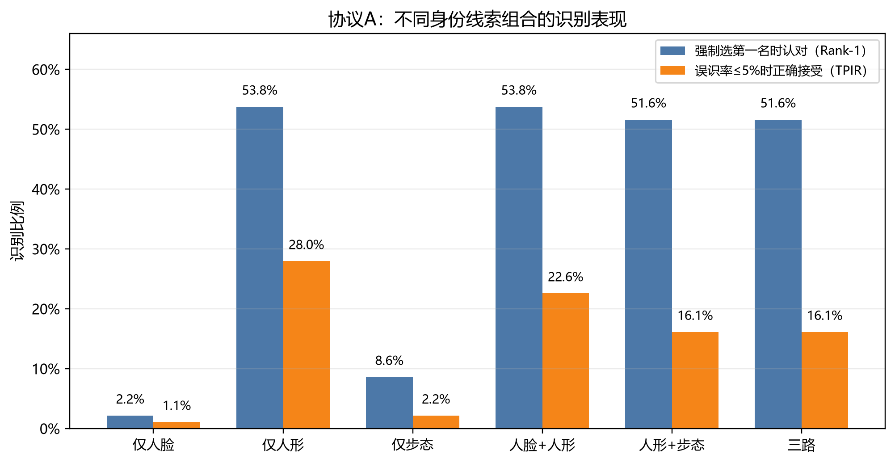
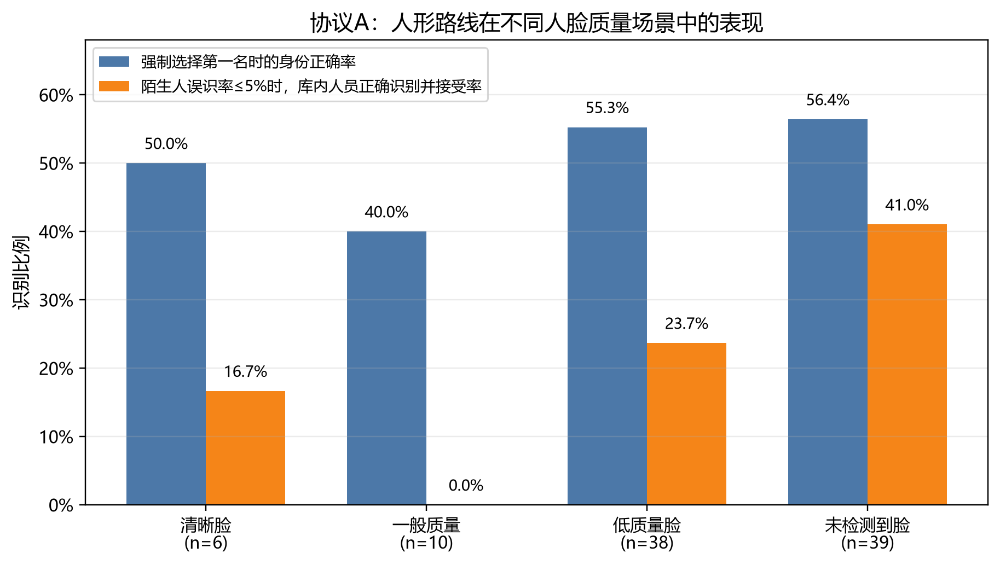
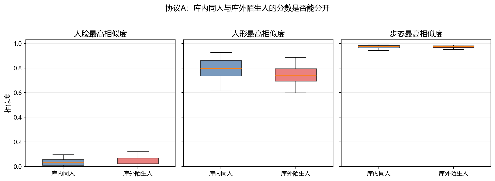
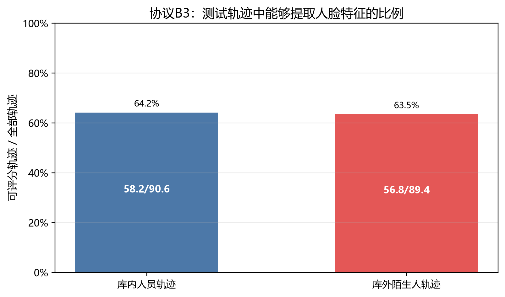
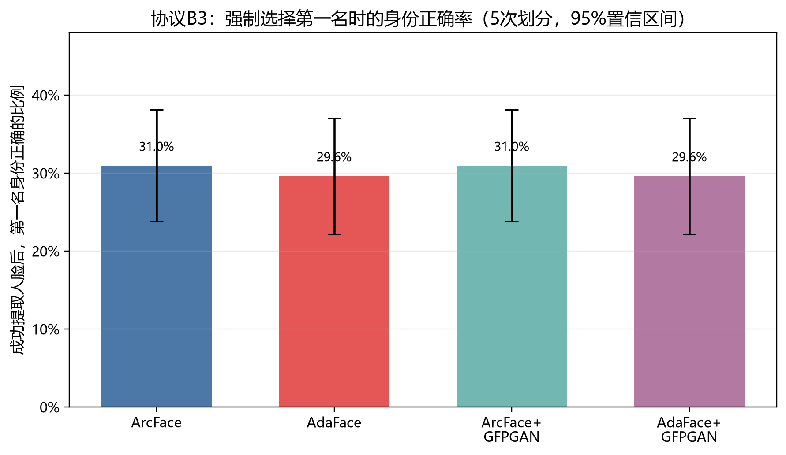
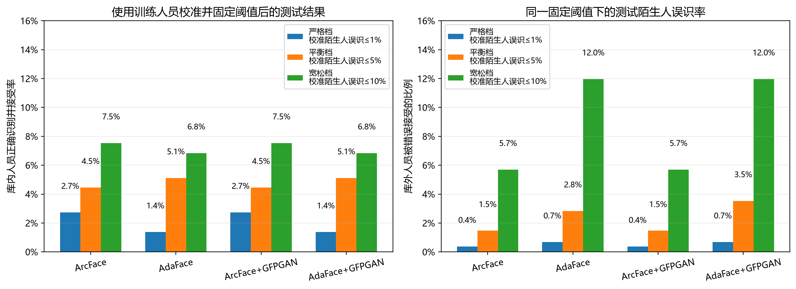
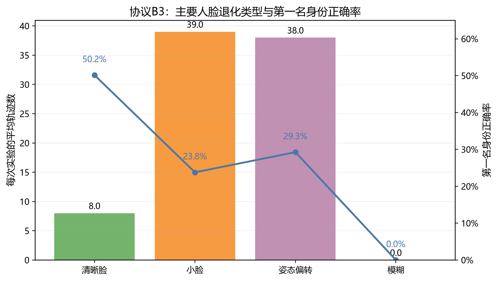
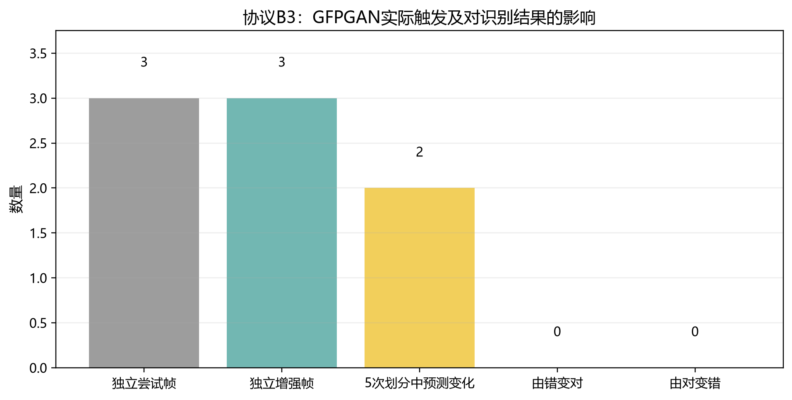

# 面向低质量监控场景的多模态身份识别方法研究

## ——基于人脸、人形与步态线索的开放环境实验分析

> **文档性质**：实习论文阶段性初稿  
> **正式实验**：协议A（人脸、人形、步态消融）与协议B3（独立训练身份校准的人脸模型对比）  
> **待补充内容**：统一主体注册表、空库状态机回放及原始全帧监控视频实验  
> **实验日期**：2026年7月  

---

## 摘要

真实监控视频中的人脸通常较小，并伴随运动模糊、侧脸、低头、遮挡或完全不可见等问题。
如果只依赖人脸识别，系统可能无法建立参考档案，也可能将新出现的陌生人错误归入已有身份。
本文基于MEVID真实监控人物轨迹，分别研究人脸、人形和步态线索能否互相补充，以及ArcFace、
AdaFace和GFPGAN在人脸输入完全一致时的表现。

协议A使用MEVID测试集，将27人录入参考库、25人作为从未录入过的陌生人，分别测试仅人脸、
仅人形、仅步态及其组合。严格人脸质量门控后，仅1/27个身份能够建立人脸参考特征；OSNet
人形单路的Rank-1为53.8%，在陌生人误识率不超过5%时，正确识别并接受率为28.0%。
当前步态路线Rank-1仅为8.6%，同人与陌生人的步态分数几乎重叠。

协议B3进一步下载MEVID训练人物数据，使用104个训练身份确定ArcFace和AdaFace各自的一套
固定身份匹配判断标准，然后冻结该标准，在完全不同的52个测试身份上重复评测5次。ArcFace
和AdaFace的平均Rank-1分别为31.0%和29.6%，95%置信区间重叠。使用“平衡档（校准数据中
陌生人误识率上限5%）”对应的固定判断标准后，两者测试集中的库内人员正确识别并接受率分别为
4.5%和5.1%，陌生人实际误识率分别为1.5%和2.8%。
GFPGAN在测试特征提取阶段实际增强3个独立帧，没有改变Rank-1结果。

实验表明，当前系统的首要困难不是简单更换人脸识别模型，而是人脸过小、姿态偏转、未检测到脸、
严格门控导致参考库覆盖不足，以及不同身份线索的分数未正确校准。本文结果可用于模型筛选和问题
定位，但不能直接等同于完整产品效果。

**关键词**：监控身份识别；低质量人脸；行人重识别；步态识别；身份匹配阈值；MEVID

---

## 1. 研究背景与问题

证件照识别通常拥有清晰、正面且尺寸较大的人脸，而监控摄像头中的人物往往距离较远。系统可能
遇到以下情况：

1. **没有检测到脸**：人物背身、脸太小或被遮挡；
2. **检测到脸但不能录入**：人脸过小、模糊或角度不合格，写入参考库可能污染后续结果；
3. **有参考特征但认错**：陌生人与某个库内人员分数过高，被错误归入已有身份；
4. **同一个人被拆成多个身份**：判断标准过严，同一人物再次出现时没有复用已有档案；
5. **不同身份线索互相冲突**：人脸、人形和步态分别指向不同人员。

本文希望回答：

- 严格人脸质量门控会损失多少参考库覆盖率？
- 当看不到脸时，人形和步态能否帮助认人？
- 在相同参考照片和测试片段下，ArcFace和AdaFace谁更稳定？
- GFPGAN是否真的改善识别，而不仅仅是让图片看起来更清晰？
- 训练数据确定的固定判断标准能否直接应用到新人物和新场景？

---

## 2. 相关方法

### 2.1 ArcFace与AdaFace

ArcFace通过角度间隔约束增强不同身份之间的特征区分度，是本文的人脸识别基线[2]。AdaFace
在训练阶段根据样本质量调整分类间隔，希望提高低质量人脸的特征稳定性[3]。AdaFace不是超分
模型，不能恢复原始图片中已经丢失的五官细节。

### 2.2 OSNet人形识别

OSNet利用人物的服装、体型和局部外观建立数字特征[4]。它不要求看见人脸，因此可以处理背身
或远距离人物，但换衣服后可能失效。

### 2.3 SkeletonGaitPP步态识别

SkeletonGaitPP利用连续帧中的人体骨架和轮廓表达行走模式[5]。理论上步态比服装稳定，但结果
依赖姿态估计、人体分割、序列长度、摄像头视角及训练数据域。

### 2.4 GFPGAN人脸修复

GFPGAN利用生成式人脸先验修复低质量人脸[6]。它可能改善视觉效果，也可能生成原图中不存在的
身份细节，因此必须同时检查正确识别率和陌生人误识率。

---

## 3. 数据集组成与易读术语

### 3.1 MEVID数据

MEVID包含158个全局身份、8092条人物轨迹和约1000万帧监控人物图片[1]。本文使用：

| 数据部分 | 身份数 | 轨迹数 | 图片数 | 本文用途 |
|---|---:|---:|---:|---|
| 训练人物数据 | 104 | 6338 | 3,609,156 | 确定固定身份匹配判断标准 |
| 测试人物数据 | 54（其中52人同时有参考候选与待识别轨迹） | 1754 | 约118万 | 计算最终成绩 |

训练身份与测试身份完全不同，避免系统提前通过训练见过测试人员。

### 3.2 什么是一段人物轨迹

一段轨迹是同一个人在某个摄像头中从出现到离开的连续过程。MEVID将视频拆成连续人物图片：

```text
0201O003C330T016F00001.jpg
0201O003C330T016F00002.jpg
……
0201O003C330T016F00500.jpg
```

文件名中的`0201`表示真实身份，`O003`表示衣服，`C330`表示摄像头，`T016`表示轨迹，
`F00001`表示该轨迹中的帧号。

### 3.3 本文使用的业务语言

| 数据集/算法术语 | 本文中的易读说法 | 含义 |
|---|---|---|
| gallery | 参考候选片段或参考库 | 用于选择参考照片或存放已录入人员 |
| query/probe | 待识别监控片段 | 拿来询问系统“这个人是谁” |
| template | 数字参考特征 | 一个人的若干参考图片经过模型后合成的数字表示 |
| threshold | 身份匹配判断标准 | 达到多少相似度才复用已有身份 |
| genuine | 库内同人样本 | 真实身份已经录入参考库 |
| imposter | 库外陌生人样本 | 真实身份没有录入参考库 |

---

## 4. 评价指标：每个数字回答什么问题

### 4.1 建档覆盖率

```text
建档覆盖率 = 成功建立该类参考特征的人数 / 计划录入人数
```

例如人脸覆盖`1/27`表示27个计划录入人员中，只有1人出现过满足严格质量要求的人脸。
它只回答“能不能进入参考库”，不表示后续一定能够认对。

### 4.2 Rank-1

Rank-1强制系统从参考库中选择最相似的人，统计第一名是否正确。它用于观察模型的特征区分能力，
但不允许系统回答“不认识”，因此不能单独代表产品效果。

### 4.3 陌生人误识率（FMR）

```text
FMR = 被错误认成库内人员的陌生人片段 / 全部陌生人片段
```

阈值太低时，不同人容易被错误合并；阈值太高时，同一个人容易被拒绝或重复建档。

### 4.4 库内人员正确识别并接受率（TPIR）

```text
TPIR = 身份正确且分数达到固定判断标准的库内片段 / 全部可评分库内片段
```

本文不使用含义模糊的“训练目标1%”表述，而是定义三种身份匹配工作档位：

| 工作档位 | 在训练人员校准数据上的明确要求 | 含义 |
|---|---|---|
| 严格档 | 可评分陌生人的误识率≤1% | 尽量避免将陌生人并入已有身份，但会拒绝更多库内同人 |
| 平衡档 | 可评分陌生人的误识率≤5% | 在误合并风险和正确识别覆盖之间折中 |
| 宽松档 | 可评分陌生人的误识率≤10% | 接受更多库内同人，但陌生人误合并风险更高 |

这里的1%、5%和10%限制的是**训练人员校准数据中，陌生人被错误接受的比例上限**，不是模型
训练准确率，也不是测试集最终必须达到的结果。每个档位先在训练人员上得到一个固定相似度阈值，
再到测试人员上报告该阈值产生的库内人员正确识别并接受率和陌生人实际误识率。

---

## 5. 协议A：人脸、人形和步态分别有什么价值

### 5.1 用一个监控认人例子理解实验

假设系统需要记住27名已出现人员，之后又会遇到25名从未录入过的陌生人。每名已录入人员可以
具有三类参考信息：

```text
统一身份0201
├─ 人脸参考特征
├─ 人形参考特征
└─ 步态参考特征
```

测试时，系统拿一段新的监控轨迹分别查询三类参考特征，观察每一种线索是否能够认出正确身份。
25名陌生人不进入任何参考库，用于检查系统是否会将新人物错误归入27名已知人员。

### 5.2 27名已录入人员如何选择

MEVID测试集中有52个身份同时具有参考候选片段和待识别片段。实验固定随机种子，选择：

```text
27人：进入参考库
25人：不进入参考库，作为陌生人
```

27和25不是数据集规定的类别，而是为了构造“库内人员+库外人员”的开放环境实验。

### 5.3 三类参考库如何建立

#### 人脸参考库

每个身份最多使用3条参考轨迹，每条均匀抽取8帧。产品人脸质量逻辑检查：

- 是否检测到脸；
- 人脸是否太小；
- 是否模糊；
- 是否大角度侧脸或抬头低头；
- 检测置信度是否足够。

只有被判定为`clear`的帧才能写入人脸参考库。这与产品严格防止低质量人脸污染数据库的逻辑一致。
若某身份有多帧通过检查，则将最多3条参考轨迹中所有通过检查的人脸特征取平均，形成该身份最终
的人脸数字参考特征。

#### 人形参考库

人物裁剪图片经过OSNet转换为数字外观特征。尺寸、清晰度和长宽比通过产品质量检查的帧才参与
建立参考特征。

#### 步态参考库

每条轨迹最多抽取24帧，先获得人体骨架和轮廓，再由SkeletonGaitPP生成步态特征。序列过短或
姿态、轮廓提取失败时，该身份不能建立步态参考特征。

### 5.4 为什么要设计六组方案

| 方案 | 使用信息 | 想回答的问题 |
|---|---|---|
| 仅人脸F | 人脸 | 严格人脸门控下能认出多少人 |
| 仅人形B | 人形 | 看不到脸时，仅靠外观能认出多少人 |
| 仅步态G | 步态 | 不看脸和衣服时，步态是否有效 |
| 人脸+人形FB | 人脸、人形 | 人形能否补充糊脸或无人脸 |
| 人形+步态BG | 人形、步态 | 换衣场景下步态能否补充人形 |
| 三路FBG | 人脸、人形、步态 | 当前完整多模态组合是否最好 |

### 5.5 测试过程

每条待识别轨迹依次执行：

1. 均匀抽取8帧提取人脸和人形特征；
2. 最多抽取24帧提取步态特征；
3. 分别查询对应参考库；
4. 输出最相似身份和分数；
5. 对库内人员检查是否认对，对陌生人检查是否被错误接受；
6. 扫描不同判断标准，得到第一名身份正确率、库内人员正确识别并接受率和陌生人误识率。

MEVID真实身份只在最后评分时使用。实验利用该标签把三类参考特征绑定到同一个官方身份，
当前产品仍需要实现正式的统一主体注册表。

### 5.6 实验结果：先看能不能建立参考特征



图1显示，严格门控下人脸参考覆盖仅为1/27；人形覆盖27/27；步态覆盖23/27。这意味着当前
多模态系统首先面对的是“人脸无法进入参考库”，而不是单纯的人脸模型精度问题。

### 5.7 实验结果：哪一种身份线索当前最有效



| 方案 | 强制选择第一名时的正确率（Rank-1） | 陌生人误识率不超过5%时，库内人员正确识别并接受率 |
|---|---:|---:|
| 仅人脸 | 2.2% | 1.1% |
| **仅人形** | **53.8%** | **28.0%** |
| 仅步态 | 8.6% | 2.2% |
| 人脸+人形 | 53.8% | 22.6% |
| 人形+步态 | 51.6% | 16.1% |
| 三路 | 51.6% | 16.1% |

OSNet人形单路是当前唯一明显有效的身份线索。加入人脸或步态后，“陌生人误识率不超过5%时的
库内人员正确识别并接受率”下降，不代表多模态
理论无效，而是说明当前低分人脸和失效步态仍被允许参与融合。

### 5.8 无脸轨迹为什么人形仍然有效



`none`表示采样帧中没有检测到脸。人形路线在该组的“陌生人误识率不超过5%时，库内人员正确
识别并接受率”为41.0%，说明“没有脸”
不等于“没有完整人体”。部分背身轨迹虽然没有人脸，但人物全身更完整，OSNet仍可利用服装和体型。

### 5.9 为什么当前步态不能加入融合



图4比较库内同人与库外陌生人的最高分数：

- 人脸只有一个身份成功建库，大部分分数接近0；
- 人形的同人分数整体高于陌生人，但仍有明显重叠；
- 步态的同人与陌生人分数都集中在约0.97，几乎无法分开。

当前步态问题可能来自GREW预训练模型与MEVID场景不同、姿态和轮廓质量不足、24帧未覆盖完整
步态周期以及摄像头视角差异。因此当前结果只能说明现有步态管线不可直接使用，不能证明步态
模态本身无效。

### 5.10 协议A的边界

协议A使用已裁剪人物轨迹，跳过全帧人物检测和跟踪；三类参考特征通过MEVID真实身份进行绑定；
融合也不是完整产品状态机。因此协议A用于分析各路线是否具有识别能力，不是最终产品效果证明。

---

## 6. 协议B3：公平比较ArcFace、AdaFace和GFPGAN

### 6.1 为什么需要训练集和测试集彻底分开

产品上线时，身份匹配判断标准应在上线前确定，运行过程中不能根据每段新视频临时改变。B3分为
两个完全独立的阶段，而且两个阶段使用两套不同的临时参考库：

```text
阶段一：用104名训练人员确定判断标准

50名训练人员 → 录入“训练临时参考库”
54名训练人员 → 不录入，模拟陌生人
                 ↓
比较同人和陌生人的分数
                 ↓
确定ArcFace、AdaFace各自的一套固定判断标准
                 ↓
训练临时参考库全部丢弃


阶段二：用52名测试人员计算最终成绩

27名测试人员 → 录入一套全新的“测试参考库”
25名测试人员 → 不录入，作为测试陌生人
                 ↓
使用阶段一已经固定的判断标准
                 ↓
只计算成绩，不再修改标准
```

因此，52名测试人员并不全是陌生人。其中27人会先使用自己的参考照片建立测试参考特征，模拟
产品中“已经录入的人员”；另外25人才是数据库中不存在的陌生人。“测试人员从未见过”是指
这些身份没有参与阶段一的阈值校准，并不是指阶段二不允许为其中一部分人员建立参考库。

可以将其理解为：先在建筑A用一批志愿者确定统一认人规则；到建筑B后，为当地27名授权人员录入
参考照片，再检查系统能否认出他们，同时拒绝25名未录入访客。

### 6.2 四个方案比较什么

| 方案 | 识别模型 | 是否修复模糊脸 |
|---|---|---|
| FR0 | ArcFace | 否 |
| FR1 | AdaFace | 否 |
| FR2 | ArcFace | GFPGAN |
| FR3 | AdaFace | GFPGAN |

所有方案使用完全相同的原始参考图片和待识别片段。不同模型分别生成自己的数字特征，不能将
ArcFace特征与AdaFace特征直接比较。

### 6.3 每个人的参考照片如何选择

对一个身份最多查看5条参考候选轨迹，每条均匀抽取8帧。人脸检测和质量计算直接复用产品逻辑，
然后最多选择3张参考照片，并尽量满足：

- 来自不同轨迹；
- 来自不同摄像头；
- 来自不同衣服条件；
- 所有方案使用同一批原始图片；
- 不使用任何测试片段；
- 不根据某个模型是否认对来挑图。

这一步不是产品自动积累建档，而是为了保证模型比赛公平。

### 6.4 训练集如何确定统一判断标准

训练集104人中：

```text
50人进入训练参考库
54人不进入参考库，作为训练陌生人
```

每个库内身份最多提供8条与参考照片不同的轨迹；每个陌生身份最多提供8条轨迹。共处理400条
同人轨迹和410条陌生人轨迹，其中223条同人、209条陌生人轨迹成功检测到脸并产生可评分特征。

对一条库内同人轨迹，系统查询50人的参考库，记录正确身份的排名和最高分。对一条陌生人轨迹，
系统同样查询50人参考库，但只记录它与库内人员之间的最高分，因为该最高分决定陌生人是否会被
错误接受。

系统尝试多个判断标准。例如：

```text
标准太低 → 认出更多库内人员，但陌生人也容易被误认
标准太高 → 陌生人更安全，但很多库内人员会被拒绝
```

最终为每个模型确定一套全局标准，而不是为每个人分别设置标准：

| 模型 | 严格档：校准陌生人误识率≤1% | 平衡档：≤5% | 宽松档：≤10% |
|---|---:|---:|---:|
| ArcFace | 0.5916 | 0.5494 | 0.5045 |
| AdaFace | 0.6433 | 0.5647 | 0.5174 |

这些数值是**人脸身份匹配接受阈值**，不是决定一张人脸能否写入参考库的质量门槛。例如选择
ArcFace的平衡档时，一段待识别人脸与库内人员的最高相似度达到0.5494，才允许将其
视为已有人脸身份；低于该值则拒绝复用。三列代表三种安全取舍，产品最终只选择其中一个工作点，
而不是同时使用三个阈值：

```text
严格档：阈值最高，陌生人更难被误认，但更多同人会被拒绝
平衡档：安全与识别覆盖的折中
宽松档：阈值最低，能接受更多同人，但误合并风险更高
```

阈值确定后冻结，测试阶段不再调整。它也不能直接作为客户产品最终配置，因为当前数值由MEVID
训练数据校准，正式上线前仍需使用客户场景数据确认。

#### 质量门控与身份匹配是两道不同判断

产品处理一条人物轨迹时，应分别回答：

```text
问题一：这张图片质量是否足够好，可以写入参考库？
问题二：它是否与参考库中的某个已有身份足够相似？
```

第一道是质量门控：

- 人脸检查尺寸、模糊、姿态和检测置信度，严格模式下只有`clear`才允许写入；
- 人形检查人体尺寸、清晰度和长宽比；
- 步态检查有效帧数、姿态和轮廓序列是否完整。

第二道才使用上表这类身份匹配阈值。实验B3为了公平比较人脸模型，预先固定参考照片，因此重点
评估第二道判断；协议A的`clear-only`覆盖率则主要评估第一道判断。

#### 人脸、人形和步态如何共同属于一个人

正式产品应为一个人物建立一个统一主体档案，但三种特征仍存放在三个独立向量索引中：

```text
统一主体 subject#42
├─ 人脸特征索引中的若干向量
├─ 人形特征索引中的若干向量
└─ 步态特征索引中的若干向量
```

人脸向量只与人脸向量比较，人形只与人形比较，步态只与步态比较；不能将不同维度、不同含义的
原始特征直接混合或求平均。三路分别得到候选统一主体和分数后，才在统一主体层进行置信度融合。

建档也不必固定为“先人脸、再人形”。例如首次出现时没有清晰脸，但人形质量合格，可以先创建
`subject#42`并写入人形特征；后续该人物再次出现，人形命中`subject#42`且出现清晰脸时，再将
人脸特征补充到同一个主体档案。若多路高置信结果指向不同主体，则进入冲突灰区，禁止自动合并
和写库。

### 6.5 测试集如何计算最终成绩

测试集52人中，有48人能够为全部四个方案建立共同参考特征。每次先从这48人中随机选择27人进入
参考库；剩余21人加上无法建立共同参考特征的4人，共25人作为数据库外陌生人。实验重复5次，每次：

```text
27人进入测试参考库
其余25人完全不进入参考库，作为陌生人
每个身份最多使用4条官方待识别轨迹
```

对于每条测试轨迹，系统直接使用训练阶段冻结的判断标准。5次实验改变进入参考库的身份组合，
用来观察结论是否稳定，并计算95%置信区间。

#### “5次身份划分”具体是什么意思

测试阶段共有52人，其中48人能够建立四个方案共用的参考特征。每次实验从这48人中重新随机选择
27人进入参考库，其他人员作为陌生人。可以用一个缩小例子理解：

```text
假设只有A、B、C、D、E、F六个人，每次选择三个人进入参考库。

第1次：参考库=A、B、C；陌生人=D、E、F
第2次：参考库=A、D、F；陌生人=B、C、E
第3次：参考库=B、D、E；陌生人=A、C、F
```

真实实验中，每次都是27人进入参考库、25人作为陌生人。身份匹配阈值、模型权重、参考照片选择
方法和测试轨迹均保持不变，只有“哪些人属于库内、哪些人属于陌生人”的组合发生变化。

需要重复划分，是因为实验难度会受到身份组合影响。例如某次进入参考库的人员外貌差异较大，
识别相对容易；另一次参考库中有很多外貌相近人员，Rank-1和陌生人误识可能下降。如果只运行
一次，结果可能恰好来自一组容易或困难的人员。

ArcFace五次Rank-1分别为：

```text
22.4%、36.8%、35.6%、30.9%、29.0%
```

AdaFace五次Rank-1分别为：

```text
20.7%、36.8%、32.2%、30.9%、27.4%
```

因此论文报告五次平均值，而不是只选择其中最好的一次。

#### 95%置信区间是什么意思

ArcFace五次结果的平均值为31.0%，但五次之间存在波动。置信区间利用五次结果的平均值、标准差
和样本数量，估计“如果继续更换不同的身份组合，平均表现可能落在哪个范围”：

```text
平均值 = 31.0%
五次结果的样本标准差 = 5.8个百分点
样本数量 = 5

95%置信区间
= 平均值 ± t系数 × 标准差 / √5
= 23.8%～38.1%
```

这里使用小样本t分布，而不是直接使用大样本正态分布。AdaFace对应的结果为29.6%，95%置信
区间为22.1%～37.1%。

95%置信区间不是“模型有95%的概率识别正确”，也不是“95%的测试轨迹都在这个范围内”。它表示：
如果不断用类似方式重新选择身份组合并重复实验，按同样方法计算出的区间中，约95%会覆盖真实
平均水平。

ArcFace和AdaFace的区间大量重叠，因此当前数据不足以证明二者Rank-1存在稳定的明显差异。
此外，五次划分仍然使用同一个MEVID测试集，彼此不是完全独立的新数据，所以该区间主要反映
“身份组合变化带来的不确定性”，不能代表所有真实客户监控场景的完整统计范围。

### 6.6 先看人脸路线能够处理多少轨迹



平均只有约64%的测试轨迹能够检测到脸并产生可评分人脸特征。其余约36%的轨迹无法进入ArcFace
或AdaFace比较。因此本文将：

- 成功提取人脸的轨迹用于比较识别模型；
- 所有轨迹用于报告人脸路线覆盖率；
- 未检测到脸的轨迹不能被用来证明某个人脸识别模型更差。

#### 64%如何计算

每次测试划分虽然会改变哪些人属于库内人员，但27名库内人员加25名陌生人仍覆盖全部52个测试
身份。每个身份最多使用4条官方待识别轨迹，实际每次共有180条测试轨迹。每条轨迹均匀抽取8帧，
逐帧运行同一套产品人脸检测：

```text
至少1帧检测到脸、完成关键点对齐并产生512维人脸特征
→ 该轨迹“可评分”

8帧全部没有检测到可用脸
→ 该轨迹“不可评分”
```

每次划分中，可评分轨迹均为115条：

```text
115 / 180 = 63.9% ≈ 64%

不可评分轨迹：
65 / 180 = 36.1% ≈ 36%
```

5次划分只是改变这180条轨迹中哪些属于库内人员、哪些属于陌生人，不会改变轨迹本身是否检测到
脸。分开看时，库内人员轨迹平均为58.2/90.6=64.2%，陌生人轨迹平均为56.8/89.4=63.5%。
人数出现小数是因为这里展示的是5次身份划分后的平均轨迹数。

#### 为什么未检测到脸不能用于比较ArcFace和AdaFace

处理链路是：

```text
人物轨迹
→ 人脸检测
→ 关键点对齐
→ ArcFace或AdaFace提取特征
→ 查询参考库
```

如果前两步没有得到人脸，ArcFace和AdaFace根本没有收到输入。此时将该轨迹记为“ArcFace认错”
或“AdaFace认错”，相当于考生没有拿到试卷却被判为答错，会把上游人脸检测问题错误归因给识别
模型。

因此本文同时报告两个层面的结果：

1. **模型识别能力**：只在115条可评分轨迹中比较第一名身份正确率、库内人员正确识别并接受率
   和陌生人误识率；
2. **人脸路线产品覆盖**：在全部180条轨迹中报告仅约64%能够进入人脸识别，另外36%必须依赖
   更好的人脸检测、人形或步态路线。

如果评价完整产品，未检测到脸当然仍属于产品未能通过人脸路线认人的情况；但它不能用于判断
ArcFace和AdaFace两种识别模型谁更强。

### 6.7 强制选择第一名时的身份正确率



| 方案 | Rank-1均值 | 95%置信区间 |
|---|---:|---:|
| ArcFace | **31.0%** | 23.8%–38.1% |
| AdaFace | 29.6% | 22.1%–37.1% |
| ArcFace+GFPGAN | **31.0%** | 23.8%–38.1% |
| AdaFace+GFPGAN | 29.6% | 22.1%–37.1% |

两者置信区间高度重叠，因此不能声称ArcFace的Rank-1能力显著优于AdaFace。

### 6.8 固定训练标准在测试集上的表现



| 方案 | 严格档：正确识别并接受率（测试陌生人实际误识率） | 平衡档：正确识别并接受率（实际误识率） | 宽松档：正确识别并接受率（实际误识率） |
|---|---:|---:|---:|
| ArcFace | **2.7%**（0.4%） | 4.5%（1.5%） | **7.5%**（5.7%） |
| AdaFace | 1.4%（0.7%） | **5.1%**（2.8%） | 6.8%（12.0%） |
| ArcFace+GFPGAN | **2.7%**（0.4%） | 4.5%（1.5%） | **7.5%**（5.7%） |
| AdaFace+GFPGAN | 1.4%（0.7%） | **5.1%**（3.5%） | 6.8%（12.0%） |

ArcFace在严格档下更稳健；AdaFace在平衡档下的正确识别并接受率略高，但两者差异较小。
AdaFace的宽松档阈值在测试集上产生约12%实际误识率，说明训练人员和测试人员的分数分布
并不完全一致，产品上线时需要采用更保守的安全余量。

### 6.9 哪些人脸问题最常见



同一条轨迹可以同时具有小脸和姿态偏转，因此图中的数量允许重叠。可评分轨迹主要问题是人脸
尺寸过小和姿态偏转；单纯“已检测但仅模糊”的样本极少。说明继续增加人脸超分并不能覆盖大部分
失败样本，优先级应放在人脸检测、远场小脸和多角度参考特征。

该图按照每条轨迹中“质量最好的可评分人脸”标记主要问题；GFPGAN则会检查轨迹内所有采样帧，
因此某条轨迹的最佳脸可能属于小脸或姿态问题，但其中其他帧仍可能触发模糊修复。两种统计口径
不同，不应将图中的模糊轨迹数直接等同于GFPGAN触发帧数。

### 6.10 GFPGAN是否有效



测试特征只提取一次，GFPGAN实际尝试并成功增强3个独立帧；这3帧在5次身份划分中被重复用于
评测，因此JSON中形成15次重复评测记录。它没有救回或破坏任何Rank-1。FR2与FR0的汇总指标
完全相同；FR3与FR1的Rank-1和正确识别并接受率相同，但平衡档下陌生人实际误识率略高
（3.5%与2.8%）。
该差异样本很少，不能据此判断GFPGAN稳定提高了陌生人相似度。因此当前只能得出：

> MEVID测试轨迹中适合GFPGAN处理的真实模糊脸太少，尚不足以评价总体增益。

不能据此推广为GFPGAN在所有模糊人脸数据上无效。

### 6.11 协议B3的边界

本实验仍使用已裁剪人物轨迹，无法评价全帧人物检测、跟踪和人脸-人体关联。参考照片也是离线
固定选择，不是产品从空库开始自动积累。本轮长时间实验因容器GPU不可用而回退CPU，准确率结果
可使用，但运行时间不能作为GPU性能结论。

---

## 7. 综合结论

### 7.1 对研究问题的回答

| 问题 | 当前答案 |
|---|---|
| 严格人脸门控影响多大？ | 人脸参考覆盖仅1/27，是协议A的首要瓶颈。 |
| 人形能否帮助无人脸轨迹？ | 可以；当陌生人误识率不超过5%时，OSNet单路的库内人员正确识别并接受率为28.0%，无人脸组为41.0%。 |
| 当前步态能否直接加入融合？ | 不能；同人与陌生人步态分数几乎重叠。 |
| ArcFace是否明显优于AdaFace？ | Rank-1没有显著差异；严格档、平衡档和宽松档下各有轻微差别。 |
| GFPGAN是否有效？ | 触发样本过少，无法得出总体结论。 |
| 当前融合是否优于人形单路？ | 否；低分人脸和失效步态仍在拖累融合。 |

### 7.2 对产品开发的启示

1. 优先解决远场小脸、姿态和未检测到脸，而不是只更换识别骨干；
2. 人形路线当前最有价值，但需要独立校准匹配判断标准；
3. 步态必须先解决特征坍缩和输入质量，再允许参与身份融合；
4. 三类向量必须绑定统一主体ID，不能比较各自数据库的本地编号；
5. 每种模型和模态需要自己的固定判断标准；
6. 模型对比、身份状态机验证和完整产品实验必须分层进行。

---

## 8. 有效性威胁

1. MEVID人物图片已经裁好，跳过了人物检测和跟踪误差；
2. 协议A使用真实身份标签绑定三类特征，产品尚缺统一主体注册表；
3. 协议A融合没有先执行每条路线的独立命中门控；
4. 协议B3只比较成功产生人脸特征的轨迹，约36%未检出轨迹需要单独通过覆盖率体现；
5. GFPGAN触发样本不足；
6. 5次测试划分并非完全独立样本，置信区间主要反映身份组合变化。

---

## 9. 下一阶段工作

### 9.1 修正多模态融合

- 分别校准人脸、人形和步态判断标准；
- 只有达到对应标准的路线才能参与融合；
- 多路指向同一统一主体时才增加一致性置信；
- 高置信冲突进入灰区并禁止写入参考库。

### 9.2 产品身份状态机回放

- 所有参考库从空库开始；
- 按轨迹顺序执行`new/grey/hit`；
- 建立统一主体注册表；
- 统计身份碎片、错误合并、模板污染和首次建档延迟；
- 运行过程中不读取MEVID真实身份，真实身份仅用于最后评分。

### 9.3 原始全帧监控实验

最终需要使用MEVID/MEVA原始全帧或客户授权视频，完整执行：

```text
人物检测
→ 多目标跟踪
→ 人脸与人体关联
→ 人脸/人形/步态建档
→ 统一主体融合
→ 事件报告
```

---

## 参考文献

[1] D. Davila, D. Du, B. Lewis, et al. “MEVID: Multi-View Extended Videos With Identities for Video Person Re-Identification.” *WACV*, 2023.  
https://openaccess.thecvf.com/content/WACV2023/html/Davila_MEVID_Multi-View_Extended_Videos_With_Identities_for_Video_Person_Re-Identification_WACV_2023_paper.html

[2] J. Deng, J. Guo, N. Xue, and S. Zafeiriou. “ArcFace: Additive Angular Margin Loss for Deep Face Recognition.” *CVPR*, 2019.  
https://openaccess.thecvf.com/content_CVPR_2019/html/Deng_ArcFace_Additive_Angular_Margin_Loss_for_Deep_Face_Recognition_CVPR_2019_paper.html

[3] M. Kim, A. K. Jain, and X. Liu. “AdaFace: Quality Adaptive Margin for Face Recognition.” *CVPR*, 2022.  
https://arxiv.org/abs/2204.00964

[4] K. Zhou, Y. Yang, A. Cavallaro, T. M. Hospedales, and T. Xiang. “Omni-Scale Feature Learning for Person Re-Identification.” *ICCV*, 2019.  
https://openaccess.thecvf.com/content_ICCV_2019/html/Zhou_Omni-Scale_Feature_Learning_for_Person_Re-Identification_ICCV_2019_paper.html

[5] C. Fan, J. Ma, D. Jin, C. Shen, and S. Yu. “SkeletonGait: Gait Recognition Using Skeleton Maps.” *arXiv:2311.13444*, 2023.  
https://arxiv.org/abs/2311.13444

[6] X. Wang, Y. Li, H. Zhang, and Y. Shan. “Towards Real-World Blind Face Restoration with Generative Facial Prior.” *CVPR*, 2021.  
https://openaccess.thecvf.com/content/CVPR2021/html/Wang_Towards_Real-World_Blind_Face_Restoration_With_Generative_Facial_Prior_CVPR_2021_paper.html

---

## 附录A：早期人脸实验为何不作为正式结论

早期协议B只进行一次身份划分，并在同一批测试轨迹上选择判断标准和报告结果。协议B2虽然将
校准轨迹与评测轨迹分开并重复5次，但两者仍来自同一批测试身份。它们帮助发现了共同锚点、
阈值校准、GFPGAN触发率和质量原因混合等问题，但正式论文结论以训练身份与测试身份完全独立的
协议B3为准。

---

## 附录B：结果文件

协议A：

```text
experiment/糊脸消融实验/results/runs/mevid_e2e_e27_i25_20260710_081808.json
```

协议B3：

```text
experiment/糊脸消融实验/results/runs/mevid_face_b3_train50_r5_test27_20260713_090421.json
```
