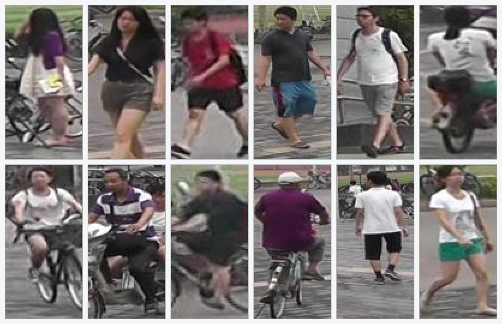
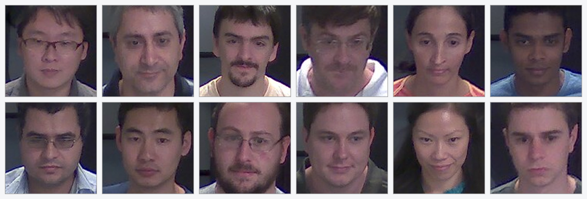
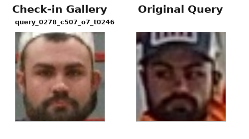
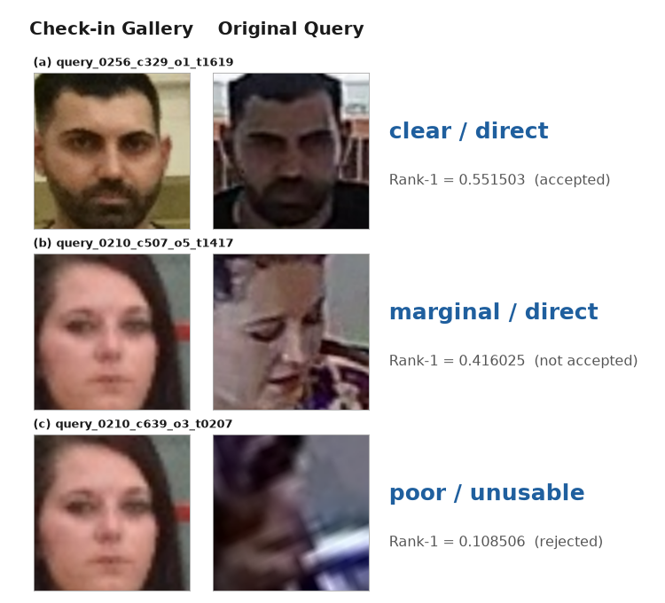
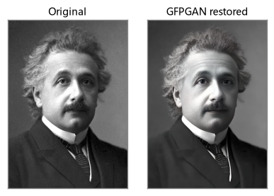
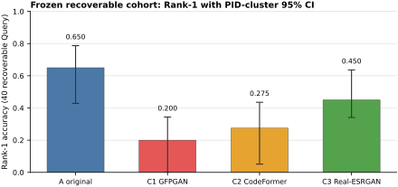
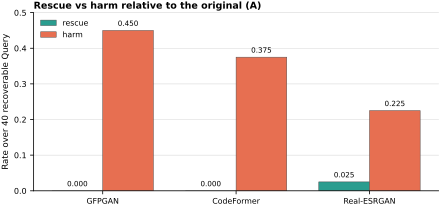
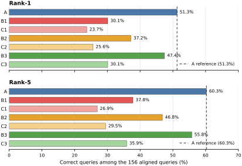
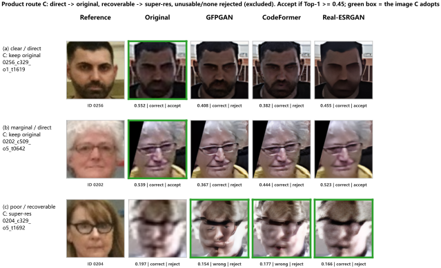

# 监控糊脸超分实验过程与阶段结论
吴止境 7月

## 第一阶段：问题从哪里来

监控视频里经常出现这些情况：

- 人脸很小，放大后只有很少的像素；
- 运动导致画面模糊；
- 人物侧脸、低头或被遮挡；
- 人体看得清，但脸看不清；
- 有些画面根本检测不到脸。

它们会造成三种不同的问题：

1. **不能识别**：画面信息不足，系统本应拒绝判断；
2. **不能建库**：画面勉强能看，但不适合当作以后比对用的身份模板；
3. **错误识别**：系统给出一个看似确定、实际错误的身份——这种最危险。

最初的直觉是：把模糊人脸“修清楚”，模型也许能提取到更多身份信息。GFPGAN 正是为修复人脸设计的[2]，所以成为最早测试的工具。后来又加入 CodeFormer[6] 和 Real-ESRGAN[7]，用来判断问题是 GFPGAN 独有，还是这类“生成式超分”的通病。

---

## 第二阶段：先解决数据

要判断超分到底有没有用，数据必须同时满足几点：同一个人要有清晰的参考照片（做gallary）、有独立的模糊 Query、有可靠的身份标签、有足够多“不是完全没救、有修复价值”的样本。围绕这几点，我前后使用了三个不同的开源数据集。

### 2.1 [Market-1501](https://zheng-lab-anu.github.io/Project/project_reid.html)（问题：能验证“没脸时用人形兜底”，但不能公平验证人脸超分）

第一轮用 Market-1501，抽了 25 个身份、148 张测试图。

结果：人脸识别约 29.7%，人形 ReID 兜底约 92.6%，整体约 91.9%。说明：脸太小或没脸时，靠体型、衣着等人形特征确实能继续跟住身份。但它不能证明超分有没有用，因为：

- 这个数据里的脸几乎都是极小脸或没脸；
- 缺少清晰脸和中等模糊脸；
- 人形模型可能借助了衣服、背景、同一机位等信息，不等于真正的跨场景身份识别。

图为本轮 25 个身份中的部分样本。每张都是整幅行人图（原图仅 64×128 像素），人脸往往只有十几个像素、看不清五官——这正是它只能验证“没脸时用人形兜底”、却不能公平验证人脸超分的原因。

### 2.2 [ChokePoint](http://arma.sourceforge.net/chokepoint/)（问题：Query人脸质量分布太集中）

为了补充清晰和中等质量的脸，改用 ChokePoint。125 张测试图里：clear（清晰）5 张、marginal（勉强可用）113 张、poor（差）7 张、none（无脸）0 张。

这次虽然有很多中等质量脸，但九成以上都挤在 marginal 一档，清晰和差的都太少；再加上候选身份很少，识别很容易接近满分，不同方案之间根本拉不开差距。

这次的教训是：**样本“看起来更像人脸”，不等于适合做算法对比。** 如果质量分布和难度不合理，数字再漂亮也没有判断价值。

图为按官方标注的眼睛坐标裁出的人脸。它们大多能看清、却都不够清晰，几乎全部落在 marginal 一档，缺少清晰脸和很差的脸，所以不同方案之间拉不开差距。

### 2.3 [MEVID](https://github.com/Kitware/MEVID)：

最终选 MEVID，因为它同时具备：多摄像头监控轨迹、可追溯的身份标签、每个人的登记参考照片（check-in）、不同距离/姿态/遮挡/清晰度的画面、官方 Query 列表和更大的身份数量。

MEVID 更接近真实监控场景，但也暴露了更多真实问题：参考照片不一定都适合建库、同一段轨迹有很多帧、人脸质量和人体质量并不一致、简单的阈值无法可靠判断哪些脸值得超分。这些问题在后面逐一暴露和解决。

左侧 check-in 是登记时拍的清晰正身照，用来建身份库；右侧 query 是同一人在监控里的画面，又小又糊、还带遮挡。MEVID 同时提供这两者，才让“用清晰底库比对模糊监控脸”的实验成为可能。

---

## 第三阶段：第一轮 MEVID 实验遇到一些新问题

### 3.1 建库规则太严，几乎没人能建人脸库

早期规则只允许非常清晰的脸进入 Gallery，结果 27 个测试身份里只有 1 个能建立人脸模板。这时就算识别结果很差，也不能怪模型——因为系统根本没有足够的参考人脸可比对。

所以这一轮回答不了“哪个模型更好”，但是发现问题：**人脸库gallary覆盖不足，比识别模型更早成了瓶颈。**

### 3.2 GFPGAN 门控太窄：498 张脸只有 3 张走了超分

另一轮实验里有 180 条有效轨迹、498 张可处理人脸，但旧规则只放行 3 张脸进入 GFPGAN超分，故而前后 Rank-1 完全没变。

这不能解释成“GFPGAN 没用”，更准确的说法是：**规则几乎没给 GFPGAN 一次像样的测试机会。** 当时只用清晰度、尺寸、拉普拉斯方差来判断质量，一些“肉眼很差、数值却不低”的脸没被选进“可修复”组——这也是后来考虑引入 CR-FIQA质量分的直接原因之一。

### 3.3 放宽门控后，又走到另一个极端

于是我放宽了规则。但是这一次审计显示：1305 张可对齐脸，超分处理了 1238 张，只差 5.1%。这说明路由几乎把所有脸都覆盖了，两个方案其实在做几乎一样的事。

超分门控从“几乎不触发”变成“几乎全触发”，还是回答不了问题。更麻烦的是，当时把同一段轨迹的多张人脸特征平均在一起，只要其中几张被超分改坏，就会污染整条轨迹的结果。

所以这轮结果只作为诊断证据保留，没有进入正式结论。

---

## 第四阶段：修正第三阶段实验发现和总结的问题

前面几轮反复失败，让我意识到：很多“实现细节”其实直接决定了实验可不可信。下面几个问题被逐一纠正。

### 4.1 “画面差”和“值得超分”不是一回事

最初只有一套质量分档：clear（清晰）、marginal（勉强可用）、poor（差）、none（无脸）。但同样是 poor，原因可能完全不同：

- 只是单纯模糊——可能还有修复价值；
- 脸太小——原图本就没有足够身份信息；
- 极端侧脸或遮挡——超分补不回真实结构；
- 检测框不准——要修复的对象本身可能就不对。

于是我把“看到的质量”和“产品该怎么处理”拆成两条独立的轴：

| 维度 | 类别 | 回答的问题 |
| --- | --- | --- |
| 画面严重程度 | clear / marginal / poor / none | 这张脸看起来有多差？ |
| 产品处理资格 | direct / recoverable / unusable / none | 该直接识别、尝试修复、拒绝，还是根本没有脸？ |

这样，一张 poor 脸既可能是 recoverable（值得修），也可能是 unusable（没救）。正式实验只把 recoverable 当作超分的主检验组，避免把“本来就不可能恢复”的样本混进来稀释结论。

图中每条 Query 标成“质量档 / 处理资格”两段：前一段（clear / marginal / poor）指的是这张 **Query 人脸本身**的清晰程度，后一段（direct / recoverable / unusable）指产品该怎么处理它。左列是 check-in 正身照（身份库），右列是同一人的 Query。三条样本只用于解释“质量类别、处理资格、产品阈值”的区别；它们在看身份结果之前就已固定，不能事后挑对某个方案有利的样本。

### 4.2 “人形最清楚的一帧”不等于“人脸最清楚的一帧”

早期产品先选“人形最清楚”的一帧，再从里面取脸。但全身清楚，不代表脸就最大、最正、最清楚。

正式实验改为：

1. 每条 Query 先按固定规则抽取有限的几帧；
2. 每帧都做人脸检测和对齐；
3. 用尺寸、姿态、检测分、清晰度来挑脸，且这个过程不看身份答案；
4. 每条 Query 只留一张“脸最好”（face-best）的帧作为输入。

关键点：**选帧不能参考识别结果**，否则等于先看答案再挑图。

### 4.3 Gallery 不能默认用上所有登记照（Check in）

MEVID 给每个人提供了登记照（check-in），但这些照片并不天然都是清晰、正脸、能建库的标准证件照。正式准备阶段审计了 2,898 张照片、172 个前缀，经过质量门控后，最终用 343 张脸建立了 145 个身份模板。

这个过程同时检查：身份前缀有没有重复或缺失、脸能不能检测和对齐、是否达到 direct 且 clear 的要求、文件摘要是否稳定（防止不同方案误用了不同的 Gallery）。

### 4.4 为满足不同超分算法要求而对人脸crop进行的放大再缩小，也要单独做对照

三种超分都会改变图片尺寸。万一结果变差，必须分清到底是“算法生成的内容”造成的，还是“放大再缩回”这个尺寸变化本身造成的。

所以正式实验加了两个纯缩放对照组：Resize-512（缩放到 512 再缩回）和 Resize-x2（放大 2 倍再缩回）。后面会看到，两组结果都和原图完全一样，从而排除了“尺寸往返”这个可能的解释。

### 4.5 Rank-5 不能被当成“产品识别成功”

离线评估里的 Rank-5 只表示“真人出现在前五名候选里”。但产品不可能一次给用户返回五个身份，真正的自动匹配仍然要求：第一名最相似、第一名分数达到阈值、并且和第二名之间没有明显歧义。当前 ArcFace[1] 的接受条件是“分数 ≥ 0.45”。所以 Rank-5 适合用来分析候选之间的歧义，不代表系统已经认对了人。

---

## 第五阶段：为什么尝试 FIQA，又为什么放弃

### 5.1 引入 FIQA 的动机

早期数据有两个相反的毛病：Market-1501 几乎全是极小脸和没脸，中间质量样本太少；ChokePoint 又几乎全挤在 marginal。同时，简单的清晰度指标会漏掉一些“肉眼很差、数值却不低”的脸。于是我想引入 CR-FIQA[5]，希望它更接近“这张脸是否适合做身份识别”，帮我更准地划出 recoverable 组。

### 5.2 诊断结果不支持这个设想

正式诊断里，632 条候选轨迹中有 118 条得到有效人脸，最终形成 39 条参考记录和 49 条独立测试记录。结果如下：

| 诊断指标 | 结果 |
| --- | ---: |
| ArcFace 第一名身份正确 | 9/49（18.4%） |
| 第一名正确且达到 0.45 阈值 | 0/49 |
| CR-FIQA 与“是否认对”的相关系数 | 0.026（几乎无关） |
| 去掉分数最低 10% FIQA 后的准确率 | 20.0% |
| 去掉最低 20% 后 | 17.5% |
| 去掉最低 50% 后 | 16.0% |

也就是说，FIQA 高的脸，并没有更容易被当前 ArcFace 认对。它能描述某种“图像质量”，但不能直接当作“当前系统能不能认出这个人”。

### 5.3 超分进一步印证“看起来更好”≠“身份更准”

三种超分的诊断结果把这个道理说得更清楚：

| 后端 | 单脸耗时 | 原图与超分特征相似度 | FIQA 变化 | 身份结果 |
| --- | ---: | ---: | ---: | --- |
| GFPGAN | 0.236 秒 | 0.402 | +0.468 | 下降最大 |
| CodeFormer | 0.324 秒 | 0.584 | +0.154 | 明显下降 |
| Real-ESRGAN | 0.075 秒 | 0.783 | -0.142 | 三者最好，但仍低于原图 |

表中“原图与超分特征相似度”越低，说明超分把人脸的身份特征改得越多。GFPGAN 让 FIQA 提升最多，却让身份结果下降最多；Real-ESRGAN 的 FIQA 反而下降，却最接近原图。这说明：

> 对人眼更自然、质量分更高，不代表保留了更多真实身份信息。

因此，CR-FIQA 最终降级为诊断信号，不再参与正式分档、建库、超分路由或身份匹配的决策。

### 5.4 为什么“修得更清楚”反而更容易认错

5.3 用数字说明了超分确实改动了身份特征，但没有解释为什么。其实从原理上看，这类“生成式修复”对身份识别有三个天然风险：

- **补出来的“合理”不等于“真实”。** 修复模型是用海量人脸训练出来的，遇到看不清的地方，它会补上一套*看起来合理*的五官，但那不一定是这个人本来的样子。画面是更干净了，填进去的细节却可能根本不属于本人[2]。
- **像素太少时，根本没有唯一答案。** 当一张脸只剩几十个像素，同一张糊脸在数学上可以对应很多张完全不同的清晰脸。模型只能挑一张“像样”的补出来，挑中本人的概率并不高——它是在合理地猜，而不是在如实还原[4]。
- **去噪会顺手抹掉身份线索。** 修复会磨平噪点、重画皮肤纹理、淡化皱纹和眼周阴影，而这些恰恰是识别模型用来区分不同人的关键细节。于是常出现“看着更清楚、却更不像本人”的情况——对人眼更好看，和对机器识别更有用，是两回事[3]。

下面这组公开对比图能直观说明第三点：

左图保留了照片原有的颗粒、皱纹和阴影；右图经 GFPGAN 修复后更平滑、更“高清”，但眼周、皮肤和明暗都被重新画过一遍。这张图来自 GFPGAN 官方在线 demo，只用来演示这种视觉现象，不作为本实验的定量结果。放到监控人脸上，被改掉的往往正是识别最依赖的那些细节——这也解释了为什么在后面第七阶段，越是把脸修得干净好看的 GFPGAN，反而把身份认得最差。

---

## 第六阶段：冻结统一协议，保证正式实验公平

反复试错后，我“冻结”了一套统一实验协议。所谓冻结，就是在看最终结果之前先固定好一切，任何方案都不能单独去调数据或阈值：

- 用同一份 MEVID 登记照（check-in）Gallery；
- 用同一份官方 Query 列表；
- 每条 Query 固定抽取 24 帧；
- 每条 Query 独立挑一张“脸最好”的帧；
- 用同一个 ArcFace 模型；
- 用同一条“分数 ≥ 0.45”的接受标准；
- 所有方案共用同一套 Query、Gallery 和身份映射；
- 每种超分单独缓存、单独留痕，避免结果串用。

最终 316 条官方 Query 被固定分成：

| 类型 | 数量 | 产品含义 |
| --- | ---: | --- |
| direct | 34 | 原图就能直接识别 |
| recoverable | 40 | 有脸且有修复空间，是超分的主检验组 |
| unusable | 82 | 有脸，但信息不足或风险太高，应拒绝 |
| none | 160 | 没有可用人脸 |

其中共有 156 条 Query 能检测并对齐出人脸。

正式实验分三类方案：

- **A 原图基线**：所有可对齐的脸都用原图；
- **B 全量替换**：所有可对齐的脸，分别全部交给 GFPGAN、CodeFormer 或 Real-ESRGAN；
- **C 产品路由**：direct 用原图，recoverable 用指定超分，unusable 和 none 直接拒绝。

B 组回答“如果无条件用超分会怎样”，C 组回答“如果按产品规则只修可修复的脸会怎样”。

---

## 第七阶段：正式实验结果

### 7.1 主结果：40 条 recoverable Query

这是最能说明超分价值的一组，因为它排除了 direct、unusable、none 的干扰。

| 处理方式 | 第一名身份正确 | 相比原图 | 救回 | 损害 |
| --- | ---: | ---: | ---: | ---: |
| 保留原图 | 26/40（65.0%） | -- | -- | -- |
| GFPGAN | 8/40（20.0%） | 下降 45.0 个百分点 | 0 | 18 |
| CodeFormer | 11/40（27.5%） | 下降 37.5 个百分点 | 0 | 15 |
| Real-ESRGAN | 18/40（45.0%） | 下降 20.0 个百分点 | 1 | 9 |
| 只缩放到 512 再缩回 | 26/40（65.0%） | 不变 | -- | -- |
| 只放大 2 倍再缩回 | 26/40（65.0%） | 不变 | -- | -- |

三种超分都没超过原图。Real-ESRGAN 相对最好——速度最快、对身份特征的改动也最小，但它仍然比原图少认对 8 条。两个纯缩放对照都没有改变结果，说明问题不在“尺寸往返”，而在于超分生成的细节改变了身份特征。

从“救回/损害”看更直接：GFPGAN 和 CodeFormer 一条都没救回，却分别损害了 18 条和 15 条；Real-ESRGAN 只救回 1 条，却损害了 9 条。

为了确认这些差距不是碰巧，我按“人”为单位反复重排数据做了显著性检验：GFPGAN 和 CodeFormer 的下降几乎每次都在（p≈0.001、0.004，统计显著），是稳定可信的真实差距；而 Real-ESRGAN 与原图之间的差距时有时无（p≈0.31），并不显著——也就是说，连表现最好的 Real-ESRGAN，都谈不上稳定地强过原图。下图把各方案的成绩连同这种波动范围一起画了出来。

### 7.2 156 条可对齐 Query 的整体结果

把范围扩大到全部 156 条可对齐 Query，趋势和主组一致：

| 方案 | 第一名身份正确 |
| --- | ---: |
| A 原图 | 80/156（51.3%） |
| B1 GFPGAN 全量替换 | 47/156（30.1%） |
| C1 GFPGAN 产品路由 | 37/156（23.7%） |
| B2 CodeFormer 全量替换 | 58/156（37.2%） |
| C2 CodeFormer 产品路由 | 40/156（25.6%） |
| B3 Real-ESRGAN 全量替换 | 74/156（47.4%） |
| C3 Real-ESRGAN 产品路由 | 47/156（30.1%） |

注意：C 组本身包含“主动拒绝 unusable 样本”的产品逻辑，所以它的原始正确数量不能单独拿来比算法强弱。判断超分本身有没有用，还是要看同一批 recoverable 样本上的 A/B 对比。

Rank-5 也没改变排序：原图 60.3%、Real-ESRGAN 全量替换 55.8%，其余更低。而且如前所述，Rank-5 只表示真人进了前五名，不能替代“第一名 + 阈值”的产品判定。

### 7.3 冻结样本的视觉审计

这张图只看产品路由 C 实际会处理的三类 Query —— unusable 和 none 会被 C 直接拒绝，放进来没意义，所以排除。clear 和 marginal 都属于 direct，C 保留原图（绿框标在“原图”列）；只有 poor 属于 recoverable，C 才走超分（绿框标在三个超分列）。每格标注真人的 Top-1 相似度、认对/认错与接受/拒绝（阈值 0.45）。可以看到：clear、marginal 用原图就能对上并接受；而最后一条 poor 的原图本来认对（只是分数没过阈值），交给超分后反而认错——再次说明**图片看起来更清楚，不等于身份特征更稳定**。三条为各类代表样本，仅作辅助观察，不替代前面的整体统计。

---

## 第八阶段：结果如何反过来改造产品

这轮实验没有停在“模型分数对比”，还直接改了产品实现。

### 8.1 超分默认关闭

正式结果证明，当前超分更可能改变身份特征，而不是稳定恢复身份信息。所以：recoverable 人脸继续用原始对齐脸；超分后端可以插拔、可显式选择，但默认关闭；超分图不能自动进入 Gallery。

### 8.2 默认人脸模型统一为 ArcFace

正式阈值和超分实验都基于 ArcFace，产品默认也改成 ArcFace，避免“实验用一套模型、线上默认用另一套”。AdaFace 仍可切换，但要单独校准阈值。

### 8.3 “看候选”和“建库”两件事分开

过去 Rank-5 容易被同时理解成“看五个候选”和“用五帧建库”。现在两者已经分开：Gallery 候选深度只用于比较第一名、第二名和内部歧义；新身份入库可以要求 1、3 或 5 个时间分散的 Query 帧共同支持；多帧证据只能拦住有歧义的入库，不能把低分候选“抬”成匹配成功。

### 8.4 人脸和人形各用各自的最佳帧

人体最佳帧继续服务人形 ReID，人脸最佳帧独立挑选，避免“全身清楚但脸很差”的画面进入人脸识别和建库。

---

## 最终结论：能确认什么，不能确认什么

### 可以确认

1. 在当前 MEVID、ArcFace 和冻结协议下，GFPGAN V1.3、CodeFormer（w=1）、Real-ESRGAN x2plus 都没有提高 recoverable 人脸的身份识别结果。
2. GFPGAN 和 CodeFormer 带来的“人眼更好看”或“FIQA 更高”，不能转化为身份识别的提升。
3. Real-ESRGAN 的身份漂移最小、速度最快，是三者中风险最低的，但仍未超过原图。
4. 结果下降不是单纯尺寸变化造成的（纯缩放对照已排除）。
5. FIQA 不适合直接用作当前产品的分档、建库或路由条件。
6. 目前更值得投入的方向是：改进原始采集、face-best 选帧、Gallery 质量和多帧一致性，而不是无条件增强图片。

### 不能确认

1. 不能证明所有超分算法对所有人脸任务都无效。
2. 不能把 MEVID 的结果直接等同于客户真实摄像头环境。
3. recoverable 主组只有 40 条，Real-ESRGAN 那 1 条“救回”还需要更多独立身份复验。
4. 不能用 Rank-5 较高来宣称产品已经识别成功。
5. 不能用“图片更清楚”或“FIQA 更高”来替代身份正确性的评估。

### 一句话总结

在本阶段的数据、模型和参数下，超分不能默认接入自动身份识别流程：**身份识别默认使用原始对齐人脸，超分默认关闭，只保留为人工查看或显式实验能力；FIQA 只作诊断，不再决定分桶、建库或路由。** 这个结论只适用于本阶段的条件，不能扩大为“所有超分在所有场景都无效”。

---

## 参考文献

[1] J. Deng, J. Guo, N. Xue, S. Zafeiriou. "ArcFace: Additive Angular Margin Loss for Deep Face Recognition." CVPR, 2019.  
[2] X. Wang, Y. Li, H. Zhang, Y. Shan. "Towards Real-World Blind Face Restoration with Generative Facial Prior."（GFPGAN）CVPR, 2021.  
[3] Y. Blau, T. Michaeli. "The Perception-Distortion Tradeoff." CVPR, 2018.  
[4] S. Menon, A. Damian, S. Hu, N. Ravi, C. Rudin. "PULSE: Self-Supervised Photo Upsampling via Latent Space Exploration of Generative Models." CVPR, 2020.  
[5] F. Boutros, M. Fang, M. Klemt, B. Fu, N. Damer. "CR-FIQA: Face Image Quality Assessment by Learning Sample Relative Classifiability." CVPR, 2023.  
[6] S. Zhou, K. C. K. Chan, C. Li, C. C. Loy. "Towards Robust Blind Face Restoration with Codebook Lookup Transformer."（CodeFormer）NeurIPS, 2022.  
[7] X. Wang, L. Xie, C. Dong, Y. Shan. "Real-ESRGAN: Training Real-World Blind Super-Resolution with Pure Synthetic Data." ICCVW, 2021.
