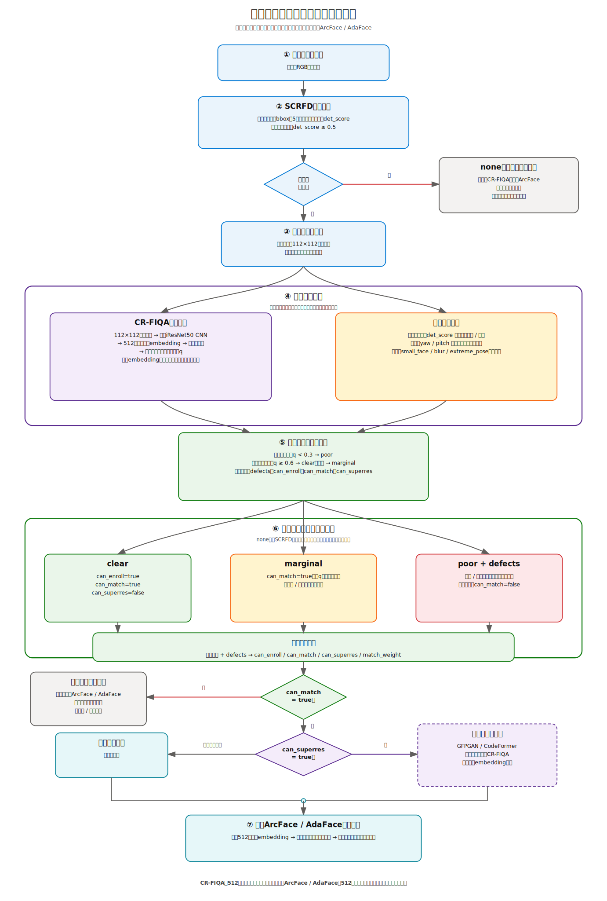

## 1. 设计原则

人脸检测后只运行一次产品质量评估。质量评估输出总体等级和具体问题标签，超分模块直接消费这些
结果，不再建立另一套重复的人脸质量评分逻辑。

## 2. 质量结果与处理动作

| 质量结果 | 建档 | 查询匹配 | 超分 |
|---|---|---|---|
| `clear` | 是 | 是 | 否 |
| `marginal` | 否或谨慎 | 是，适当降权 | 有模糊标签时尝试 |
| `poor + blur/small_face` | 否 | 可以低权重查询 | 可以尝试 |
| `poor + extreme_pose` | 否 | 谨慎或拒绝 | 否 |
| `none` | 否 | 人脸路线不匹配 | 当前人脸裁剪超分无法运行 |

`none`只表示人脸路线不可用，不会丢弃人物轨迹。系统仍继续运行人物跟踪、人形ReID、步态识别
和事件理解；如果无法确认身份，事件报告可以输出“未识别人物正在执行某行为”。

## 3. 建议的代码输出

```json
{
  "category": "poor",
  "defects": ["blur", "small_face"],
  "can_enroll": false,
  "can_match": true,
  "can_superres": true
}
```

总体等级使用：

```text
clear / marginal / poor / none
```

具体问题允许同时存在，例如：

```text
blur / small_face / extreme_yaw / extreme_pitch / low_detection / occlusion
```

## 4. 产品目标链路

```text
人物轨迹
  ↓
SCRFD人脸检测
  ├─ 没检测到脸 → none
  └─ 检测到脸
       ↓
     同时计算
       ├─ 人脸检测置信度
       ├─ 人脸尺寸
       ├─ yaw / pitch姿态
       ├─ 拉普拉斯清晰度
       ├─ FIQA识别可用性分数
       └─ 遮挡等子标签
       ↓
     合成clear / marginal / poor
       ↓
     分别决定建档、匹配、降权和超分
```

## 5. SCRFD后续改进方向

> 当前阶段先接入CR-FIQA，本节的SCRFD两级候选恢复后续再实现。

### 第一档：确认人脸

```text
det_score ≥ 0.5
→ 确认人脸
→ 正常质量评估、FIQA、识别
```

### 第二档：低可信人脸候选

```text
0.2 ≤ det_score < 0.5
→ 低可信人脸候选
→ 不建档、不直接识别
→ 结合人体头部区域、关键点几何和多帧一致性验证
→ 验证通过后再尝试放大/超分并重新检测
```

### 完全没有候选

```text
face_status=unavailable
→ 转人形、步态和事件理解
```

## 6. 超分对比实验

先对原图统一计算质量结果，并固定`category / defects / can_match / can_superres`。仅使用
`can_match=true`的同一批人脸进行三组对比：

| 方案 | 处理方式 |
|---|---|
| A 原图 | 不超分，直接ArcFace |
| B 全量超分 | 所有可匹配人脸都超分，再ArcFace |
| C 门控超分 | 仅`can_superres=true`时超分，其余使用原图ArcFace |

三组使用相同参考库、测试图片、ArcFace和身份匹配阈值。超分后可以重新计算FIQA，但不能删除
或更换测试样本。

报告识别准确率、陌生人误识率、正确变错误/错误变正确、FIQA变化、身份特征漂移，以及总耗时、
平均耗时、P50/P95、GFPGAN调用次数和耗时。

重点比较：

```text
B-A：全量超分的净影响
C-A：产品门控超分的净影响
C-B：效果接近时，门控超分能节省多少时间
```

## 7. 实验目录与运行方式

```text
糊脸消融实验/
├── common/
│   └── mevid_eval_common.py
└── 超分实验/
    ├── 实验设计.md
    ├── scripts/
    │   └── run_superres_gate.py
    ├── manifests/
    └── results/
```

公共MEVID加载、模板和开放集指标只保留在`common/`。旧`scripts/mevid_eval_common.py`仅作为兼容入口。

### 7.1 prepare：分类并冻结输入

```powershell
python experiment\糊脸消融实验\超分实验\scripts\run_superres_gate.py prepare `
  --data <MEVID根目录> `
  --manifest experiment\糊脸消融实验\超分实验\manifests\superres_gate.json
```

`prepare`只运行SCRFD、五点对齐和产品质量评估，通过`face.detect(..., with_identity=False)`保证
不调用ArcFace/AdaFace。它固定：

```text
sample_id / gallery-query角色 / 原图路径
112×112原始对齐脸及SHA256
category / defects / can_match / can_superres
FIQA before
```

`none`样本仍保留在manifest中，不能从后续A/B/C删除。

### 7.2 evaluate：固定输入上运行A/B/C

```powershell
python experiment\糊脸消融实验\超分实验\scripts\run_superres_gate.py evaluate `
  --manifest experiment\糊脸消融实验\超分实验\manifests\superres_gate.json `
  --enroll-subjects 27 `
  --imposter-subjects -1
```

评测阶段不重新运行SCRFD或质量分桶：

```text
A_original       = 原始对齐脸 → ArcFace
B_all_superres   = 所有can_match人脸 → GFPGAN → ArcFace
C_gated_superres = 仅冻结can_superres=true时采用B，否则采用A
```

Gallery模板只由A建立一次；A/B/C统一使用产品`FACE_HIT_THRESH`，实验中不重新校准识别阈值。
GFPGAN失败时B/C回退A，但样本仍保留。结果写入`超分实验/results/`，该目录默认不提交Git。
`--imposter-subjects -1`表示使用建档后所有剩余可用测试身份；若仍有52个满足gallery/query要求的
身份，则实际为27个建档身份和25个陌生身份。
